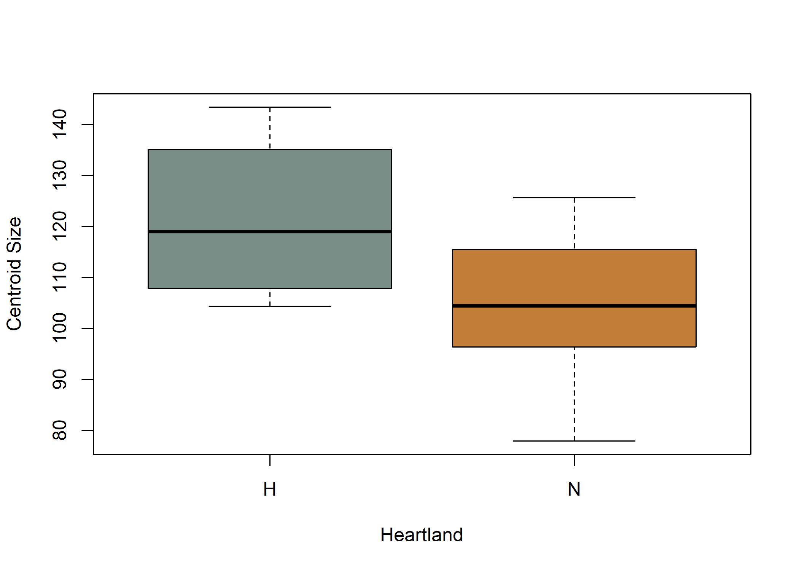
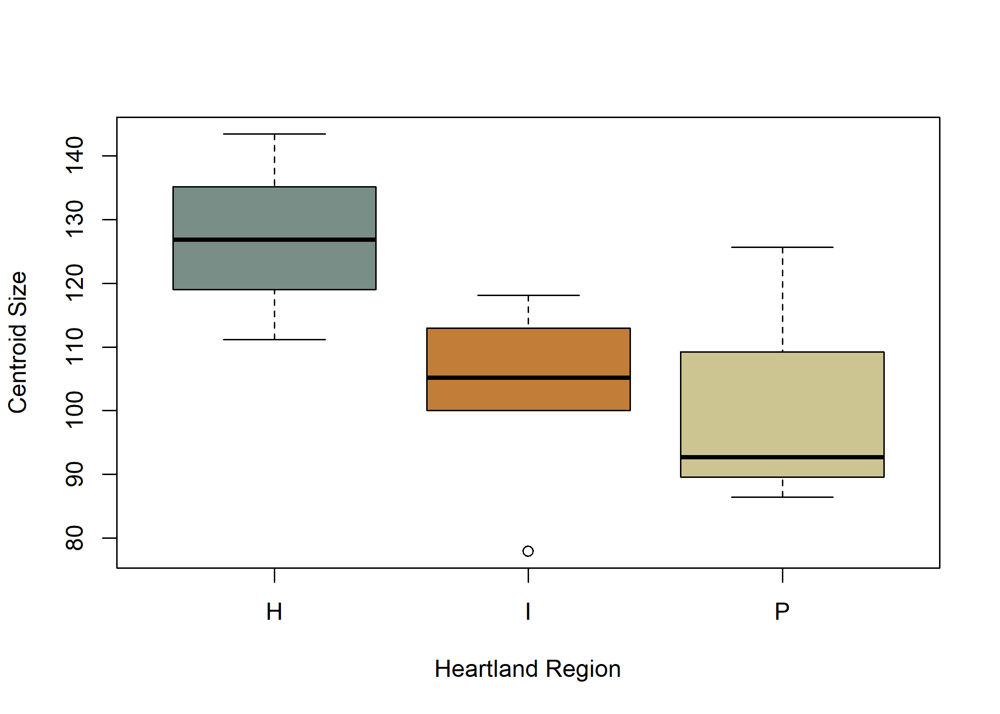
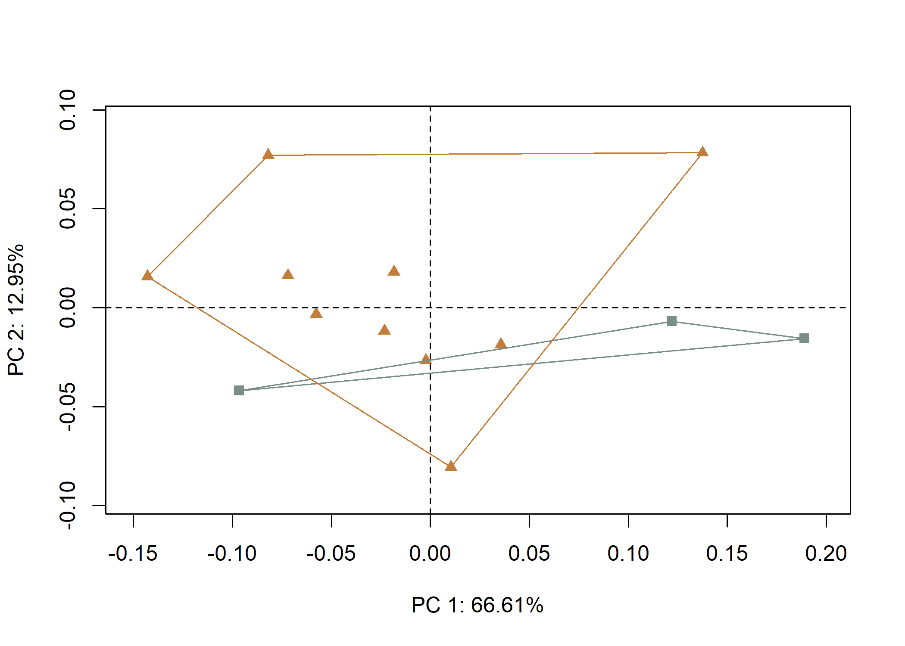
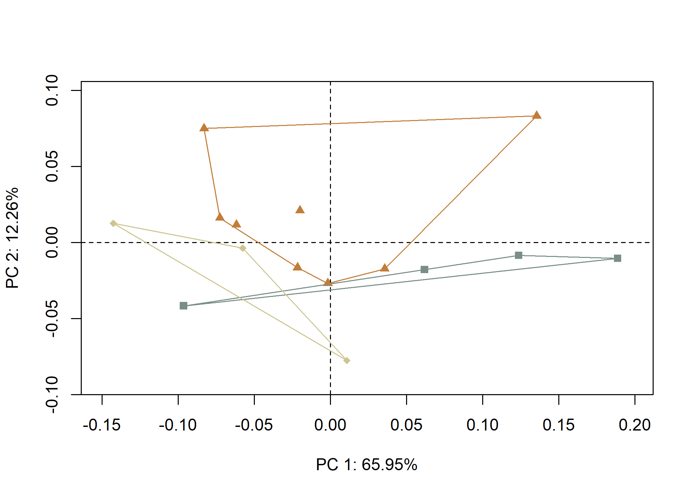

Analysis of Dalton point morphology
================
Robert Z. Selden, Jr.
17 September, 2020

## Load packages + data

``` r
# load packages

# devtools::install_github("geomorphR/geomorph", ref = "Stable", build_vignettes = TRUE)
library(geomorph)
```

    ## Loading required package: RRPP

    ## Loading required package: rgl

``` r
library(tidyverse)
```

    ## -- Attaching packages --------------------------- tidyverse 1.3.0 --

    ## v ggplot2 3.3.2     v purrr   0.3.4
    ## v tibble  3.0.3     v dplyr   1.0.2
    ## v tidyr   1.1.2     v stringr 1.4.0
    ## v readr   1.3.1     v forcats 0.5.0

    ## -- Conflicts ------------------------------ tidyverse_conflicts() --
    ## x dplyr::filter() masks stats::filter()
    ## x dplyr::lag()    masks stats::lag()

``` r
library(ggfortify)
library(ggExtra)
library(wesanderson)

# setwd
setwd(getwd())

# read GM data
source('readmulti.csv.R')

# read .csv files
setwd("./data")
filelist <- list.files(pattern = ".csv")
coords <- readmulti.csv(filelist)
setwd("../")

# read qualitative data
qdata <- read.csv("qdata.csv", header = TRUE, row.names = 1)
qdata <- qdata[match(dimnames(coords)[[3]],rownames(qdata)),]

# print qdata
knitr::kable(qdata, caption = "Attributes included in qdata.")
```

|               | heart.out | heart.reg |
| :------------ | :-------- | :-------- |
| 11AI225       | H         | H         |
| 11HE445       | N         | P         |
| HK49\_1462    | N         | I         |
| HK49\_2       | N         | I         |
| HK49\_3022    | N         | I         |
| HK49\_3823    | N         | I         |
| HK49\_4       | N         | I         |
| HK49\_5928    | N         | I         |
| HK49\_5961    | N         | I         |
| HK49\_7       | N         | I         |
| KeilMangold13 | H         | H         |
| KeilMangold3  | H         | H         |
| KeilMangold8  | H         | H         |
| Kinzer46      | N         | P         |
| Kinzer49      | N         | P         |

Attributes included in qdata.

## Generalized Procrustes Analysis

``` r
# gpa
Y.gpa <- gpagen(coords, PrinAxes = TRUE, ProcD = TRUE, Proj = TRUE, print.progress = FALSE)

# output + consensus configuration coords
Y.gpa
```

    ## 
    ## Call:
    ## gpagen(A = coords, PrinAxes = TRUE, ProcD = TRUE, Proj = TRUE,  
    ##     print.progress = FALSE) 
    ## 
    ## 
    ## 
    ## Generalized Procrustes Analysis
    ## with Partial Procrustes Superimposition
    ## 
    ## 34 fixed landmarks
    ## 0 semilandmarks (sliders)
    ## 3-dimensional landmarks
    ## 2 GPA iterations to converge
    ## 
    ## 
    ## Consensus (mean) Configuration
    ## 
    ##                X             Y             Z
    ## 1  -0.3205241506 -4.573595e-04 -4.611571e-04
    ## 2   0.2120556843  1.282389e-01 -3.731409e-04
    ## 3   0.2069219025 -1.345850e-01  1.883301e-03
    ## 4   0.0834230310  1.316656e-01 -2.146095e-03
    ## 5   0.0777176859 -1.290802e-01  6.645687e-04
    ## 6   0.1931995811 -2.828767e-03  6.644907e-04
    ## 7  -0.2404522342  5.098683e-02  2.494381e-03
    ## 8  -0.1602114664  7.842844e-02  4.915429e-05
    ## 9  -0.0799104385  9.280955e-02  1.058582e-03
    ## 10  0.0004290064  1.059172e-01  2.380187e-05
    ## 11  0.1417496306  1.240522e-01 -1.984237e-03
    ## 12  0.2146651076  6.413912e-02 -1.147489e-03
    ## 13  0.2146794491 -7.156056e-02  6.616261e-04
    ## 14  0.1325002015 -1.249471e-01 -1.589521e-04
    ## 15  0.0015074736 -1.024038e-01 -2.338896e-03
    ## 16 -0.0789512772 -8.964896e-02 -2.631744e-03
    ## 17 -0.1594449417 -7.666043e-02 -3.545060e-03
    ## 18 -0.2399673340 -5.380299e-02 -2.478454e-03
    ## 19 -0.2401731878 -1.296467e-04  2.257741e-02
    ## 20 -0.1597696134  3.760171e-04  3.057570e-02
    ## 21 -0.0793918341  7.124903e-04  3.253161e-02
    ## 22  0.0010264092  1.177773e-03  3.190307e-02
    ## 23  0.0805733627  1.512254e-03  2.732662e-02
    ## 24  0.1366850390 -6.104520e-04  1.935725e-02
    ## 25  0.1372663697 -8.736560e-04 -1.909080e-02
    ## 26  0.0805366980  1.152383e-03 -2.692568e-02
    ## 27  0.0010415213  7.708264e-04 -3.060722e-02
    ## 28 -0.0793721834  4.215008e-04 -3.025749e-02
    ## 29 -0.1597914908  2.376341e-05 -2.796228e-02
    ## 30 -0.2401921454 -2.621951e-04 -2.126766e-02
    ## 31  0.0820991332  7.008530e-02  2.435119e-02
    ## 32  0.0790398273 -6.685888e-02  2.581841e-02
    ## 33  0.0790321378 -6.722223e-02 -2.374887e-02
    ## 34  0.0820030456  6.946199e-02 -2.481594e-02

``` r
# plot consensus configuration
par(mfrow=c(1, 3))
plot(Y.gpa$consensus[,c("Y", "X")], pch=20)
plot(Y.gpa$consensus[,c("Z", "X")], pch=20)
plot(Y.gpa$consensus[,c("Z", "Y")], pch=20)
```

<div class="figure">


<p class="caption">

2D plot of 3D consensus configuration.

</p>

</div>

``` r
# render 3d gpa plot
#plot(Y.gpa)

# gpa plot
# knitr::include_graphics('images/gpa3d.png')
```

## Set gdf + boxplots by centroid size

``` r
# geomorph data frame
gdf <- geomorph.data.frame(shape = Y.gpa$coords, size = Y.gpa$Csize, heart = qdata$heart.out, hreg = qdata$heart.reg)

# attributes for boxplots
csz <- Y.gpa$Csize # centroid size
heart <- qdata$heart.out # heartland in/out
hreg <- qdata$heart.reg # heartland region

# boxplot of Dalton point centroid size by in/out heartland
boxplot(csz~heart,
        names = c("H","N"), # heartland (H), and not heartland (N)
        xlab = "Heartland",
        ylab = "Centroid Size",
        col = wes_palette("Moonrise2"),
        )
```



``` r
fig.cap = "Boxplot of centroid size by Heartland (in/out)."

# boxplot of Dalton point centroid size by heartland + regions
boxplot(csz~hreg,
        names = c("H","I","P"), # heartland (H), interior (I), and northern periphery (P)
        xlab = "Heartland Region",
        ylab = "Centroid Size",
        col = wes_palette("Moonrise2"),
        )
```



``` r
fig.cap = "Boxplot of centroid size by Heartland region."
```

## Principal Components Analysis

``` r
# principal components analysis
pca<-gm.prcomp(Y.gpa$coords)
summary(pca)
```

    ## 
    ## Ordination type: Principal Component Analysis 
    ## Centering and projection: OLS 
    ## Number of observations 15 
    ## Number of vectors 15 
    ## 
    ## Importance of Components:
    ##                              Comp1       Comp2       Comp3        Comp4
    ## Eigenvalues            0.008869235 0.001648387 0.001030728 0.0004905267
    ## Proportion of Variance 0.659463070 0.122564192 0.076638762 0.0364726196
    ## Cumulative Proportion  0.659463070 0.782027262 0.858666023 0.8951386429
    ##                               Comp5       Comp6       Comp7        Comp8
    ## Eigenvalues            0.0003818797 0.000274153 0.000233368 0.0001691414
    ## Proportion of Variance 0.0283942782 0.020384369 0.017351844 0.0125763371
    ## Cumulative Proportion  0.9235329211 0.943917291 0.961269135 0.9738454720
    ##                               Comp9       Comp10       Comp11       Comp12
    ## Eigenvalues            9.844172e-05 7.388721e-05 5.370839e-05 4.911933e-05
    ## Proportion of Variance 7.319535e-03 5.493809e-03 3.993434e-03 3.652218e-03
    ## Cumulative Proportion  9.811650e-01 9.866588e-01 9.906523e-01 9.943045e-01
    ##                              Comp13       Comp14       Comp15
    ## Eigenvalues            4.444396e-05 3.215625e-05 1.795910e-33
    ## Proportion of Variance 3.304586e-03 2.390946e-03 1.335331e-31
    ## Cumulative Proportion  9.976091e-01 1.000000e+00 1.000000e+00

``` r
# set plot parameters to plot by heartland in (H) and out (N)
pch.gps.heart <- c(15,17)[as.factor(heart)]
col.gps.heart <- wes_palette("Moonrise2")[as.factor(heart)]
col.hull <- c("#798E87","#C27D38")

# plot pca by heartland in (H) and out (N)
pc.plot1 <- plot(pca, 
                 asp = 1,
                 pch = pch.gps.heart,
                 col = col.gps.heart)
                    shapeHulls(pc.plot1, 
                             groups = heart,
                             group.cols = col.hull)
```



``` r
# set plot parameters to plot by heartland + regions
pch.gps.hreg <- c(15,17,18)[as.factor(hreg)]
col.gps.hreg <- wes_palette("Moonrise2")[as.factor(hreg)]
col.hull.2 <- c("#798E87","#CCC591","#C27D38")

# plot pca by heartland + regions
pc.plot2 <- plot(pca, 
                 asp = 1,
                 pch = pch.gps.hreg,
                 col = col.gps.hreg)
                    shapeHulls(pc.plot2, 
                             groups = hreg,
                             group.cols = col.hull.2)
```



## Define models

``` r
## Define models
# size as a function of heart
fit.size.heart <- procD.lm(size ~ heart, 
                           data = gdf, 
                           print.progress = FALSE, 
                           iter = 9999)
# size as a function of hreg
fit.size.hreg <- procD.lm(size ~ hreg, 
                          data = gdf, 
                          print.progress = FALSE, 
                          iter = 9999)

# shape as a function of heart
fit.shape.heart <- procD.lm(shape ~ heart, 
                            data = gdf, 
                            print.progress = FALSE, 
                            iter = 9999)
# shape as a function of hreg
fit.shape.hreg <- procD.lm(shape ~ hreg, 
                           data = gdf, 
                           print.progress = FALSE, 
                           iter = 9999)
```

## Size

``` r
# ANOVA: do dalton projectile point sizes differ by heart?
anova(fit.size.heart)
```

    ## 
    ## Analysis of Variance, using Residual Randomization
    ## Permutation procedure: Randomization of null model residuals 
    ## Number of permutations: 10000 
    ## Estimation method: Ordinary Least Squares 
    ## Sums of Squares and Cross-products: Type I 
    ## Effect sizes (Z) based on F distributions
    ## 
    ##           Df     SS     MS     Rsq      F      Z Pr(>F)  
    ## heart      1  855.0 855.02 0.21635 3.5891 1.0691 0.0869 .
    ## Residuals 13 3096.9 238.23 0.78365                       
    ## Total     14 3951.9                                      
    ## ---
    ## Signif. codes:  0 '***' 0.001 '**' 0.01 '*' 0.05 '.' 0.1 ' ' 1
    ## 
    ## Call: procD.lm(f1 = size ~ heart, iter = 9999, data = gdf, print.progress = FALSE)

``` r
# ANOVA: do dalton projectile point sizes differ by hreg?
anova(fit.size.hreg)
```

    ## 
    ## Analysis of Variance, using Residual Randomization
    ## Permutation procedure: Randomization of null model residuals 
    ## Number of permutations: 10000 
    ## Estimation method: Ordinary Least Squares 
    ## Sums of Squares and Cross-products: Type I 
    ## Effect sizes (Z) based on F distributions
    ## 
    ##           Df     SS     MS     Rsq      F       Z Pr(>F)
    ## hreg       2  886.9 443.47 0.22443 1.7363 0.76723  0.226
    ## Residuals 12 3065.0 255.42 0.77557                      
    ## Total     14 3951.9                                     
    ## 
    ## Call: procD.lm(f1 = size ~ hreg, iter = 9999, data = gdf, print.progress = FALSE)

``` r
# pairwise comparison of LS means = which differ?
sz.hreg <- pairwise(fit.size.hreg, 
                    groups = qdata$heart.reg)
summary(sz.hreg, 
        confidence = 0.95, 
        test.type = "dist")
```

    ## 
    ## Pairwise comparisons
    ## 
    ## Groups: H I P 
    ## 
    ## RRPP: 10000 permutations
    ## 
    ## LS means:
    ## Vectors hidden (use show.vectors = TRUE to view)
    ## 
    ## Pairwise distances between means, plus statistics
    ##             d UCL (95%)         Z Pr > d
    ## H:I 16.029601  19.88169  1.276183 0.1243
    ## H:P 19.855000  24.98554  1.250909 0.1230
    ## I:P  3.825399  22.17582 -0.821662 0.7512

``` r
# pairwise distance between variances = standardization?
summary(sz.hreg, 
        confidence = 0.95, 
        test.type = "var")
```

    ## 
    ## Pairwise comparisons
    ## 
    ## Groups: H I P 
    ## 
    ## RRPP: 10000 permutations
    ## 
    ## 
    ## Observed variances by group
    ## 
    ##        H        I        P 
    ## 227.8299 158.2345 295.9358 
    ## 
    ## Pairwise distances between variances, plus statistics
    ##             d UCL (95%)           Z Pr > d
    ## H:I  69.59544  269.5836 -0.58889022 0.6591
    ## H:P  68.10592  338.0508 -0.75414771 0.7261
    ## I:P 137.70136  295.2966  0.08175118 0.4130

## Shape

``` r
# ANOVA: do dalton projectile point shapes differ by heart?
anova(fit.shape.heart)
```

    ## 
    ## Analysis of Variance, using Residual Randomization
    ## Permutation procedure: Randomization of null model residuals 
    ## Number of permutations: 10000 
    ## Estimation method: Ordinary Least Squares 
    ## Sums of Squares and Cross-products: Type I 
    ## Effect sizes (Z) based on F distributions
    ## 
    ##           Df      SS       MS     Rsq      F      Z Pr(>F)  
    ## heart      1 0.03237 0.032370 0.17191 2.6989 1.5936 0.0697 .
    ## Residuals 13 0.15592 0.011994 0.82809                       
    ## Total     14 0.18829                                        
    ## ---
    ## Signif. codes:  0 '***' 0.001 '**' 0.01 '*' 0.05 '.' 0.1 ' ' 1
    ## 
    ## Call: procD.lm(f1 = shape ~ heart, iter = 9999, data = gdf, print.progress = FALSE)

``` r
# ANOVA: do dalton projectile point shapes differ by hreg?
anova(fit.shape.hreg)
```

    ## 
    ## Analysis of Variance, using Residual Randomization
    ## Permutation procedure: Randomization of null model residuals 
    ## Number of permutations: 10000 
    ## Estimation method: Ordinary Least Squares 
    ## Sums of Squares and Cross-products: Type I 
    ## Effect sizes (Z) based on F distributions
    ## 
    ##           Df       SS       MS     Rsq      F      Z Pr(>F)
    ## hreg       2 0.044977 0.022489 0.23887 1.8831 1.2106 0.1234
    ## Residuals 12 0.143311 0.011943 0.76113                     
    ## Total     14 0.188288                                      
    ## 
    ## Call: procD.lm(f1 = shape ~ hreg, iter = 9999, data = gdf, print.progress = FALSE)

``` r
# pairwise comparison of LS means = which differ?
sh.hreg <- pairwise(fit.shape.hreg, groups = qdata$heart.reg)
summary(sz.hreg, confidence = 0.95, test.type = "dist")
```

    ## 
    ## Pairwise comparisons
    ## 
    ## Groups: H I P 
    ## 
    ## RRPP: 10000 permutations
    ## 
    ## LS means:
    ## Vectors hidden (use show.vectors = TRUE to view)
    ## 
    ## Pairwise distances between means, plus statistics
    ##             d UCL (95%)         Z Pr > d
    ## H:I 16.029601  19.88169  1.276183 0.1243
    ## H:P 19.855000  24.98554  1.250909 0.1230
    ## I:P  3.825399  22.17582 -0.821662 0.7512

``` r
# pairwise distance between variances = standardization?
summary(sz.hreg, confidence = 0.95, test.type = "var")
```

    ## 
    ## Pairwise comparisons
    ## 
    ## Groups: H I P 
    ## 
    ## RRPP: 10000 permutations
    ## 
    ## 
    ## Observed variances by group
    ## 
    ##        H        I        P 
    ## 227.8299 158.2345 295.9358 
    ## 
    ## Pairwise distances between variances, plus statistics
    ##             d UCL (95%)           Z Pr > d
    ## H:I  69.59544  269.5836 -0.58889022 0.6591
    ## H:P  68.10592  338.0508 -0.75414771 0.7261
    ## I:P 137.70136  295.2966  0.08175118 0.4130
