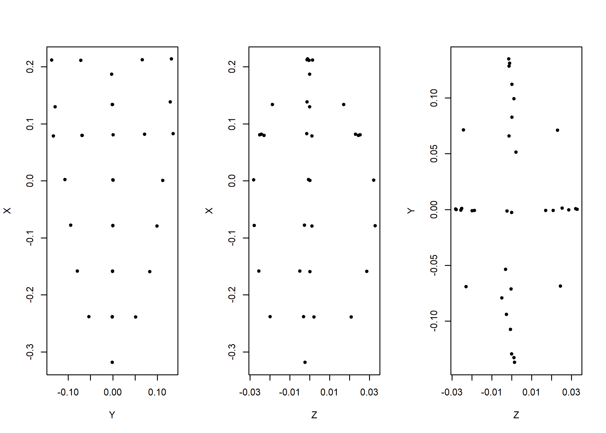

Analysis of Dalton point morphology
================
Robert Z. Selden, Jr.
17 September, 2020

## Generalised Procrustes Analysis

``` r
# library(devtools)
#devtools::install_github("geomorphR/geomorph", ref = "Stable", build_vignettes = TRUE)
library(geomorph)
```

    ## Loading required package: RRPP

    ## Loading required package: rgl

``` r
library(tidyverse)
```

    ## -- Attaching packages ------------------------------------------------- tidyverse 1.3.0 --

    ## v ggplot2 3.3.2     v purrr   0.3.4
    ## v tibble  3.0.3     v dplyr   1.0.2
    ## v tidyr   1.1.2     v stringr 1.4.0
    ## v readr   1.3.1     v forcats 0.5.0

    ## -- Conflicts ---------------------------------------------------- tidyverse_conflicts() --
    ## x dplyr::filter() masks stats::filter()
    ## x dplyr::lag()    masks stats::lag()

``` r
library(wesanderson)
setwd(getwd())

# read GM data
source('readmulti.csv.R')

# read .csv files
setwd("./data")
filelist <- list.files(pattern = ".csv")
coords <- readmulti.csv(filelist)
setwd("../")

# read qualitative data
qdata <- read.csv("qdata.csv", header = TRUE, row.names = 1)
qdata <- qdata[match(dimnames(coords)[[3]],rownames(qdata)),]
qdata
```

    ##               heart.out heart.reg
    ## 11AI225               H         H
    ## 11HE445               N         P
    ## HK49_2                N         I
    ## HK49_4                N         I
    ## HK49_7                N         I
    ## KeilMangold13         H         H
    ## KeilMangold3          H         H
    ## Kinzer46              N         P
    ## Kinzer49              N         P

``` r
# gpa
Y.gpa <- gpagen(coords, PrinAxes = TRUE, ProcD = TRUE, Proj = TRUE, print.progress = FALSE)
# plot consensus configuration
par(mfrow=c(1,3))
plot(Y.gpa$consensus[,c("Y", "X")], pch=20)
plot(Y.gpa$consensus[,c("Z", "X")], pch=20)
plot(Y.gpa$consensus[,c("Z", "Y")], pch=20)
```



``` r
# gpa plot
# knitr::include_graphics('images/gpa3d.png')
# fig.cap="Results of generalized Procrustes analysis."
```

``` r
# geomorph data frame
gdf <- geomorph.data.frame(shape = Y.gpa$coords, size = Y.gpa$Csize, heart = qdata$heart.out, hreg = qdata$heart.reg)

# attributes for boxplots
csz <- Y.gpa$Csize # centroid size
heart <- qdata$heart.out # heartland in/out
hreg <- qdata$heart.reg # heartland region

# boxplot of Dalton point centroid size by in/out heartland
boxplot(csz~heart,
        names = c("H","N"), # heartland (H), and not heartland (N)
        xlab = "Heartland",
        ylab = "Centroid Size",
        col = wes_palette("Moonrise2"),
        )
```


``` r
fig.cap = "Boxplot of centroid size by Heartland (in/out)."

# boxplot of Dalton point centroid size by heartland + regions
boxplot(csz~hreg,
        names = c("H","I","P"), # heartland (H), interior (I), and northern periphery (P)
        xlab = "Heartland Region",
        ylab = "Centroid Size",
        col = wes_palette("Moonrise2"),
        )
```


``` r
fig.cap = "Boxplot of centroid size by Heartland region."
```

## Principal Components Analysis

``` r
# principal components analysis
pca<-gm.prcomp(Y.gpa$coords)
summary(pca)
```

    ## 
    ## Ordination type: Principal Component Analysis 
    ## Centering and projection: OLS 
    ## Number of observations 9 
    ## Number of vectors 9 
    ## 
    ## Importance of Components:
    ##                            Comp1       Comp2        Comp3        Comp4
    ## Eigenvalues            0.0119500 0.002003109 0.0006055074 0.0005072158
    ## Proportion of Variance 0.7356167 0.123307213 0.0372737657 0.0312231442
    ## Cumulative Proportion  0.7356167 0.858923961 0.8961977266 0.9274208707
    ##                              Comp5        Comp6        Comp7        Comp8
    ## Eigenvalues            0.000464455 0.0003374303 0.0002227413 0.0001544117
    ## Proportion of Variance 0.028590878 0.0207715002 0.0137114896 0.0095052614
    ## Cumulative Proportion  0.956011749 0.9767832490 0.9904947386 1.0000000000
    ##                               Comp9
    ## Eigenvalues            1.818811e-33
    ## Proportion of Variance 1.119622e-31
    ## Cumulative Proportion  1.000000e+00

``` r
# set plot parameters to plot by heartland in (H) and out (N)
pch.gps.heart <- c(15,17)[as.factor(heart)]
col.gps.heart <- wes_palette("Moonrise2")[as.factor(heart)]
col.hull <- c("#798E87","#C27D38")

# plot pca by heartland in (H) and out (N)
pc.plot1 <- plot(pca, 
                 asp = 1,
                 pch = pch.gps.heart,
                 col = col.gps.heart)
                    shapeHulls(pc.plot1, 
                             groups = heart,
                             group.cols = col.hull)
```


``` r
# set plot parameters to plot by heartland + regions
pch.gps.hreg <- c(15,17,18)[as.factor(hreg)]
col.gps.hreg <- wes_palette("Moonrise2")[as.factor(hreg)]
col.hull.2 <- c("#798E87","#CCC591","#C27D38")

# plot pca by heartland + regions
pc.plot2 <- plot(pca, 
                 asp = 1,
                 pch = pch.gps.hreg,
                 col = col.gps.hreg)
                    shapeHulls(pc.plot2, 
                             groups = hreg,
                             group.cols = col.hull.2)
```


## Define models

``` r
## Define models
# size as a function of heart
fit.size.heart <- procD.lm(size ~ heart, 
                           data = gdf, 
                           print.progress = FALSE, 
                           iter = 9999)
# size as a function of hreg
fit.size.hreg <- procD.lm(size ~ hreg, 
                          data = gdf, 
                          print.progress = FALSE, 
                          iter = 9999)

# shape as a function of heart
fit.shape.heart <- procD.lm(shape ~ heart, 
                            data = gdf, 
                            print.progress = FALSE, 
                            iter = 9999)
# shape as a function of hreg
fit.shape.hreg <- procD.lm(shape ~ hreg, 
                           data = gdf, 
                           print.progress = FALSE, 
                           iter = 9999)
```

## Size

``` r
# ANOVA: do dalton projectile point sizes differ by heart?
anova(fit.size.heart)
```

    ## 
    ## Analysis of Variance, using Residual Randomization
    ## Permutation procedure: Randomization of null model residuals 
    ## Number of permutations: 10000 
    ## Estimation method: Ordinary Least Squares 
    ## Sums of Squares and Cross-products: Type I 
    ## Effect sizes (Z) based on F distributions
    ## 
    ##           Df     SS      MS     Rsq      F      Z  Pr(>F)  
    ## heart      1 1383.2 1383.21 0.38082 4.3054 1.2145 0.08585 .
    ## Residuals  7 2248.9  321.28 0.61918                        
    ## Total      8 3632.1                                        
    ## ---
    ## Signif. codes:  0 '***' 0.001 '**' 0.01 '*' 0.05 '.' 0.1 ' ' 1
    ## 
    ## Call: procD.lm(f1 = size ~ heart, iter = 9999, data = gdf, print.progress = FALSE)

``` r
# ANOVA: do dalton projectile point sizes differ by hreg?
anova(fit.size.hreg)
```

    ## 
    ## Analysis of Variance, using Residual Randomization
    ## Permutation procedure: Randomization of null model residuals 
    ## Number of permutations: 10000 
    ## Estimation method: Ordinary Least Squares 
    ## Sums of Squares and Cross-products: Type I 
    ## Effect sizes (Z) based on F distributions
    ## 
    ##           Df     SS     MS     Rsq      F       Z Pr(>F)
    ## hreg       2 1386.5 693.27 0.38174 1.8523 0.71201 0.2568
    ## Residuals  6 2245.6 374.27 0.61826                      
    ## Total      8 3632.1                                     
    ## 
    ## Call: procD.lm(f1 = size ~ hreg, iter = 9999, data = gdf, print.progress = FALSE)

``` r
# pairwise comparison of LS means = which differ?
sz.hreg <- pairwise(fit.size.hreg, 
                    groups = qdata$heart.reg)
summary(sz.hreg, 
        confidence = 0.95, 
        test.type = "dist")
```

    ## 
    ## Pairwise comparisons
    ## 
    ## Groups: H I P 
    ## 
    ## RRPP: 10000 permutations
    ## 
    ## LS means:
    ## Vectors hidden (use show.vectors = TRUE to view)
    ## 
    ## Pairwise distances between means, plus statistics
    ##             d UCL (95%)         Z  Pr > d
    ## H:I 27.042574  32.80832  1.275882 0.13055
    ## H:P 25.554212  32.91342  1.143745 0.15075
    ## I:P  1.488362  33.29938 -1.259120 0.93550

``` r
# pairwise distance between variances = standardization?
summary(sz.hreg, 
        confidence = 0.95, 
        test.type = "var")
```

    ## 
    ## Pairwise comparisons
    ## 
    ## Groups: H I P 
    ## 
    ## RRPP: 10000 permutations
    ## 
    ## 
    ## Observed variances by group
    ## 
    ##        H        I        P 
    ## 173.8491 278.7527 295.9358 
    ## 
    ## Pairwise distances between variances, plus statistics
    ##             d UCL (95%)          Z Pr > d
    ## H:I 104.90361  313.4813 -0.2920817 0.5274
    ## H:P 122.08670  316.6555 -0.1238263 0.4726
    ## I:P  17.18309  316.6538 -1.2435538 0.9287

## Shape

``` r
# ANOVA: do dalton projectile point shapes differ by heart?
anova(fit.shape.heart)
```

    ## 
    ## Analysis of Variance, using Residual Randomization
    ## Permutation procedure: Randomization of null model residuals 
    ## Number of permutations: 10000 
    ## Estimation method: Ordinary Least Squares 
    ## Sums of Squares and Cross-products: Type I 
    ## Effect sizes (Z) based on F distributions
    ## 
    ##           Df       SS       MS     Rsq     F      Z Pr(>F)
    ## heart      1 0.036932 0.036932 0.28418 2.779 1.5042 0.1044
    ## Residuals  7 0.093027 0.013290 0.71582                    
    ## Total      8 0.129959                                     
    ## 
    ## Call: procD.lm(f1 = shape ~ heart, iter = 9999, data = gdf, print.progress = FALSE)

``` r
# ANOVA: do dalton projectile point shapes differ by hreg?
anova(fit.shape.hreg)
```

    ## 
    ## Analysis of Variance, using Residual Randomization
    ## Permutation procedure: Randomization of null model residuals 
    ## Number of permutations: 10000 
    ## Estimation method: Ordinary Least Squares 
    ## Sums of Squares and Cross-products: Type I 
    ## Effect sizes (Z) based on F distributions
    ## 
    ##           Df       SS       MS    Rsq      F       Z Pr(>F)
    ## hreg       2 0.042613 0.021306 0.3279 1.4636 0.68458 0.2874
    ## Residuals  6 0.087346 0.014558 0.6721                      
    ## Total      8 0.129959                                      
    ## 
    ## Call: procD.lm(f1 = shape ~ hreg, iter = 9999, data = gdf, print.progress = FALSE)

``` r
# pairwise comparison of LS means = which differ?
sh.hreg <- pairwise(fit.shape.hreg, groups = qdata$heart.reg)
summary(sz.hreg, confidence = 0.95, test.type = "dist")
```

    ## 
    ## Pairwise comparisons
    ## 
    ## Groups: H I P 
    ## 
    ## RRPP: 10000 permutations
    ## 
    ## LS means:
    ## Vectors hidden (use show.vectors = TRUE to view)
    ## 
    ## Pairwise distances between means, plus statistics
    ##             d UCL (95%)         Z  Pr > d
    ## H:I 27.042574  32.80832  1.275882 0.13055
    ## H:P 25.554212  32.91342  1.143745 0.15075
    ## I:P  1.488362  33.29938 -1.259120 0.93550

``` r
# pairwise distance between variances = standardization?
summary(sz.hreg, confidence = 0.95, test.type = "var")
```

    ## 
    ## Pairwise comparisons
    ## 
    ## Groups: H I P 
    ## 
    ## RRPP: 10000 permutations
    ## 
    ## 
    ## Observed variances by group
    ## 
    ##        H        I        P 
    ## 173.8491 278.7527 295.9358 
    ## 
    ## Pairwise distances between variances, plus statistics
    ##             d UCL (95%)          Z Pr > d
    ## H:I 104.90361  313.4813 -0.2920817 0.5274
    ## H:P 122.08670  316.6555 -0.1238263 0.4726
    ## I:P  17.18309  316.6538 -1.2435538 0.9287
