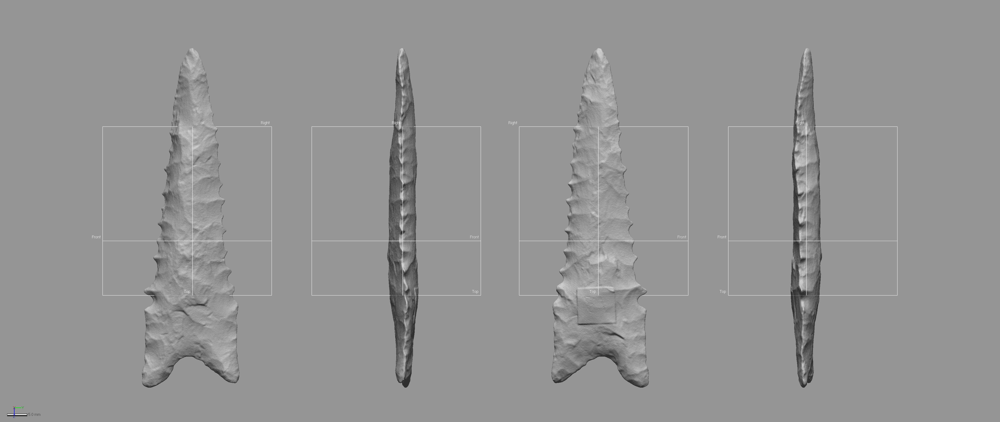
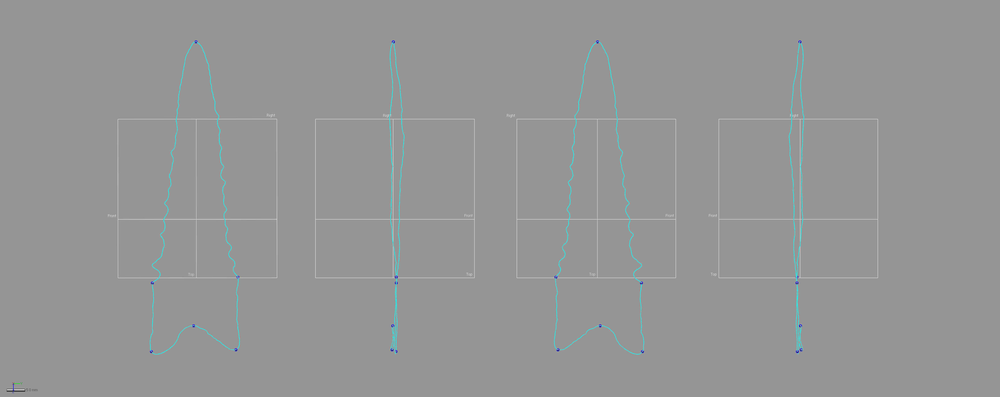

# Landmarking Protocol

This document includes supplemental materials for the article, "Article title here." The landmarking protocol outlined here was initially developed for an analysis of [Gahagan bifaces](https://github.com/aksel-blaise/gahaganmorph2/blob/master/analysis/landmarking-protocol.md) [@RN21001]. The goals of this study differ; however, the mechanics of the landmarking protocol are similar, and follow components of Dalton projectile morphology identified in previous studies (refs). _Geomagic Design X (Build Version 2020.0.1 [Build Number: 30])_ was used to generate a spline around the periphery of each biface, and to populate the landmarks and equidistant semilandmarks in a replicable manner using a suite of mathematically-defined criteria.

```{r figbev}

fig.cap="Dalton point KeilMangold13. \\label{figdalton}"
```

The goal of this effort was to increase both the precision and rigour of the study by including the z-dimension to capture morphological characteristics associated with axial twisting introduced through the general practices of knapping and beveling. While true that some landmarking protocols can be—and often are—recycled as new specimens are added, this particular research programme endeavours to achieve ever-greater accuracy and precision in each analytical iteration.

_This landmarking protocol was developed prior to running auto3dgm, and details the procedure for applying landmarks and equidistant semilandmarks; however, it may not reflect their actual placement on this specimen._

## Generating the spline

This effort enlists a spline extracted from the surface geometry of the mesh using the `extract contour curves` command, which is used to detect and extract 3D contour curves from high-curvature areas of the mesh. In reverse-engineering, `extract contour curves` is regularly employed as the first step in building a `patch network` that is used to create a surface. The extracted feature curve is rendered as a spline, and follows the highest curvature contours around the periphery of the lateral and basal edges, following the highly variable sinuous edge morphology around the entirety of the projectile. The remainder of the landmarking protocol is based upon this spline, which was subsequently split at six mathematically-defined locations.

```{r figspline}
knitr::include_graphics('images/extractspline.png')
fig.cap="Spline extracted along the highest contours of the Dalton point \\label{figspline}"
```

## Splitting the spline

_A few definitions are warranted before proceeding. `Reference geometries` are used in the assistance of creating other features. These include basic geometric entities, such as `planes`, `vectors`, `coordinates`, `points`, and `polygons`. A `reference point` is a virtual point and is used to mark a specific position on a model or in 3D space. A `reference plane` is a virtual plane that has a normal direction and an infinite size. A `reference plane` is not a surface body, and is used to create other features._ 

The characteristic points and tangents developed for this landmarking protocol were inspired by the work of Birkhoff [-@RN11786], which has been gainfully employed within the context of both ceramic [@RN11801;@RN11782;@RN11716;@RN20697] and lithic analyses [@RN11783;@RN21001]. The first landmark (LM1) is placed at the horizontal tangent on the tip of each Dalton point. The second through fifth splits (LM2 - LM5) occur at points of highest curvature, where LM2 is always placed on the right side of the projectile when oriented in 3D space following the alignment output of _auto3dgm_. To place the final landmark (LM6), a linear measurement was used to project a reference point equidistant between LM2 and LM3. The location of that point was leveraged in placing the reference plane used to cut the spline at the location of LM6.

## Spline split at location of LM1

The `horizontal tangent` is calculated by drawing a horizontal line above the tip of the biface using the tangent as a `common constraint`, and the horizontal as the `independent constraint`. To split the 3D spline at the location of the horizontal tangent, a `reference point` was inserted at the location of the `tangent` in the sketch (light blue point; below, left), followed by a `reference plane` (in white; below, left and right) using the `pick point and normal axis` function where the `reference point` (h-tangent) was used as the `pick point`, and the `Right plane` as the `normal axis` (below, left). The spline was then cut at the location where the `reference plane` intersected with the spline (below image, right).

```{r figlm1}
knitr::include_graphics('images/lm1.png')
fig.cap="Identify horizontal tangent, insert reference point and reference plane (left). Use reference plane to cut spline at the location of the horizontal tangent (right). \\label{figlm1}"
```

## Spline split at locations of LM2 - LM3

The point of highest curvature on either side of the basal edge was calculated using the `curvature function` in the Accuracy Analyser. This function displays the curvature flow as a continuous colour plot across the area of the curve. In this instance, _curvature_ is defined as the amount by which a geometric shape deviates from being flat or straight in the case of a line. The curvature is displayed in different colours according to the local radius, and is calculated in only one direction (U or V) along the curve. Using this tool, the two points of highest curvature were located between the basal and lateral edges on either side of each projectile where the local radius measure was largest. The alignment and orientation of each biface was dictated by the _auto3dgm_ output, and the landmarking protocol follows the mesh orientation, where LM2 was always placed on the right side of the basal edge, and LM3 on the left.

```{r figcurve}
knitr::include_graphics('images/splinesplit1.png')
fig.cap="Identify points of hightest curvature (light blue) at left/right intersection of lateral and basal edges. \\label{figsplinesplitlr}"
```

## Spline split at locations of LM4 - LM5

The point of highest curvature at the intersection of the blade and base was also calculated using the `curvature function` in the Accuracy Analyser. Using this tool, the two points of highest curvature were located between the blade and base on either side of each projectile where the local radius measure was largest. The alignment and orientation of each biface was dictated by the _auto3dgm_ output, and the landmarking protocol follows the mesh orientation in that figure, where LM4 was always placed on the right side of the basal edge, and LM5 on the left.

```{r figcurve2}
knitr::include_graphics('images/splinesplit2.png')
fig.cap="Identify points of hightest curvature (light blue) at left/right intersection of blade and base. \\label{figsplinesplitlr}"
```

## Spline split at location of LM6

One additional landmark (LM6) was placed at the centre of the base. The location of this landmark was identified by calculating the linear distance between LM2 and LM3, and projecting a `reference point` (ctrl-div; below) equidistant between the two. A `reference plane` was added using the ctrl-div as the pick point, and the `Right plane` as the `normal axis`. The spline was then split at the intersection of the `reference plane` and the basal spline.

```{r figlm4}
knitr::include_graphics('images/lm6.png')
fig.cap="Calculate linear distance between LM2 and LM3, insert reference plane coplanar to Right plane equidistant between LM2 and LM3, and use the reference plane to cut the spline.  \\label{figlm6}"
```

## Final spline

Through the preceding protocol, the initial spline was split into four discrete splines. These splines articulate with components of projectile morphology that can be compartmentalised in the subsequent analyses. The primary analytical gain achieved through this exercise is the requisite foundation needed to carry out replicable analyses of Dalton point morphology in three dimensions, further increasing the precision of the geometric morphometric analysis.

```{r figsplinesplit-frbl}

fig.cap="Result of spline splits include six discrete splines, each articulating with a region of analytical interest. \\label{figsplinesplit-frbl}"
```

## Landmark and semilandmark placement

Landmarks 1-6 were placed at the location of each spline split (blue points, below). Equidistant semilandmarks were then added to each of the four splines; 10 between LM1 and LM4, three between LM4 and LM2, three between LM2 and LM6, three between LM6 and LM3, three between LM3 and LM5, and 10 between LM5 and LM1.

```{r figlmslm-all}

fig.cap="Mesh with landmarks (blue) and equidistant semilandmarks (white) applied.  \\label{figlmslm-all}"
```

The rigourous protocol used in the application of landmarks and semilandmarks aids in capturing morphological variation that articulates with differing patterns of reduction and axial twisting introduced by knappers through the general practice of knapping and beveling. Thus, this constellation of landmarks and semilandmarks provides for greater precision in the geometric morphometric analysis, marking a substantive advancement in those analytical protocols used to achieve a more complete and holistic analysis of Dalton point morphology.

## Acknowledgments

I extend my gratitude to Christian S. Hoggard and David K. Thulman for their thoughtful comments and constructive criticisms on the draft of this landmarking protocol, which was originally developed for the study of [Gahagan bifaces](https://github.com/aksel-blaise/gahaganmorph2/blob/master/analysis/landmarking-protocol.md), and is extended here to an analysis of Dalton point morphology. This iteration of the landmarking protocol was developed using the [digit3DLand](https://github.com/morphOptics/digit3DLand) package in R (code available in Github repository); however, the capacity to populate a replicable suite of reference geometry across the sample in _Geomagic Design X_ made it a better option for the dynamic design process. Definitions of reference geometries and _Design X_ features described in this protocol are paraphrased from the reference manual.
