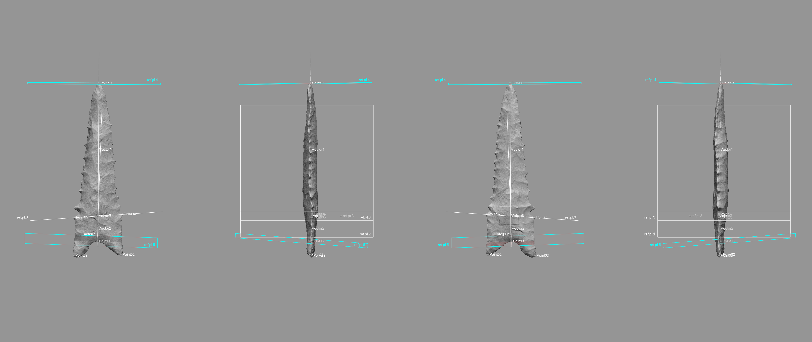
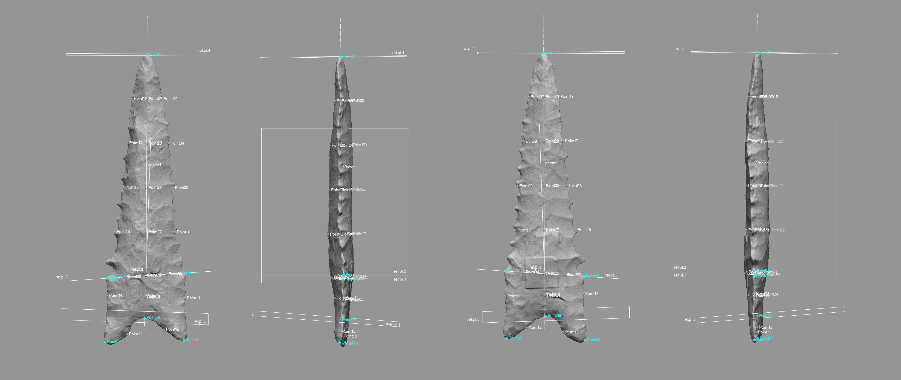

# Landmarking Protocol 3d3

The results of the elliptical Fourier analysis (EFA) provided useful insights that aided in developing the 3D landmarking protocol used in this study.

1. For the in/out of Heartland hypothesis, there is a significant difference in plan view shape that is driven by the lateral edges along the left/right sides of the biface. This suggests that two of the equidistant semilandmarks employed in the landmarking configuration (sLMs 12 and 13) may not be necessary if the driver of the morphological difference that occurs in/out of the Heartland rests along the lateral edge (see section 1.7 in the previous chapter).
2. For the Heartland regions (hreg) hypothesis, the lateral edges along the left/right sides of the biface appear to drive the morphological differences once more. In one case (Heartland vs. Northern Periphery), the difference is significant, and driven by one side of the base, but primarily by the left/right lateral edges. The only other significant difference is between the Heartland vs. Interior, with the heartland being represented by lateral edges that are generally narrower than those of the interior. The Interior vs. Northern Periphery does not differ significantly; however, the mean shapes indicate that it is basal---not blade---morphology that may differentiate those populations. This outcome also suggests that sLMs 12 and 13 may not be warranted
3. The comparison of beveled vs. not beveled bifaces yielded a significant difference, which is driven (once more) by the left/right lateral edges, and not the distal end of the base. This suggests, once more, that sLMs 12 and 13 are not needed for the analysis.
4. The only significant difference between the bevel types was the comparison of alternate vs. no beveling. Mean shapes indicate that this difference is driven by the left/right lateral edges, and not by the morphology of the distal portion of the base. The mean shapes for unifacial bimarginal vs. no beveling are surprisingly similar in plan view, and the difference between alternate vs. unifacial bimarginal is driven---once more---by left/right lateral edges from the base to the tip of the point, and not the distal end of the base.

Of those landmark and semilandmark configurations included in the draft sketches for this project, it is sLMs 12 and 13 that appear to contribute least to the formal tests of those hypotheses tested using EFA. They are, however, still included in the 3D landmarking protocol since the z-axis may provide additional useful data, particularly for analyses of bilateral asymmetry (see Chapter 5).

## Overview

Landmarking protocol 3d3 (LM3d3) represents a substantive advancement from [LM3d1](https://github.com/aksel-blaise/gahaganmorph2/blob/master/analysis/landmarking-protocol.md) [@RN21001] and was modified from the [LM3d2](https://aksel-blaise.github.io/gahaganmorph3/landmarking-protocol.html) protocol developed for the analysis of Gahagan bifaces. The principal difference between [LM3d2](https://aksel-blaise.github.io/gahaganmorph3/landmarking-protocol.html) and LM3d3 is that the projectiles analysed using [LM3d2](https://aksel-blaise.github.io/gahaganmorph3/landmarking-protocol.html) are lanceolate bifaces, and that landmarking protocol was not designed to capture the variation in basal morphology exhibited by stemmed (Dalton) projectile points. Like [LM3d1](https://github.com/aksel-blaise/gahaganmorph2/blob/master/analysis/landmarking-protocol.md) and [LM3d2](https://aksel-blaise.github.io/gahaganmorph3/landmarking-protocol.html), LM3d3 uses the topology of the 3D mesh that articulates with the prehistoric design of each projectile point to construct a suite of `reference geometry` used to apply semilandmarks in a replicable manner. The result is a landmarking protocol that provides for the improved characterisation of whole-object morphology, which can be subset to analyse variability associated with specific _plan_, _profile_, and _cross-section_ components. It also provides those data points needed to investigate questions of _directional asymmetry_, differences in front/back morphology, morphological integration between blade and basal morphology, and the morphology of broken, fractured, or otherwise incomplete specimens that permeate the archaeological record.

```{r lm3d3.landmarkx, out.width = "100%", dpi = 300, echo=TRUE, warning=FALSE, fig.cap="_**Figure 1. Coordinates of landmarks populated using the [LM3d1](https://github.com/aksel-blaise/gahaganmorph2/blob/master/analysis/landmarking-protocol.md) protocol serve as the basis for LM3d3.**_"}
knitr::include_graphics('images/landmarks.png')
```

Like its' predecessors, LM3d3 was initially designed using the [`digit3DLand`](https://github.com/morphOptics/digit3DLand) package in R. When the draft protocol was completed, design of the landmarking protocol shifted to [Geomagic Design X](https://www.3dsystems.com/software/geomagic-design-x) _(Build Version 2020.0.2 [Build Number: 55])_, where the workflow was modified to include those elements of `reference geometry` that articulate with the prehistoric design attributes of each projectile point.

The goal of this effort was to increase both the precision and rigour of the study by including the Z-dimension to capture those shape characteristics associated with axial twisting, introduced by knappers through the practice of beveling ([LM3d1](https://github.com/aksel-blaise/gahaganmorph2/blob/master/analysis/landmarking-protocol.md)) [@RN21001]. The addition of cross-sections was needed to better characterise whole-object morphology, providing for the possibility of subsampling the semilandmarks to explore the contribution of specific cross-sections or profiles ([LM3d2](https://aksel-blaise.github.io/gahaganmorph3/landmarking-protocol.html)). LM3d3 includes an additional cross section at the blade/base transition, allowing for tests of morphological integration. While true that some landmarking protocols can be—--and often are—--recycled as new specimens are added, this particular research programme endeavours to achieve ever-greater accuracy and precision in each analytical iteration.

## Generating the peripheral (plan view) spline

This effort begins with a spline extracted from the surface geometry of the mesh using the `extract contour curves` command. In reverse-engineering, `extract contour curves` is regularly employed as the first step in building a `patch network` used to create a surface. The extracted feature curve is rendered as a spline, and follows the highest curvature contours around the periphery of the lateral and basal edges, following the highly variable sinuous edge morphology around the entirety of the projectile. The remainder of the landmarking protocol is based upon this spline, which was subsequently split at six mathematically-defined locations.

```{r lm3d3.figspline, out.width = "100%", dpi = 300, echo=TRUE, warning=FALSE, fig.cap="_**Figure 2. Spline extracted along the highest contours of the Dalton point.**_"}
knitr::include_graphics('images/extractspline.png')
```

## Splitting the spline

_`Reference geometries` are used in the assistance of creating other features. These include basic geometric entities, such as `planes`, `vectors`, `coordinates`, `points`, and `polygons`. A `reference point` is a virtual point and is used to mark a specific position on a model or in 3D space. A `reference plane` is a virtual plane that has a normal direction and an infinite size. A `reference plane` is not a surface body, and is used to create other features._ 

The characteristic points and tangents developed for this landmarking protocol were inspired by the work of Birkhoff [-@RN11786], which has been gainfully employed within the context of both ceramic [@RN11801;@RN11782;@RN11716;@RN20697] and lithic analyses [@RN11783;@RN21001]. The first landmark (LM1) is placed at the horizontal tangent on the tip of each Dalton point. The second through fifth splits (LMs 02 - 05) occur at points of highest curvature, where LM 02 is always placed on the right side of the projectile following the application of the `reference vectors`. To place the final landmark (LM 06), a linear measurement was used to project a `reference point` equidistant between LM 02 and LM 03. The location of that point was leveraged in placing the `reference plane` used to cut the spline at the location of LM 06.

## Spline split at location of LM 01

The `horizontal tangent` is calculated by drawing a horizontal line above the tip of the biface using the tangent as a `common constraint`, and the horizontal as the `independent constraint`. To split the 3D spline at the location of the horizontal tangent, a `reference point` was inserted at the location of the `tangent` in the sketch (light blue point; below, left), followed by a `reference plane` (in white; below, left and right) using the `pick point and normal axis` function where the `reference point` (h-tangent) was used as the `pick point`, and the `Right plane` as the `normal axis` (below, left). The spline was then cut at the location where the `reference plane` intersected with the spline (below image, right).

```{r lm3d3.figlm1, out.width = "100%", dpi = 300, echo=TRUE, warning=FALSE, fig.cap="_**Figure 3. Identify horizontal tangent, insert `reference point` and `reference plane` (left). Use `reference plane` to cut spline at the location of the horizontal tangent (right).**_"}
knitr::include_graphics('images/lm1.png')
```

## Spline split at locations of LM 02 and LM 03

The point of highest curvature on either side of the basal edge was calculated using the `curvature` function in the Accuracy Analyser. This function displays the curvature flow as a continuous colour plot across the area of the curve. In this instance, _curvature_ is defined as the amount by which a geometric shape deviates from being flat or straight in the case of a line. Curvature is displayed in different colours according to the local radius, and calculated in only one direction (U or V) along the curve. Using this tool, the two points of highest curvature were located between the basal and lateral edges on either side of each projectile where the local radius measure was largest. The orientation of each biface was dictated by the _auto3dgm_ output in [LM3d1](https://github.com/aksel-blaise/gahaganmorph2/blob/master/analysis/landmarking-protocol.md) and [LM3d2](https://aksel-blaise.github.io/gahaganmorph3/landmarking-protocol.html); however, LM3d3 enlists a novel method to determine which side of the projectile is associated with LM 02 and LM03 using `reference vectors`.

```{r lm3d3.figcurve, out.width = "100%", dpi = 300, echo=TRUE, warning=FALSE, fig.cap="_**Figure 4. Identify points of hightest curvature (light blue) at left/right intersection of lateral and basal edges.**_"}
knitr::include_graphics('images/splinesplit1.png')
```

## Spline split at locations of LM 04 and LM 05

The point of highest curvature at the intersection of the blade and base was also calculated using the `curvature` function in the Accuracy Analyser. Using this tool, the two points of highest curvature were located between the blade and base on either side of each projectile where the local radius measure was largest. The orientation of each projectile was dictated by `reference vectors`, and the landmarking protocol follows the mesh orientation in that figure, where LM 04 was always placed on the right side of the basal edge, and LM 05 on the left.

```{r lm3d3.figcurve2, out.width = "100%", dpi = 300, echo=TRUE, warning=FALSE, fig.cap="_**Figure 5. Identify points of hightest curvature (light blue) at left/right intersection of blade and base.**_"}
knitr::include_graphics('images/splinesplit2.png')
```

## Spline split at location of LM 06

One additional landmark (LM 06) was placed at the centre of the base. The location of this landmark was identified by calculating the linear distance between LM 02 and LM 03, and projecting a `reference point` (ctrl-div; below) equidistant between the two. A `reference plane` was added using the ctrl-div as the pick point, and the `Right plane` as the `normal axis`. The spline was then split at the intersection of the `reference plane` and the basal spline.

```{r lm3d3.figlm4, out.width = "100%", dpi = 300, echo=TRUE, warning=FALSE, fig.cap="_**Figure 6. Calculate linear distance between LM 02 and LM 03, insert `reference plane` coplanar to Right plane equidistant between LM 02 and LM 03, and use the `reference plane` to cut the spline.**_"}
knitr::include_graphics('images/lm6.png')
```

## Peripheral (plan view) spline

Through the preceding protocol, the initial spline was split into six discrete splines. These splines articulate with components of projectile morphology that can be compartmentalised in the analyses. The primary analytical gain achieved through this exercise is the requisite foundation needed to carry out replicable analyses of Dalton point morphology in three dimensions, further increasing the precision of the geometric morphometric analysis.

```{r lm3d3.figsplinesplit-frbl, out.width = "100%", dpi = 300, echo=TRUE, warning=FALSE, fig.cap="_**Figure 7. Result of spline splits include six discrete splines, each articulating with a region of analytical interest. The coordinates of each spline split are known, and used to place the landmarks.**_"}
knitr::include_graphics('images/splinesplit-frbl.png')
```

## Reference vectors and ref.pt.0

The fundamental components of `reference geometry` used to create LM3d3 consist of three `reference vectors`, and a single `reference point` (ref.pt.0), placed equidistant between LM 04 and LM 05. The three `reference vectors` were placed between LM 01 and ref.pt.0 (Vector 1), ref.pt.0 and LM 06 (Vector 2), and LMs 04 and 05 (Vector 3).  These three `reference vectors` serve as the foundation for the suite of `reference geometry` used to place the semilandmarks.

```{r lm3d3.vectors, out.width = "100%", dpi = 300, echo=TRUE, warning=FALSE, fig.cap="_**Figure 8. `Reference vectors` placed between LMs 01 and ref.pt.0 (left), ref.pt.0 and LM 06 (center), and between LMs 04 and 05 (right).**_"}
knitr::include_graphics('images/lm3d3.vectors.png')
```

The measure of the angle between Vector 1 (blade) and Vector 2 (base) may have additional utility in lithic studies as an orthogonal metric associated with knapper skill, where greater skill is represented by an arbitrary range of angles nearest---and lesser, furthest away from---180 degrees. A second similar measure could be collected between Vectors 1 and 2 in comparison with Vector 3. Collection of these metrics from a 3D mesh in computer aided design (CAD) software adds an increased element of precision in comparison with a goniometer, and serves as an example of the added analytical value that can be extracted from this novel landmarking protocol.

Prior to the addition of the `reference vectors`, the location of LMs 02 through 05 are considered arbitrary. Previous iterations of this landmarking protocol have relied upon `auto3dgm` to provide principal alignments that dictate which LMs are placed on the left/right side of the biface or projectile. In this protocol, the side of the projectile with the lowest orthogonal measure between Vector 1 and Vector 2 will be on the left, meaning that from the investigator's view, the projectiles will curve, bend, or lean slightly---or in some cases more dramatically---to the left from base to tip.

## Reference planes and points

Five `reference planes` provide the framework needed to populate the semilandmarks. Admittedly, the logic associated with placement may seem curious at this point; however, the utility of these `reference planes` will become clear in subsequent sections.

### Placement of ref.pl.1

The first `reference plane` (ref.pl.1) was placed between LM 01 and ref.pt.0, bisecting the blade of the projectile along the mid-line. The method of placement enlists a `reference point` (ref.pt.1), inserted at the intersection of the three `reference vectors`. It has the same x,y position as ref.pt.0, but the coordinates of ref.pt.1 were altered to relocate it 15 mm from the vector in the direction of the Z-axis. The `pick point and coplanar` function was used to place ref.pl.1 coplanar to the first `reference vector`, and in the direction of ref.pt.1.

```{r lm3d3.ref.pl.1, out.width = "100%", dpi = 300, echo=TRUE, warning=FALSE, fig.cap="_**Figure 9. Placement of ref.pl.1, and temporary location of ref.pt.1 15mm from Vector 1, and equidistant between LM 01 and ref.pt.0 on the blade of the projectile.**_"}
knitr::include_graphics('images/lm3d3.ref.pl.1.png')
```

### Placement of ref.pl.2

The second `reference plane` (ref.pl.2) was placed between ref.pt.0 and LM 06, bisecting the base of the projectile along the mid-line. The method of placement for ref.pl.2 follows the same protocol described in the application of ref.pl.1, and enlists the same `reference point` (ref.pt.1).

```{r lm3d3.ref.pl.2, out.width = "100%", dpi = 300, echo=TRUE, warning=FALSE, fig.cap="_**Figure 10. Placement of ref.pl.2, and temporary location of ref.pt.2 15 mm from Vector 2, and equidistant between ref.pt.0 and LM 06 on the base of the projectile.**_"}
knitr::include_graphics('images/lm3d3.ref.pl.2.png')
```

### Placement of ref.pl.3

The third `reference plane` (ref.pl.3) was placed between LMs 04 and 05, and bisects the projectile at the blade/base intersection. The method of placement for ref.pl.3 follows the same protocol described in the application of ref.pl.1, and enlists the same `reference point` (ref.pt.1), which was deleted following the placement of ref.pl.3.

```{r lm3d3.ref.pl.3, out.width = "100%", dpi = 300, echo=TRUE, warning=FALSE, fig.cap="_**Figure 11. Placement of ref.pl.3, and temporary location of ref.pt.3 15 mm from Vector 3, and equidistant between LMs 04 and 05 at the intersection of the blade and base.**_"}
knitr::include_graphics('images/lm3d3.ref.pl.3.png')
```

### Placement of ref.pl.4 and ref.pl.5

The fourth (ref.pl.4) and fifth (ref.pl.5) `reference planes` were placed using the `pick point and normal` function at the intersections of the first `reference vector` and LMs 01 and 06. 

```{r lm3d3.ref.pl.4-5, out.width = "100%", dpi = 300, echo=TRUE, warning=FALSE, fig.cap="_**Figure 12. Placement of ref.pl.4 (top) and ref.pl.5 (bottom).**_"}

```

## Sectioning the mesh

The `reference geometry` described above was enlisted in the following three-step method developed to produce one cross-section at the blade/base intersection, four cross-sections between the blade/base intersection and LM 01, and one cross-section between the blade/base intersection and LM 06.

### Sectioning the blade/base intersection

To section the blade/base intersection, a single section was inserted using ref.pl.2, resulting in a single cross-section that bisects the projectile between LMs 04 and 05.

```{r lm3d3.section1, out.width = "100%", dpi = 300, echo=TRUE, warning=FALSE, fig.cap="_**Figure 13. Placement of the first section, bisecting the mesh along ref.pl.2.**_"}
knitr::include_graphics('images/lm3d3.section1.png')
```

### Sectioning the blade and base

Six equidistant sections were placed between LM 01 and ref.pt.0, and the two sections at the locations of LM 01 and ref.pt.0 were deleted. Three equidistant sections were placed between LM 06 and ref.pt.0. The sections intersecting with ref.pt.0 and LM 06 were deleted. Subsequent to placing the sections, ref.pt.0 was itself deleted.

```{r lm3d3.section3, out.width = "100%", dpi = 300, echo=TRUE, warning=FALSE, fig.cap="_**Figure 14. Placement of the two equidistant sections between LM 06 and ref.pt.3.**_"}
knitr::include_graphics('images/lm3d3.all.sections.png')
```

## Splitting the sections

The `curvature` function was employed to split each curves at the locations of highest curvature along the lateral edge. This function was detailed above, and in the application of LMs 02, 03, 04, and 05 in [LM3d1](https://github.com/aksel-blaise/gahaganmorph2/blob/master/analysis/landmarking-protocol.md). 

A `reference plane` (ref.pl.1) was then used to cut each of the four curves along the mid-line of the blade where it intersects with the curves. A second `reference plane` (ref.pl.2) was used to cut the single basal curve and the curve between LMs 04 and 05. Since ref.pt.0 was used to generate ref.pl.1 and ref.pl.2, either of the `reference planes` could be used to cut the curve between LMs 04 and 05.

```{r lm3d3.split, out.width = "100%", dpi = 300, echo=TRUE, warning=FALSE, fig.cap="_**Figure 15. Each section was split at the points of highest curvature along the lateral edges, then along the mid-line at the intersection of the curve and ref.pl.1 (for the blade), and ref.pl.2 (for the base).**_"}
knitr::include_graphics('images/lm3d3.split.sections.png')
```

## LM3d3: Configuration 1

LM3d3: Configuration 1 (LM3d3.c1) was used to assess the three hypotheses included in this pilot study. Semilandmarks 07 - 18 were applied around the lateral edges, and sLMs 12 and 13 between LMs 02, 06, and 03 using the curve constructed in [LM3d1](https://github.com/aksel-blaise/gahaganmorph2/blob/master/analysis/landmarking-protocol.md). Semilandmarks 19 - 30 articulate with the mid-line between LMs 01 and 06, and sLMs 31 - 34 were placed along the curve that articulates with ref.pl.3 equidistant between the lateral edge and midline. .

The result is a landmark configuration that can be subset in numerous ways (plan, profile, cross-section, front/back, left/right, blade/base, etc.), using a suite of design-based attributes to achieve maximum utility for analysts of lithic morphology.

```{r lm3d3.semi, out.width = "100%", dpi = 300, echo=TRUE, warning=FALSE, fig.cap="_**Figure 16. Landmarks (blue), semilandmarks (white), curves (orange), and splits (blue) used for LM3d3.**_"}
knitr::include_graphics('images/lm3d3.semi.png')
```

Based upon knowledge garnered from running `LaSEC` [@RN28913] on [LM3d1](https://github.com/aksel-blaise/gahaganmorph2/blob/master/analysis/landmarking-protocol.md), this landmarking protocol would likely be oversampled if it included additional landmarks on the cross-sections; however, it can be adapted to include as many or as few landmarks and semilandmarks needed to address the research question.

```{r lm3d3.slm, out.width = "100%", dpi = 300, echo=TRUE, warning=FALSE, fig.cap="_**Figure 17. Landmarks (blue), semilandmarks (white), and `reference geometry` used in LM3d3.**_"}

```

## References