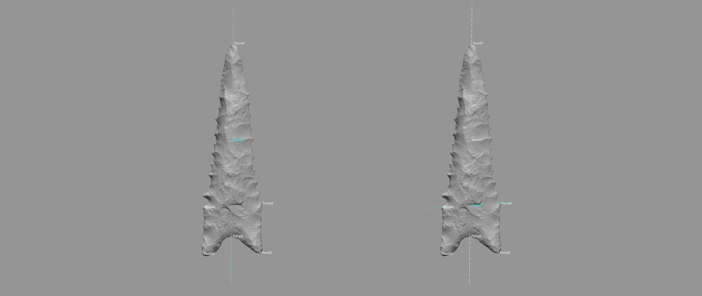
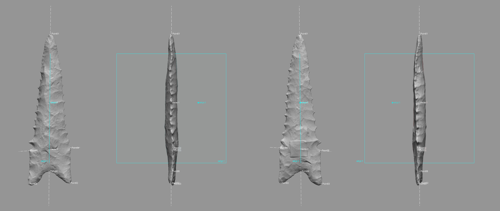
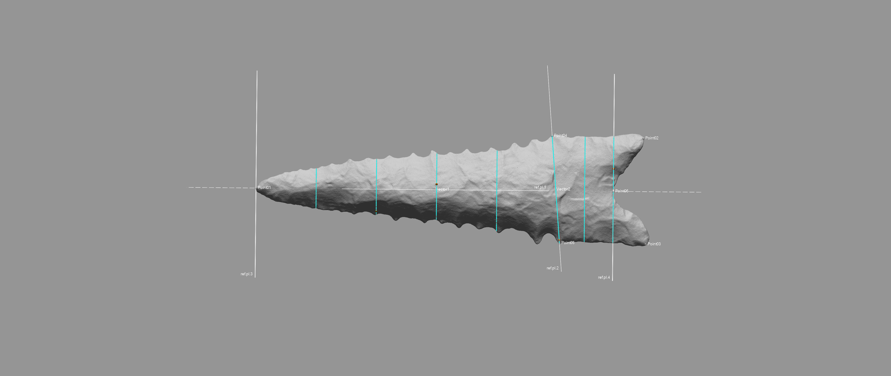
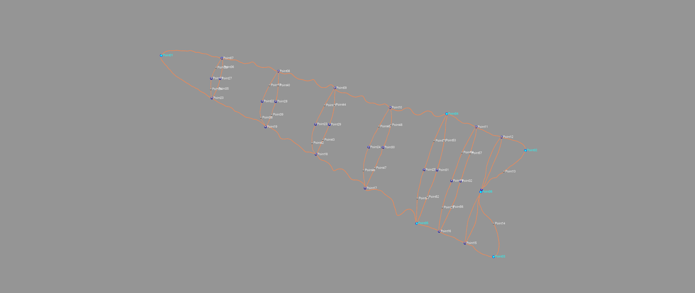
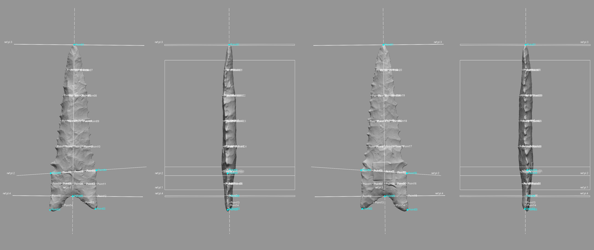

# Landmarking Protocol 3d2

Landmarking protocol 3d2 (LM3d2) represents a significant advancement from LM3d1. All landmarks (LMs) from LM3d1 were retained; however, all semilandmarks (SLMs) were discarded. The landmarking protocol that follows employs the mesh topology and landmark coordinates as the basis for a suite of `reference geometry`, as well as the insight from the application of `LaSEC` to LM3d1. The `reference geometry` was employed in the creation of a novel landmarking protocol that builds directly upon LM3d1 to achieve a novel configuration of semilandmarks. The result is that LM3d2 provides for the improved characterisation of whole-object morphology, and can be subset to explore morphological variation in _plan_, _profile_, and _cross-section_ morphology that articulates with the blade and base of the projectile. While not included in the current analysis, LM3d2 also provides the means for testing hypotheses associated with _directional asymmetry_.

```{r lm3d2.landmarks, out.width = "100%", dpi = 300, echo=TRUE, warning=FALSE, fig.cap="Landmarks from LM3d1 serve as the basis for LM3d2."}
knitr::include_graphics('images/landmarks.png')
```

## Reference vectors

The first components of `reference geometry` used in LM3d2 include two `reference vectors`. These were placed between LMs 01 and 06, and between LMs 04 and 05. The `reference vectors` serve as the basis for the `reference geometry` needed to place the semilandmarks.

```{r lm3d2.vectors, out.width = "100%", dpi = 300, echo=TRUE, warning=FALSE, fig.cap="Reference vectors placed between LMs 01 and 06 (left), and between LMs 04 and 05 (right)."}

```

## Reference planes and points

Four `reference planes` provide the requisite framework needed to populate the semilandmarks. Admittedly, the logic associated with placement may seem curious at this point; however, the utility of the `reference planes` will become clear in subsequent sections.

### Placement of ref.pl.1

The first `reference plane` (ref.pl.1) was placed between LMs 01 and 06, and bisects the projectile along the midline. The method of placement enlists a `reference point` (ref.pt.1), which was inserted along the first `reference vector`, and is located at a position equidistant between LMs 01 and 06. The location of the point was then altered to move it 15 mm from the vector in the direction of the Z-axis. The `pick point and coplanar` function was then used to place the plane coplanar to the first `reference vector`, and in the direction of ref.pt.1. Following placement of ref.pl.1, ref.pt.1 was deleted.

```{r lm3d2.ref.pl.1, out.width = "100%", dpi = 300, echo=TRUE, warning=FALSE, fig.cap="Placement of ref.pl.1, and location of ref.pt.1."}

```

### Placement of ref.pl.2

The second `reference plane` (ref.pl.2) was placed between LMs 04 and 05, and bisects the projectile at the blade/base intersection. The method of placement for ref.pl.2 follows the same protocol described in the previous section, and the `reference point` (ref.pt.2) was deleted following the placement of ref.pl.2.

```{r lm3d2.ref.pl.2, out.width = "100%", dpi = 300, echo=TRUE, warning=FALSE, fig.cap="Placement of ref.pl.2, and location of ref.pt.2."}
knitr::include_graphics('images/lm3d2.ref.pl.2.png')
```

### Placement of ref.pl.3 and ref.pl.4

The third (ref.pl.3) and fourth (ref.pl.4) `reference planes` were placed using the `pick point and normal` function at the intersections of the first `reference vector` and LMs 01 and 06. 

```{r lm3d2.ref.pl.3-4, out.width = "100%", dpi = 300, echo=TRUE, warning=FALSE, fig.cap="Placement of ref.pl.3 (top) and ref.pl.4 (bottom)."}
knitr::include_graphics('images/lm3d2.ref.pl.3-4.png')
```

## Sectioning the mesh

The `reference geometry` described above was enlisted in the following three-step protocol developed to produce one cross-section at the blade/base intersection, four cross-sections between the blade/base intersection and LM 01, and one cross-sections between the blade/base intersection and LM 06, to include one cross-section that articulates with the location of LM 06. 

### Sectioning the blade/base intersection

To section the blade/base intersection, a single section was inserted using ref.pl.2, resulting in a single cross-section that bisects the projectile between LMs 04 and 05.

```{r lm3d2.section1, out.width = "100%", dpi = 300, echo=TRUE, warning=FALSE, fig.cap="Placement of the first section, bisecting the mesh along ref.pl.2."}
knitr::include_graphics('images/lm3d2.section1.png')
```

### Sectioning the blade and base

A single `reference point` (ref.pt.3) was placed equidistant along the `reference vector` between LMs 04 and 05. Six equidistant sections were then placed between LM 01 and ref.pt.3, and the two sections at the locations of LM 01 and ref.pt.3 were deleted. Three equidistant sections were placed between LM 06 and ref.pt.3. The section intersecting with ref.pt.3 was deleted. Subsequent to placing the sections, ref.pt.3 was itself deleted.

```{r lm3d2.section3, out.width = "100%", dpi = 300, echo=TRUE, warning=FALSE, fig.cap="Placement of the two equidistant sections between LM 06 and ref.pt.3."}

```

## Splitting the sections

The `curvature` function was employed to split the spline at the location of highest curvature. This function was detailed in the application of LMs 02, 03, 04, and 05 in LM3d1. Each section was then split at the point of highest curvature along the lateral margins. The `reference plane` ref.pl.1 was then used to split each curve along the mid-line where it intersected.

```{r lm3d2.split, out.width = "100%", dpi = 300, echo=TRUE, warning=FALSE, fig.cap="Each section was split at the points of highest curvature along the lateral edges, then along the mid-line at the intersection of the curve and ref.pl.1."}
knitr::include_graphics('images/lm3d2.split.sections.png')
```

## Applying the semilandmarks

Semilandmarks 07 - 20 were applied around the lateral edges, and sLMs 13 and 14 employ the spline between LMs 02, 06, and 03 that was constructed in LM3d1. Semilandmarks 21 - 32 articulate with the mid-line between LMs 01 and 06. Additional sLMs (33 - 57) were placed on each section equidistant between those sLMs defined by the splits described above.

The result is a landmark configuration that can be subset in numerous ways (plan, profile, cross-section, left/right, front/back, etc.), and was designed to achieve maximum utility to analysts of lithic morphology.

```{r lm3d2.semi, out.width = "100%", dpi = 300, echo=TRUE, warning=FALSE, fig.cap="Landmarks (blue), semilandmarks (white), curves (orange), and splits (blue) used for LM3d2."}

```

This landmarking protocol is likely oversampled; however, it can also be subsampled to include only those landmarks and semilandmarks that articulate with the plan and profile (LMs 01 - 06, and sLMs 07 - 32), depending upon the research question. 

```{r lm3d2.slm, out.width = "100%", dpi = 300, echo=TRUE, warning=FALSE, fig.cap="Landmarks (blue), semilandmarks (white), and `reference geometry` used for LM3d2."}

```

## Acknowledgments

This landmarking protocol grew out of my efforts to analyse Caddo ceramic and Gahagan biface morphology in the American Southeast. I express my gratitude to colleagues past and present for providing the comments, constructive criticisms, and motivation needed to continue this pursuit of a rigorous and replicable design-based landmarking protocol.
