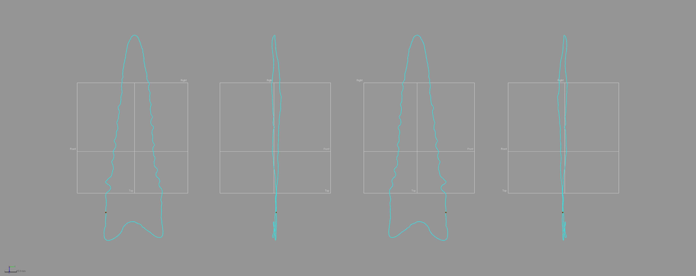
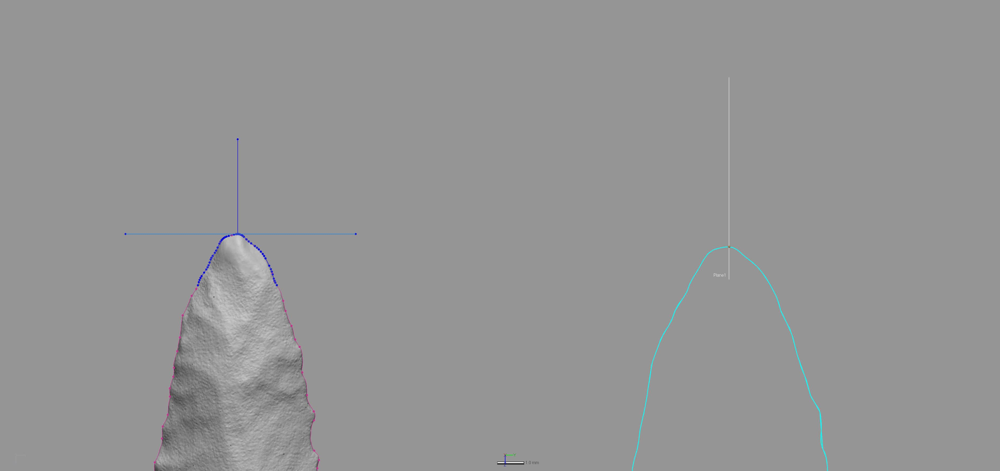

# Landmarking Protocol 3d2

Landmarking protocol 3d2 (LM3d2) represents a significant advancement from LM3d1. All landmarks (LMs) from LM3d1 were retained; however, all semilandmarks (SLMs) were discarded. The landmarking protocol that follows uses mesh topology paired with landmark coordinates as the foundation for a suite of `reference geometry`, which was combined with insight garnered from the application of `LaSEC` to LM3d1. The `reference geometry` was employed in constructing a novel landmarking protocol that builds directly upon LM3d1 to achieve a rigorous and replicable configuration of semilandmarks. The result is a landamrking protocol that provides for the improved characterisation of whole-object morphology, and that can be subset to explore morphological variation in _plan_, _profile_, and _cross-section_ morphology. It also provides those data points needed to investigate questions of _directional asymmetry_, differences in front/back morphology, and morphological integration in blade/base morphology.

```{r lm3d2.landmarks, out.width = "100%", dpi = 300, echo=TRUE, warning=FALSE, fig.cap="Landmarks from LM3d1 serve as the basis for LM3d2."}
knitr::include_graphics('images/landmarks.png')
```

Geomagic Design X _(Build Version 2020.0.1 [Build Number: 30])_ was used to generate a spline around the periphery of each biface, and to populate the landmarks and semilandmarks in a rigorous and replicable manner using `reference geometry` that articulates with the specific design attributes of each point.

The goal of this effort was to increase both the precision and rigour of the study by including the Z-dimension to capture morphological characteristics associated with axial twisting introduced by knappers through beveling. While true that some landmarking protocols can be—--and often are—--recycled as new specimens are added, this particular research programme endeavours to achieve ever-greater accuracy and precision in each analytical iteration.

_**This landmarking protocol was developed prior to running auto3dgm, and details the procedure for applying landmarks and equidistant semilandmarks; however, it may not reflect their actual placement on this specimen.**_

## Generating the peripheral (plan view) spline

This effort begins with a spline extracted from the surface geometry of the mesh using the `extract contour curves` command. In reverse-engineering, `extract contour curves` is regularly employed as the first step in building a `patch network` used to create a surface. The extracted feature curve is rendered as a spline, and follows the highest curvature contours around the periphery of the lateral and basal edges, following the highly variable sinuous edge morphology around the entirety of the projectile. The remainder of the landmarking protocol is based upon this spline, which was subsequently split at six mathematically-defined locations.

```{r lm3d2.figspline, out.width = "100%", dpi = 300, echo=TRUE, warning=FALSE, fig.cap="Spline extracted along the highest contours of the Dalton point."}

```

## Splitting the spline

_`Reference geometries` are used in the assistance of creating other features. These include basic geometric entities, such as `planes`, `vectors`, `coordinates`, `points`, and `polygons`. A `reference point` is a virtual point and is used to mark a specific position on a model or in 3D space. A `reference plane` is a virtual plane that has a normal direction and an infinite size. A `reference plane` is not a surface body, and is used to create other features._ 

The characteristic points and tangents developed for this landmarking protocol were inspired by the work of Birkhoff [-@RN11786], which has been gainfully employed within the context of both ceramic [@RN11801;@RN11782;@RN11716;@RN20697] and lithic analyses [@RN11783;@RN21001]. The first landmark (LM1) is placed at the horizontal tangent on the tip of each Dalton point. The second through fifth splits (LMs 02 - 05) occur at points of highest curvature, where LM2 is always placed on the right side of the projectile when oriented in 3D space following the alignment output of _auto3dgm_. To place the final landmark (LM6), a linear measurement was used to project a reference point equidistant between LM 02 and LM 03. The location of that point was leveraged in placing the reference plane used to cut the spline at the location of LM6.

## Spline split at location of LM1

The `horizontal tangent` is calculated by drawing a horizontal line above the tip of the biface using the tangent as a `common constraint`, and the horizontal as the `independent constraint`. To split the 3D spline at the location of the horizontal tangent, a `reference point` was inserted at the location of the `tangent` in the sketch (light blue point; below, left), followed by a `reference plane` (in white; below, left and right) using the `pick point and normal axis` function where the `reference point` (h-tangent) was used as the `pick point`, and the `Right plane` as the `normal axis` (below, left). The spline was then cut at the location where the `reference plane` intersected with the spline (below image, right).

```{r lm3d2.figlm1, out.width = "100%", dpi = 300, echo=TRUE, warning=FALSE, fig.cap="Identify horizontal tangent, insert reference point and reference plane (left). Use reference plane to cut spline at the location of the horizontal tangent (right)."}

```

## Spline split at locations of LM2 - LM3

The point of highest curvature on either side of the basal edge was calculated using the `curvature` function in the Accuracy Analyser. This function displays the curvature flow as a continuous colour plot across the area of the curve. In this instance, _curvature_ is defined as the amount by which a geometric shape deviates from being flat or straight in the case of a line. The curvature is displayed in different colours according to the local radius, and is calculated in only one direction (U or V) along the curve. Using this tool, the two points of highest curvature were located between the basal and lateral edges on either side of each projectile where the local radius measure was largest. The alignment and orientation of each biface was dictated by the _auto3dgm_ output, and the landmarking protocol follows the mesh orientation, where LM2 was always placed on the right side of the basal edge, and LM3 on the left.

```{r lm3d2.figcurve, out.width = "100%", dpi = 300, echo=TRUE, warning=FALSE, fig.cap="Identify points of hightest curvature (light blue) at left/right intersection of lateral and basal edges."}
knitr::include_graphics('images/splinesplit1.png')
```

## Spline split at locations of LM4 - LM5

The point of highest curvature at the intersection of the blade and base was also calculated using the `curvature function` in the Accuracy Analyser. Using this tool, the two points of highest curvature were located between the blade and base on either side of each projectile where the local radius measure was largest. The alignment and orientation of each biface was dictated by the _auto3dgm_ output, and the landmarking protocol follows the mesh orientation in that figure, where LM4 was always placed on the right side of the basal edge, and LM5 on the left.

```{r lm3d2.figcurve2, out.width = "100%", dpi = 300, echo=TRUE, warning=FALSE, fig.cap="Identify points of hightest curvature (light blue) at left/right intersection of blade and base."}
knitr::include_graphics('images/splinesplit2.png')
```

## Spline split at location of LM6

One additional landmark (LM6) was placed at the centre of the base. The location of this landmark was identified by calculating the linear distance between LM2 and LM3, and projecting a `reference point` (ctrl-div; below) equidistant between the two. A `reference plane` was added using the ctrl-div as the pick point, and the `Right plane` as the `normal axis`. The spline was then split at the intersection of the `reference plane` and the basal spline.

```{r lm3d2.figlm4, out.width = "100%", dpi = 300, echo=TRUE, warning=FALSE, fig.cap="Calculate linear distance between LM2 and LM3, insert reference plane coplanar to Right plane equidistant between LM2 and LM3, and use the reference plane to cut the spline."}
knitr::include_graphics('images/lm6.png')
```

## Peripheral (plan view) spline

Through the preceding protocol, the initial spline was split into six discrete splines. These splines articulate with components of projectile morphology that can be compartmentalised in the analyses. The primary analytical gain achieved through this exercise is the requisite foundation needed to carry out replicable analyses of Dalton point morphology in three dimensions, further increasing the precision of the geometric morphometric analysis.

```{r lm3d2.figsplinesplit-frbl, out.width = "100%", dpi = 300, echo=TRUE, warning=FALSE, fig.cap="Result of spline splits include six discrete splines, each articulating with a region of analytical interest."}
knitr::include_graphics('images/splinesplit-frbl.png')
```

## Reference vectors

The fundamental components of `reference geometry` used to create LM3d2 are two `reference vectors`. The vectors were placed between LMs 01 and 06, and LMs 04 and 05, and serve as the basis for the remaining `reference geometry` needed to place the semilandmarks.

```{r lm3d2.vectors, out.width = "100%", dpi = 300, echo=TRUE, warning=FALSE, fig.cap="Reference vectors placed between LMs 01 and 06 (left), and between LMs 04 and 05 (right)."}
knitr::include_graphics('images/lm3d2.vectors.png')
```

## Reference planes and points

Four `reference planes` provide the framework needed to populate the semilandmarks. Admittedly, the logic associated with placement may seem curious at this point; however, the utility of these `reference planes` will become clear in subsequent sections.

### Placement of ref.pl.1

The first `reference plane` (ref.pl.1) was placed between LMs 01 and 06 in such a way that it bisects the projectile along the midline. The method of placement enlists a `reference point` (ref.pt.1), which was inserted along the first `reference vector`. It is located at a position equidistant between LMs 01 and 06, but the `reference point` coordinates were altered to relocate it 15 mm from the vector in the direction of the Z-axis. The `pick point and coplanar` function was used to place the plane coplanar to the first `reference vector`, and in the direction of ref.pt.1. Following placement of ref.pl.1, ref.pt.1 was deleted.

```{r lm3d2.ref.pl.1, out.width = "100%", dpi = 300, echo=TRUE, warning=FALSE, fig.cap="Placement of ref.pl.1, and location of ref.pt.1."}
knitr::include_graphics('images/lm3d2.ref.pl.1.png')
```

### Placement of ref.pl.2

The second `reference plane` (ref.pl.2) was placed between LMs 04 and 05, and bisects the projectile at the blade/base intersection. The method of placement for ref.pl.2 follows the same protocol described in the previous section, and the `reference point` (ref.pt.2) was deleted following the placement of ref.pl.2.

```{r lm3d2.ref.pl.2, out.width = "100%", dpi = 300, echo=TRUE, warning=FALSE, fig.cap="Placement of ref.pl.2, and location of ref.pt.2."}
knitr::include_graphics('images/lm3d2.ref.pl.2.png')
```

### Placement of ref.pl.3 and ref.pl.4

The third (ref.pl.3) and fourth (ref.pl.4) `reference planes` were placed using the `pick point and normal` function at the intersections of the first `reference vector` and LMs 01 and 06. 

```{r lm3d2.ref.pl.3-4, out.width = "100%", dpi = 300, echo=TRUE, warning=FALSE, fig.cap="Placement of ref.pl.3 (top) and ref.pl.4 (bottom)."}
knitr::include_graphics('images/lm3d2.ref.pl.3-4.png')
```

## Sectioning the mesh

The `reference geometry` described above was enlisted in the following three-step method developed to produce one cross-section at the blade/base intersection, four cross-sections between the blade/base intersection and LM 01, and one cross-section between the blade/base intersection and LM 06, to include one that articulates with the location of LM 06. 

### Sectioning the blade/base intersection

To section the blade/base intersection, a single section was inserted using ref.pl.2, resulting in a single cross-section that bisects the projectile between LMs 04 and 05.

```{r lm3d2.section1, out.width = "100%", dpi = 300, echo=TRUE, warning=FALSE, fig.cap="Placement of the first section, bisecting the mesh along ref.pl.2."}
knitr::include_graphics('images/lm3d2.section1.png')
```

### Sectioning the blade and base

A single `reference point` (ref.pt.3) was placed equidistant along the `reference vector` between LMs 04 and 05. Six equidistant sections were placed between LM 01 and ref.pt.3, and the two sections at the locations of LM 01 and ref.pt.3 were deleted. Three equidistant sections were placed between LM 06 and ref.pt.3. The section intersecting with ref.pt.3 was deleted. Subsequent to placing the sections, ref.pt.3 was itself deleted.

```{r lm3d2.section3, out.width = "100%", dpi = 300, echo=TRUE, warning=FALSE, fig.cap="Placement of the two equidistant sections between LM 06 and ref.pt.3."}
knitr::include_graphics('images/lm3d2.all.sections.png')
```

## Splitting the sections

The `curvature` function was employed to split the spline at the location of highest curvature. This function was detailed in the application of LMs 02, 03, 04, and 05 in LM3d1. Each section was split at the point of highest curvature along the lateral margins. The `reference plane` ref.pl.1 was then used to cut each curve along the mid-line where it intersects with the curves.

```{r lm3d2.split, out.width = "100%", dpi = 300, echo=TRUE, warning=FALSE, fig.cap="Each section was split at the points of highest curvature along the lateral edges, then along the mid-line at the intersection of the curve and ref.pl.1."}
knitr::include_graphics('images/lm3d2.split.sections.png')
```

## Applying the semilandmarks

Semilandmarks 07 - 20 were first applied around the lateral edges, and sLMs 13 and 14 between LMs 02, 06, and 03 uses the curve constructed in LM3d1. Semilandmarks 21 - 32 articulate with the mid-line between LMs 01 and 06. Additional sLMs (33 - 57) were placed on each section equidistant between those sLMs defined by the splits described above.

The result is a landmark configuration that can be subset in numerous ways (plan, profile, cross-section, front/back, left/right, blade/base, etc.), and was designed to achieve maximum utility for analysts of lithic morphology.

```{r lm3d2.semi, out.width = "100%", dpi = 300, echo=TRUE, warning=FALSE, fig.cap="Landmarks (blue), semilandmarks (white), curves (orange), and splits (blue) used for LM3d2."}
knitr::include_graphics('images/lm3d2.semi.png')
```

Based upon knowledge garnered from running `LaSEC` on LM3d1, this landmarking protocol is likely oversampled; however, it can be further modified or subsampled to include only those landmarks and semilandmarks needed to address the research question. 

```{r lm3d2.slm, out.width = "100%", dpi = 300, echo=TRUE, warning=FALSE, fig.cap="Landmarks (blue), semilandmarks (white), and `reference geometry` used for LM3d2."}
knitr::include_graphics('images/lm3d2.slm.png')
```

## Acknowledgments

This landmarking protocol has evolved over the course of my efforts to analyse Caddo ceramic and Gahagan biface morphology in the American Southeast. I express my gratitude to colleagues past and present for providing the comments, constructive criticisms, and motivation needed to continue this pursuit of a rigorous and replicable design-based landmarking protocol.
