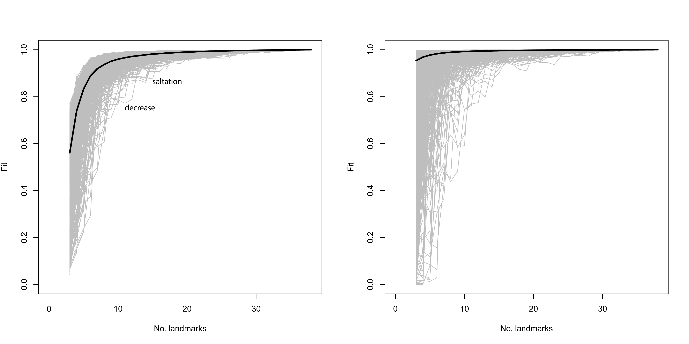

# Landmark Sampling Evaluation Curve (LM3d1)

_TEXT WILL BE REVISED FOLLOWING LM3d2 DEVELOPMENT_

The landmarking configuration designed to analyse the Dalton projectile points was further scrutinised using the Landmark Sampling Error Curve, or `LaSEC`, included in the `LaMBDA` package, as a means of assessing the fidelity of morphological characterisation by landmarks [@RN28913].

What follows is an assessment of the initial and current 3D landmark configurations used in the geometric morphometric study. This chapter concludes with the assessment of the landmark configuration for Dalton projectile points outlined in the previous chapter.

## Landmark configuration 3d2

The initial 3D landmark configuration (3d2) was developed following Selden et al. [-@RN21001, Figure 8], and landmarks were applied subsequent to alignment in `auto3dgm`. This configuration of landmarks was originally developed using the R package `digit3DLand`, but later migrated to _Geomagic Design X_ to leverage the benefits of reference geometry. In order to capitalise on this dynamic edge morphology associated with axial twisting, a new 3D [landmarking protocol](https://github.com/aksel-blaise/gahaganmorph2/blob/master/analysis/landmarking-protocol.md) was developed for Gahagan bifaces, and was revised and repurposed for this analysis. That protocol includes X landmarks, and XX semilandmarks. Like the 3D landmarking protocol that preceded it, this 3D landmarking protocol was based upon the placement of specific elements of reference geometry.

```{r, load.lasec.package.3d2, echo=TRUE}
# load package
#devtools::install_github("akiopteryx/lambda")
library(LaMBDA)

# set working directory
setwd(getwd())
source('readmulti.csv.R')

# read .csv files
setwd("./data") # REVISE ***** using data from 3d1 until 3d2 is complete *****
filelist <- list.files(pattern = ".csv")
lmdata.3d2 <- readmulti.csv(filelist)
lmdata.3d2 <- two.d.array(lmdata.3d2)
setwd("../")

# analysis
lasec(coord.data = lmdata.3d2, n.dim = 3, iter = 1000)
```

Results demonstrate that for `shape`, seven landmarks are necessary to achieve a median fit value of 0.90, nine to achieve a median fit value of 0.95, and 21 to achieve a median fit value of 0.99. For `centroid size`, only three landmarks are needed to achieve a median fit value of 0.95, and nine to achieve a median fit value of 0.99. 

```{r fig.lasec.3d2, fig.cap="Sampling curves from performing `LaSEC` on the initial 3D landmark configuration with respect to characterising shape variation. Each gray line indicates fit values from one iteration of subsampling. Thick, dark line denotes median fit value at each number of landmarks. `LaSEC` sampling curve for shape (left), and for centroid size (right). Results produced using the code above for this 3D dataset, using 1,000 iterations. Images converted to PNG following export."}

```

Results demonstrate saltation, illustrating that some landmarks are critical for capturing shape information [@RN28913]. Dynamic as the Dalton projectiles may be in shape, that variation may be captured with a landmarking protocol that employed fewer equidistant semilandmarks.
