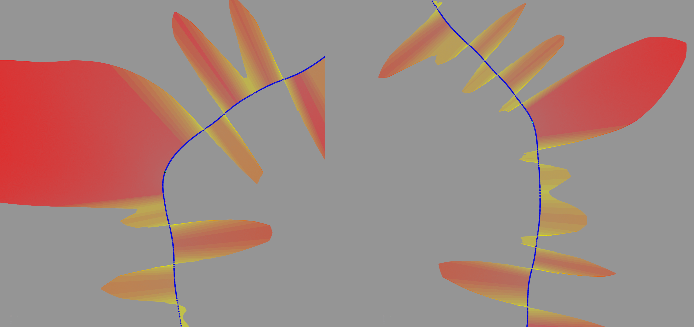
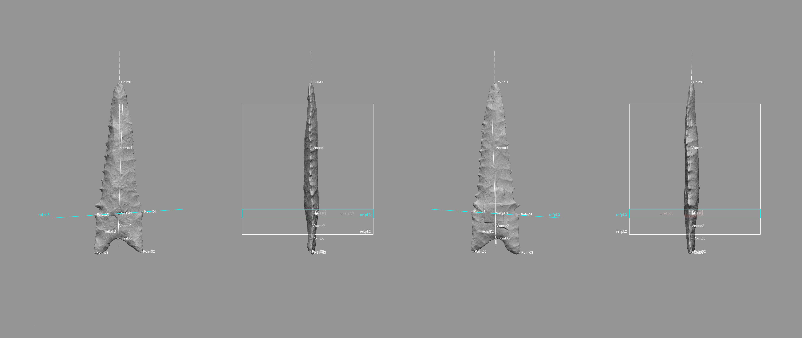

--- 
title: "Landmark 3D geometric morphometrics of Dalton projectile points"
author: 
    - Robert Z. Selden, Jr.^[Heritage Research Center, Stephen F. Austin State University and Cultural Heritage Department, Jean Monnet University, zselden@sfasu.edu]
date: "`r Sys.Date()`"
site: bookdown::bookdown_site
documentclass: book
bibliography: [book.bib]
biblio-style: apalike
link-citations: yes
description: "Morphological analysis of Dalton projectile points"
---

# Preface {-}

>Reproducibility---the ability to recompute results---and replicability--—the chances other experimenters will achieve a consistent result---are two foundational characteristics of successful scientific research [@RN20918].

This volume is written in _Markdown_, and all files needed to reproduce it are included in the [GitHub repository](https://github.com/aksel-blaise/dalton). The reproducible nature of this undertaking provides a means for others to critically assess and evaluate the various analytical components [@RN20915;@RN20916;@RN20917], which is a necessary requirement for the production of reliable knowledge.

Reproducibility projects in [psychology](https://osf.io/ezcuj/) and [cancer biology](https://www.cos.io/rpcb) are impacting current research practices across all domains. Examples of reproducible research are becoming more abundant in archaeology [@RN20804;@RN21009;@RN21001], and the next generation of archaeologists are learning those tools and methods needed to reproduce and/or replicate research results [@RN21007]. Reproducible and replicable research work flows are often employed at the highest levels of humanities-based inquiries to mitigate concern or doubt regarding proper execution, and is of particular import should the results have—explicitly or implicitly—a major impact on scientific progress [@RN21008].

Components of the undertaking presented in this volume are novel, and this basic research endeavour is rooted in archaeological epistemology. Sharing data is not enough, and if investigators share only data absent their analysis code, that places a substantive burden on those who may seek to build upon or replicate their work in the future. In this instance, the choice to pursue a replicable work flow occurs based on the simple fact that this work is foundational, and meant to begin a meaningful discussion related to projectile morphology.

As an exploratory research endeavour, this study was not [preregistered](https://www.cos.io/prereg).

## Acknowledgments

I extend my gratitude to Christian S. Hoggard and David K. Thulman for their thoughtful comments and constructive criticisms on the draft of the landmarking protocol developed for the study of [Gahagan bifaces](https://github.com/aksel-blaise/gahaganmorph2/blob/master/analysis/landmarking-protocol.md) [@RN21001], which is extended here for an analysis of Dalton point morphology. Additional thanks to Christian S. Hoggard for fielding questions related to the EFA analysis. This iteration of the landmarking protocol was initially developed using the [`digit3DLand`](https://github.com/morphOptics/digit3DLand) package in R, and I am grateful to Morgane Dubied for her help with coding questions.

## Funding

Components of this analytical work flow were developed and funded by a Preservation Technology and Training grant (P14AP00138) to the author from the National Center for Preservation Technology and Training (NCPTT), National Forests and Grasslands in Texas (15-PA-11081300-033) and the United States Forest Service (20-PA-11081300-074).

## Colophon

This version of the analysis was generated on `r Sys.time()` using the following computational environment and dependencies: 

```{r colophon, cache = FALSE}
# what R packages and versions were used?
if ("devtools" %in% installed.packages()) devtools::session_info()
```

Current Git commit details are:

```{r}
# where can I find this commit? 
if ("git2r" %in% installed.packages() & git2r::in_repository(path = ".")) git2r::repository(here::here())  
```

<!--chapter:end:index.Rmd-->

# Elliptical Fourier Analysis

Prior to running the landmark 3D geometric morphometric (3DGM) analysis, an elliptical Fourier analysis (EFA) was conducted to identify differences in the plan view of Dalton projectile points. These data have utility in developing the subsequent 3D landmarking protocol (LM3d3) used in the 3DGM analysis.

The 2D images used in the EFA were exported as screen captures from _Geomagic Design X_, and are oriented using the same (exact) alignment as the 3D dataset. Each image was masked in Photoshop to render the requisite binary (black/white) image..

## Load packages + data

```{r load.packages.efa, out.width = "100%", dpi = 300, echo=TRUE, warning=FALSE}
# load packages
library(here)
library(tidyverse)
library(wesanderson)
library(Momocs)

# read images + attribute data
jpg.list <- list.files(here("./jpeg"), full.names = TRUE)
att.data <- read.csv("qdata.csv", header = TRUE, as.is = TRUE)

# attributes to factors
att.data$heart.out <- as.factor(att.data$heart.out)
att.data$heart.reg <- as.factor(att.data$heart.reg)
att.data$bev <- as.factor(att.data$bev)
att.data$bev.type <- as.factor(att.data$bev.type)
```

## Generate outlines

```{r outlines + attribues, out.width = "100%", dpi = 300, echo=TRUE, warning=FALSE}
# generate outlines
outlines <- jpg.list %>%
  import_jpg()

# add attributes
data.out <- Out(outlines, 
         fac = att.data)

# center, scale, align, and rotate specimens
norm.outlines <- data.out %>% 
  coo_scale() %>%
  coo_rotate() %>% 
  coo_align() %>%
  coo_center()
```

## Calibrate harmonic + EFA

```{r cal.harm, out.width = "100%", dpi = 300, echo=TRUE, warning=FALSE}
# calibrate how many harmonics needed
calibrate_harmonicpower_efourier(norm.outlines, 
                                 nb.h = 20)

# 10 harmonics capture 99 percent of variation
calibrate_reconstructions_efourier(norm.outlines, 
                                   range = 1:10)

# generate efa outlines with 10 harmonics
efa.outlines <- efourier(norm.outlines, 
                         nb.h = 10, 
                         norm = TRUE)
```

## Principal Components Analysis

```{r pca.plot, out.width = "100%", dpi = 300, echo=TRUE, warning=FALSE}
# use efa.outlines for pca
pca.outlines <- PCA(efa.outlines)

# pca 
scree_plot(pca.outlines)

# mean shape + 2sd for the first 5 pcs
PCcontrib(pca.outlines, 
          nax = 1:5)
```

## Test Hypothesis 1 (Geo EFA)

Hypothesis 1 assesses whether there is a difference in the symmetric shape of Dalton points found in and out of the heartland.

```{r lm3d3.a1.h1.efa, out.width = "100%", dpi = 300, echo=TRUE, warning=FALSE, fig.cap="Hypothesis 1 considers whether Dalton points discovered in (left) and out (right) of the Heartland differ in morphology."}
knitr::include_graphics('images/dalton-vizhypothesis1.jpg')
```

### Principal Components Analysis (H1)

```{r pca.h1,, out.width = "100%", dpi = 300, echo=TRUE, warning=FALSE}
# plot pca

# heartland in/out
plot_PCA(pca.outlines, 
         morphospace_position = "range",
         palette = pal_qual_solarized,
         chullfilled = TRUE,
         ~heart.out,
         axesnames = TRUE,
         morphospace = TRUE,
         eigen = TRUE,
         center_origin = TRUE,
         zoom = 1.25)
```

### MANOVA (H1)

```{r manova.h1, out.width = "100%", dpi = 300, echo=TRUE, warning=FALSE}
# do shapes differ in/out of heartland?
MANOVA(pca.outlines, 'heart.out')
```

### Mean shapes (H1) 

```{r msshape.1, out.width = "100%", dpi = 300, echo=TRUE, warning=FALSE, fig.cap="Mean shapes for in (H) and out (N) of the heartland."}
# mean shapes
ms.1 <- MSHAPES(efa.outlines, 
                ~heart.out)
plot_MSHAPES(ms.1, size = 0.75)
```

## Test Hypothesis 2 (Geo EFA)

Hypothesis 2 assesses whether there is a difference in morphology for Dalton points found in the heartland, the interior, and the northern periphery.

```{r lm3d3.a1.h2.efa, out.width = "100%", dpi = 300, echo=TRUE, warning=FALSE, fig.cap="Hypothesis 2 considers whether Dalton points discovered in the heartland (left), interior (center), and northern periphery (right) differ in morphology."}
knitr::include_graphics('images/dalton-vizhypothesis2.jpg')
```

### Principal Components Analysis (H2)

```{r pca.h2, out.width = "100%", dpi = 300, echo=TRUE, warning=FALSE}
# plot pca

# heartland region
plot_PCA(pca.outlines, 
         morphospace_position = "range",
         palette = pal_qual_solarized,
         chullfilled = TRUE,
         ~heart.reg,
         axesnames = TRUE,
         morphospace = TRUE,
         eigen = TRUE,
         center_origin = TRUE,
         zoom = 1.25)
```

### MANOVA + MANOVA_PW (H2)

```{r manova.h2, out.width = "100%", dpi = 300, echo=TRUE, warning=FALSE}
# do shapes differ between heartland regions?
MANOVA(pca.outlines, 'heart.reg')
# which?
MANOVA_PW(pca.outlines, 'heart.reg')
```

### Mean shapes (H2)

```{r mean.shape.h2, out.width = "100%", dpi = 300, echo=TRUE, warning=FALSE, fig.cap="Mean shapes for heartland (H), interior (I), and northern periphery (P)."}
# mean shapes
ms.2 <- MSHAPES(efa.outlines, 
                ~heart.reg)
plot_MSHAPES(ms.2, size = 0.75)
```

## Test Hypothesis 3 (Techno EFA)

Hypothesis 3 assesses whether there is a discernible difference in morphology for Dalton points that are beveled.

```{r lm3d3.a1.h3.efa, out.width = "100%", dpi = 300, echo=TRUE, warning=FALSE, fig.cap="Hypothesis 3 considers whether beveled Dalton points (left) differ in morphology from those that are not beveled (right)."}
knitr::include_graphics('images/dalton-vizhypothesis3.jpg')
```

### Principal Components Analysis (H3)

```{r pca.h3, out.width = "100%", dpi = 300, echo=TRUE, warning=FALSE}
# beveled or not
plot_PCA(pca.outlines, 
         morphospace_position = "range",
         palette = pal_qual_solarized,
         chullfilled = TRUE,
         ~bev,
         axesnames = TRUE,
         morphospace = TRUE,
         eigen = TRUE,
         center_origin = TRUE,
         zoom = 1.25)
```

### MANOVA (H3)

```{r manova.h3, out.width = "100%", dpi = 300, echo=TRUE, warning=FALSE}
# do shapes differ if beveled?
MANOVA(pca.outlines, 'bev')
```

### Mean shapes (H3)

```{r mshape3efa, out.width = "100%", dpi = 300, echo=TRUE, warning=FALSE, fig.cap="Mean shapes for beveled (y), and not beveled (n)."}
# mean shapes
ms.3 <- MSHAPES(efa.outlines, 
                ~bev)
plot_MSHAPES(ms.3, size = 0.75)
```

## Test Hypothesis 4 (Techno EFA)

Hypothesis 4 assesses whether there is a discernible difference in the morphology of specific beveling types associated with Dalton points.

```{r lm3d3.a1.h4.efa, out.width = "100%", dpi = 300, echo=TRUE, warning=FALSE, fig.cap="Hypothesis 4 considers whether discrete beveling practices articulate with differences in the morphology of Dalton points"}
knitr::include_graphics('images/dalton-vizhypothesis4-1.jpg')
```

### Principal Components Analysis (H4)

```{r pca.h4, out.width = "100%", dpi = 300, echo=TRUE, warning=FALSE}
plot_PCA(pca.outlines, 
         morphospace_position = "range",
         palette = pal_qual_solarized,
         chullfilled = TRUE,
         ~bev.type,
         axesnames = TRUE,
         morphospace = TRUE,
         eigen = TRUE,
         center_origin = TRUE,
         zoom = 1.25)
```

### MANOVA + MANOVA_PW (H4)

```{r manova, out.width = "100%", dpi = 300, echo=TRUE, warning=FALSE}
# do shapes differ by bevel type?
MANOVA(pca.outlines, 'bev.type')
# which?
MANOVA_PW(pca.outlines, 'bev.type')
```

### Mean shapes (H4)

```{r mshape4efa, out.width = "100%", dpi = 300, echo=TRUE, warning=FALSE, fig.cap="Mean shapes for alternate, unifacial.bimarginal, and no.bevel."}
# mean shapes
ms.4 <- MSHAPES(efa.outlines, 
                ~bev.type)
plot_MSHAPES(ms.4, size = 0.75)
```

<!--chapter:end:01-efa.Rmd-->

# Landmarking Protocol 3d3

The results of an exploratory elliptical Fourier analysis (EFA) provided useful insights that aided in developing the 3D landmarking protocol used in this study.

1. For the in/out of Heartland hypothesis, there is a significant difference in plan view shape that is driven by the lateral edges along the left/right sides of the biface. This suggests that two of the equidistant semilandmarks employed in the landmarking configuration (sLMs 12 and 13) may not be necessary if the driver of the morphological difference that occurs in/out of the Heartland rests along the lateral edge (see section 1.7 in the previous chapter).
2. For the Heartland regions (hreg) hypothesis, the lateral edges along the left/right sides of the biface appear to drive the morphological differences once more. In one case (Heartland vs. Northern Periphery), the difference is significant, and driven by one side of the base, but primarily by the left/right lateral edges. The only other significant difference is between the Heartland vs. Interior, with the heartland being represented by lateral edges that are generally narrower than those of the interior. The Interior vs. Northern Periphery does not differ significantly; however, the mean shapes indicate that it is basal---not blade---morphology that may differentiate those populations. This outcome also suggests that sLMs 12 and 13 may not be warranted
3. The comparison of beveled vs. not beveled bifaces yielded a significant difference, which is driven (once more) by the left/right lateral edges, and not the distal end of the base. This suggests, once more, that sLMs 12 and 13 are not needed for the analysis.
4. The only significant difference between the bevel types was the comparison of alternate vs. no beveling. Mean shapes indicate that this difference is driven by the left/right lateral edges, and not by the morphology of the distal portion of the base. The mean shapes for unifacial bimarginal vs. no beveling are surprisingly similar in plan view, and the difference between alternate vs. unifacial bimarginal is driven---once more---by left/right lateral edges from the base to the tip of the point, and not the distal end of the base.

Of those landmark and semilandmark configurations included in the draft sketches for this project, it is sLMs 12 and 13 that appear to contribute least to the formal tests of those hypotheses tested using EFA; however, those sLMs may have utility in an analysis of object symmetry and fluctuating asymmetry.

## Overview

Landmarking protocol 3d3 (LM3d3) represents a substantive advancement from [LM3d1](https://github.com/aksel-blaise/gahaganmorph2/blob/master/analysis/landmarking-protocol.md) [@RN21001] and was modified from the [LM3d2](https://aksel-blaise.github.io/gahaganmorph3/landmarking-protocol.html) protocol developed for the analysis of Gahagan bifaces. The principal difference between [LM3d2](https://aksel-blaise.github.io/gahaganmorph3/landmarking-protocol.html) and LM3d3 is that the projectiles analysed using [LM3d2](https://aksel-blaise.github.io/gahaganmorph3/landmarking-protocol.html) are lanceolate bifaces, and that landmarking protocol was not designed to capture the variation in basal morphology exhibited by stemmed (Dalton) projectile points. Like [LM3d1](https://github.com/aksel-blaise/gahaganmorph2/blob/master/analysis/landmarking-protocol.md) and [LM3d2](https://aksel-blaise.github.io/gahaganmorph3/landmarking-protocol.html), LM3d3 uses the topology of the 3D mesh that articulates with the prehistoric design of each projectile point to construct a suite of `reference geometry` used to apply semilandmarks in a replicable manner. The result is a landmarking protocol that provides for the improved characterisation of whole-object morphology, which can be subset to analyse variability associated with specific _plan_, _profile_, and _cross-section_ components. It also provides those data points needed to investigate questions of _directional asymmetry_, differences in front/back morphology, morphological integration between blade and basal morphology, and the morphology of broken, fractured, or otherwise incomplete specimens that permeate the archaeological record.

```{r lm3d3.landmarkx, out.width = "100%", dpi = 300, echo=TRUE, warning=FALSE, fig.cap="_**Figure 1. Coordinates of landmarks populated using the [LM3d1](https://github.com/aksel-blaise/gahaganmorph2/blob/master/analysis/landmarking-protocol.md) protocol serve as the basis for LM3d3.**_"}
knitr::include_graphics('images/landmarks.png')
```

Like its' predecessors, LM3d3 was initially designed using the [`digit3DLand`](https://github.com/morphOptics/digit3DLand) package in R. When the draft protocol was completed, design of the landmarking protocol shifted to [Geomagic Design X](https://www.3dsystems.com/software/geomagic-design-x) _(Build Version 2020.0.2 [Build Number: 55])_, where the workflow was modified to include those elements of `reference geometry` that articulate with the prehistoric design attributes of each projectile point.

The goal of this effort was to increase both the precision and rigour of the study by including the Z-dimension to capture those shape characteristics associated with axial twisting, introduced by knappers through the practice of beveling ([LM3d1](https://github.com/aksel-blaise/gahaganmorph2/blob/master/analysis/landmarking-protocol.md)) [@RN21001]. The addition of cross-sections was needed to better characterise whole-object morphology, providing for the possibility of subsampling the semilandmarks to explore the contribution of specific cross-sections or profiles ([LM3d2](https://aksel-blaise.github.io/gahaganmorph3/landmarking-protocol.html)). LM3d3 includes an additional cross section at the blade/base transition, allowing for tests of morphological integration. While true that some landmarking protocols can be—--and often are—--recycled as new specimens are added, this particular research programme endeavours to achieve ever-greater accuracy and precision in each analytical iteration.

## Generating the peripheral (plan view) spline

The procedure begins with a spline extracted from the surface geometry of the mesh using the `extract contour curves` command. In reverse-engineering, `extract contour curves` is regularly employed as the first step in building a `patch network` used to create a surface. The extracted feature curve is rendered as a spline, and follows the highest curvature contours around the periphery of the lateral and basal edges, following the highly variable sinuous edge morphology around the entirety of the projectile. The remainder of the landmarking protocol is based upon this spline, which was subsequently split at six mathematically-defined locations.

```{r lm3d3.figspline, out.width = "100%", dpi = 300, echo=TRUE, warning=FALSE, fig.cap="_**Figure 2. Spline extracted along the highest contours of the Dalton point.**_"}
knitr::include_graphics('images/extractspline.png')
```

## Splitting the spline

_`Reference geometries` are used in the assistance of creating other features. These include basic geometric entities, such as `planes`, `vectors`, `coordinates`, `points`, and `polygons`. A `reference point` is a virtual point and is used to mark a specific position on a model or in 3D space. A `reference plane` is a virtual plane that has a normal direction and an infinite size. A `reference plane` is not a surface body, and is used to create other features._ 

The characteristic points and tangents developed for this landmarking protocol were inspired by the work of Birkhoff [-@RN11786], which has been gainfully employed within the context of both ceramic [@RN11801;@RN11782;@RN11716;@RN20697] and lithic analyses [@RN11783;@RN21001]. The first landmark (LM1) is placed at the horizontal tangent on the tip of each Dalton point. The second through fifth splits (LMs 02 - 05) occur at points of highest curvature, where LM 02 is always placed on the right side of the projectile following the application of the `reference vectors`. To place the final landmark (LM 06), a linear measurement was used to project a `reference point` equidistant between LM 02 and LM 03. The location of that point was leveraged in placing the `reference plane` used to cut the spline at the location of LM 06.

## Spline split at location of LM 01

The `horizontal tangent` is calculated by drawing a horizontal line above the tip of the biface using the tangent as a `common constraint`, and the horizontal as the `independent constraint`. To split the 3D spline at the location of the horizontal tangent, a `reference point` was inserted at the location of the `tangent` in the sketch (light blue point; below, left), followed by a `reference plane` (in white; below, left and right) using the `pick point and normal axis` function where the `reference point` (h-tangent) was used as the `pick point`, and the `Right plane` as the `normal axis` (below, left). The spline was then cut at the location where the `reference plane` intersected with the spline (below image, right).

```{r lm3d3.figlm1, out.width = "100%", dpi = 300, echo=TRUE, warning=FALSE, fig.cap="_**Figure 3. Identify horizontal tangent, insert `reference point` and `reference plane` (left). Use `reference plane` to cut spline at the location of the horizontal tangent (right).**_"}
knitr::include_graphics('images/lm1.png')
```

## Spline split at locations of LM 02 and LM 03

The point of highest curvature on either side of the basal edge was calculated using the `curvature` function in the Accuracy Analyser. This function displays the curvature flow as a continuous colour plot across the area of the curve. In this instance, _curvature_ is defined as the amount by which a geometric shape deviates from being flat or straight in the case of a line. Curvature is displayed in different colours according to the local radius, and calculated in only one direction (U or V) along the curve. Using this tool, the two points of highest curvature were located between the basal and lateral edges on either side of each projectile where the local radius measure was largest. The orientation of each biface was dictated by the _auto3dgm_ output in [LM3d1](https://github.com/aksel-blaise/gahaganmorph2/blob/master/analysis/landmarking-protocol.md) and [LM3d2](https://aksel-blaise.github.io/gahaganmorph3/landmarking-protocol.html); however, LM3d3 enlists a novel method to determine which side of the projectile is associated with LM 02 and LM03 using `reference vectors`.

```{r lm3d3.figcurve, out.width = "100%", dpi = 300, echo=TRUE, warning=FALSE, fig.cap="_**Figure 4. Identify points of hightest curvature (light blue) at left/right intersection of lateral and basal edges.**_"}
knitr::include_graphics('images/splinesplit1.png')
```

## Spline split at locations of LM 04 and LM 05

The point of highest curvature at the intersection of the blade and base was also calculated using the `curvature` function in the Accuracy Analyser. Using this tool, the two points of highest curvature were located between the blade and base on either side of each projectile where the local radius measure was largest. The orientation of each projectile was dictated by `reference vectors`, and the landmarking protocol follows the mesh orientation in that figure, where LM 04 was always placed on the right side of the basal edge, and LM 05 on the left.

```{r lm3d3.figcurve2, out.width = "100%", dpi = 300, echo=TRUE, warning=FALSE, fig.cap="_**Figure 5. Identify points of hightest curvature (light blue) at left/right intersection of blade and base.**_"}

```

## Spline split at location of LM 06

One additional landmark (LM 06) was placed at the centre of the base. The location of this landmark was identified by calculating the linear distance between LM 02 and LM 03, and projecting a `reference point` (ctrl-div; below) equidistant between the two. A `reference plane` was added using the ctrl-div as the pick point, and the `Right plane` as the `normal axis`. The spline was then split at the intersection of the `reference plane` and the basal spline.

```{r lm3d3.figlm4, out.width = "100%", dpi = 300, echo=TRUE, warning=FALSE, fig.cap="_**Figure 6. Calculate linear distance between LM 02 and LM 03, insert `reference plane` coplanar to Right plane equidistant between LM 02 and LM 03, and use the `reference plane` to cut the spline.**_"}
knitr::include_graphics('images/lm6.png')
```

## Peripheral (plan view) spline

Through the preceding protocol, the initial spline was split into six discrete splines. These splines articulate with components of projectile morphology that can be compartmentalised in the analyses. The primary analytical gain achieved through this exercise is the requisite foundation needed to carry out replicable analyses of Dalton point morphology in three dimensions, further increasing the precision of the geometric morphometric analysis.

```{r lm3d3.figsplinesplit-frbl, out.width = "100%", dpi = 300, echo=TRUE, warning=FALSE, fig.cap="_**Figure 7. Result of spline splits include six discrete splines, each articulating with a region of analytical interest. The coordinates of each spline split are known, and used to place the landmarks.**_"}
knitr::include_graphics('images/splinesplit-frbl.png')
```

## Reference vectors and ref.pt.0

The fundamental components of `reference geometry` used to create LM3d3 consist of three `reference vectors`, and a single `reference point` (ref.pt.0), placed equidistant between LM 04 and LM 05. The three `reference vectors` were placed between LM 01 and ref.pt.0 (Vector 1), ref.pt.0 and LM 06 (Vector 2), and LMs 04 and 05 (Vector 3).  These three `reference vectors` serve as the foundation for the suite of `reference geometry` used to place the semilandmarks.

```{r lm3d3.vectors, out.width = "100%", dpi = 300, echo=TRUE, warning=FALSE, fig.cap="_**Figure 8. `Reference vectors` placed between LMs 01 and ref.pt.0 (left), ref.pt.0 and LM 06 (center), and between LMs 04 and 05 (right).**_"}

```

The measure of the angle between Vector 1 (blade) and Vector 2 (base) may have additional utility in lithic studies as an orthogonal metric associated with knapper skill, where greater skill is represented by an arbitrary range of angles nearest---and lesser, furthest away from---180 degrees. A second similar measure could be collected between Vectors 1 and 2 in comparison with Vector 3. Collection of these metrics from a 3D mesh in computer aided design (CAD) software adds an increased element of precision in comparison with a goniometer, and serves as an example of the added analytical value that can be extracted from this novel landmarking protocol.

Prior to the addition of the `reference vectors`, the location of LMs 02 through 05 are considered arbitrary. Previous iterations of this landmarking protocol have relied upon `auto3dgm` to provide principal alignments that dictate which LMs are placed on the left/right side of the biface or projectile. In this protocol, the side of the projectile with the lowest orthogonal measure between Vector 1 and Vector 2 will be on the left, meaning that from the investigator's view, the projectiles will curve, bend, or lean slightly---or in some cases more dramatically---to the left from base to tip.

## Reference planes and points

Five `reference planes` provide the framework needed to populate the semilandmarks. Admittedly, the logic associated with placement may seem curious at this point; however, the utility of these `reference planes` will become clear in subsequent sections.

### Placement of ref.pl.1

The first `reference plane` (ref.pl.1) was placed between LM 01 and ref.pt.0, bisecting the blade of the projectile along the mid-line. The method of placement enlists a `reference point` (ref.pt.1), inserted at the intersection of the three `reference vectors`. It has the same x,y position as ref.pt.0, but the coordinates of ref.pt.1 were altered to relocate it 15 mm from the vector in the direction of the Z-axis. The `pick point and coplanar` function was used to place ref.pl.1 coplanar to the first `reference vector`, and in the direction of ref.pt.1.

```{r lm3d3.ref.pl.1, out.width = "100%", dpi = 300, echo=TRUE, warning=FALSE, fig.cap="_**Figure 9. Placement of ref.pl.1, and temporary location of ref.pt.1 15mm from Vector 1, and equidistant between LM 01 and ref.pt.0 on the blade of the projectile.**_"}
knitr::include_graphics('images/lm3d3.ref.pl.1.png')
```

### Placement of ref.pl.2

The second `reference plane` (ref.pl.2) was placed between ref.pt.0 and LM 06, bisecting the base of the projectile along the mid-line. The method of placement for ref.pl.2 follows the same protocol described in the application of ref.pl.1, and enlists the same `reference point` (ref.pt.1).

```{r lm3d3.ref.pl.2, out.width = "100%", dpi = 300, echo=TRUE, warning=FALSE, fig.cap="_**Figure 10. Placement of ref.pl.2, and temporary location of ref.pt.2 15 mm from Vector 2, and equidistant between ref.pt.0 and LM 06 on the base of the projectile.**_"}
knitr::include_graphics('images/lm3d3.ref.pl.2.png')
```

### Placement of ref.pl.3

The third `reference plane` (ref.pl.3) was placed between LMs 04 and 05, and bisects the projectile at the blade/base intersection. The method of placement for ref.pl.3 follows the same protocol described in the application of ref.pl.1, and enlists the same `reference point` (ref.pt.1), which was deleted following the placement of ref.pl.3.

```{r lm3d3.ref.pl.3, out.width = "100%", dpi = 300, echo=TRUE, warning=FALSE, fig.cap="_**Figure 11. Placement of ref.pl.3, and temporary location of ref.pt.3 15 mm from Vector 3, and equidistant between LMs 04 and 05 at the intersection of the blade and base.**_"}

```

### Placement of ref.pl.4 and ref.pl.5

The fourth (ref.pl.4) and fifth (ref.pl.5) `reference planes` were placed using the `pick point and normal` function at the intersections of the first `reference vector` and LMs 01 and 06. 

```{r lm3d3.ref.pl.4-5, out.width = "100%", dpi = 300, echo=TRUE, warning=FALSE, fig.cap="_**Figure 12. Placement of ref.pl.4 (top) and ref.pl.5 (bottom).**_"}
knitr::include_graphics('images/lm3d3.ref.pl.4-5.png')
```

## Sectioning the mesh

The `reference geometry` described above was enlisted in the following three-step method developed to produce one cross-section at the blade/base intersection, four cross-sections between the blade/base intersection and LM 01, and one cross-section between the blade/base intersection and LM 06.

### Sectioning the blade/base intersection

To section the blade/base intersection, a single section was inserted using ref.pl.2, resulting in a single cross-section that bisects the projectile between LMs 04 and 05.

```{r lm3d3.section1, out.width = "100%", dpi = 300, echo=TRUE, warning=FALSE, fig.cap="_**Figure 13. Placement of the first section, bisecting the mesh along ref.pl.2.**_"}
knitr::include_graphics('images/lm3d3.section1.png')
```

### Sectioning the blade and base

Six equidistant sections were placed between LM 01 and ref.pt.0, and the two sections at the locations of LM 01 and ref.pt.0 were deleted. Three equidistant sections were placed between LM 06 and ref.pt.0. The sections intersecting with ref.pt.0 and LM 06 were deleted. Subsequent to placing the sections, ref.pt.0 was itself deleted.

```{r lm3d3.section3, out.width = "100%", dpi = 300, echo=TRUE, warning=FALSE, fig.cap="_**Figure 14. Placement of the two equidistant sections between LM 06 and ref.pt.3.**_"}

```

## Splitting the sections

The `curvature` function was employed to split each curves at the locations of highest curvature along the lateral edge. This function was detailed above, and in the application of LMs 02, 03, 04, and 05 in [LM3d1](https://github.com/aksel-blaise/gahaganmorph2/blob/master/analysis/landmarking-protocol.md). 

A `reference plane` (ref.pl.1) was then used to cut each of the four curves along the mid-line of the blade where it intersects with the curves. A second `reference plane` (ref.pl.2) was used to cut the single basal curve and the curve between LMs 04 and 05. Since ref.pt.0 was used to generate ref.pl.1 and ref.pl.2, either of the `reference planes` could be used to cut the curve between LMs 04 and 05.

```{r lm3d3.split, out.width = "100%", dpi = 300, echo=TRUE, warning=FALSE, fig.cap="_**Figure 15. Each section was split at the points of highest curvature along the lateral edges, then along the mid-line at the intersection of the curve and ref.pl.1 (for the blade), and ref.pl.2 (for the base).**_"}
knitr::include_graphics('images/lm3d3.split.sections.png')
```

## LM3d3: Configuration 1

LM3d3: Configuration 1 (LM3d3.c1) was used to assess the three hypotheses included in this pilot study. Semilandmarks 07 - 18 were applied around the lateral edges, and sLMs 12 and 13 between LMs 02, 06, and 03 using the curve constructed in [LM3d1](https://github.com/aksel-blaise/gahaganmorph2/blob/master/analysis/landmarking-protocol.md). Semilandmarks 19 - 30 articulate with the mid-line between LMs 01 and 06, and sLMs 31 - 34 were placed along the curve that articulates with ref.pl.3 equidistant between the lateral edge and midline. .

The result is a landmark configuration that can be subset in numerous ways (plan, profile, cross-section, front/back, left/right, blade/base, etc.), using a suite of design-based attributes to achieve maximum utility for analysts of lithic morphology.

```{r lm3d3.semi, out.width = "100%", dpi = 300, echo=TRUE, warning=FALSE, fig.cap="_**Figure 16. Landmarks (blue), semilandmarks (white), curves (orange), and splits (blue) used for LM3d3.**_"}

```

Based upon knowledge garnered from running `LaSEC` [@RN28913] on [LM3d1](https://github.com/aksel-blaise/gahaganmorph2/blob/master/analysis/landmarking-protocol.md), this landmarking protocol would likely be oversampled if it included additional landmarks on the cross-sections; however, it can be adapted to include as many or as few landmarks and semilandmarks needed to address the research question.

```{r lm3d3.slm, out.width = "100%", dpi = 300, echo=TRUE, warning=FALSE, fig.cap="_**Figure 17. Landmarks (blue), semilandmarks (white), and `reference geometry` used in LM3d3.**_"}
knitr::include_graphics('images/lm3d3.slm.png')
```

<!--chapter:end:02-lm3d3.Rmd-->

# Landmark Sampling Evaluation Curve (LaSEC)

The landmarking configuration used to analyse Dalton points was further scrutinised using the Landmark Sampling Error Curve, or `LaSEC` included in the `LaMBDA` package, as a means of assessing the fidelity of morphological characterisation by landmarks [@RN28913], and was run after landmarking the first 20 samples

LaSEC conducts the following procedure [@RN28913, 4-5]:

1. As is typical for extracting shape data, perform a generalized Procrustes alignment (`gpagen` function in the `geomorph` package) on a coordinate dataset (argument `coord.data`) in 2-D or 3-D (argument `n.dim`) and record the resulting shape coordinates and centroid size. Here, the shape coordinates are projected onto tangent space because pairwise distances among corresponding datasets later in the analysis are based on Euclidean distances and most shape analyses in the biological literature are conducted in tangent space instead of Procrustes shape space.
2. Subsample the same three randomly selected landmarks from all specimens. The subsampling begins with a subset of three landmarks because a minimum of three landmarks is required to define shape. Then, generate shape and centroid size data with generalized Procrustes superimposition on the subsampled data.
3. Perform an Ordinary Procrustes Alignment (`protest` function in the `vegan` R package) on the subsampled data to minimize the pairwise distances between corresponding landmarks in the parent data through translation, rotation, and scaling of data in full shape space. As stated above, note that this procedure is different from the typical implementation of Procrustes alignment on coordinate data in 2-D or 3-D space. The function then records the sum of these squared distances as measure of fit (PSS) between the relative locations of data points in the parent and subsampled datasets. Equivalent procedure is conducted on centroid size data.
4. Sample one additional, randomly chosen landmark and repeat step 3 until the entire set of landmarks in the parent dataset is sampled. The completion of this step represents one iteration of subsampling.
5. Repeat steps 2–5 for specified number of iterations (`iter` argument).
6. Create sampling curves by plotting the trajectory of “fit” (1–PSS) against the number of landmarks sampled from each iteration for both shape and centroid size as gray lines. Then, plot the median fit value for each number of landmarks sampled on the same plot as a thick, dark line. Finally, output these sampling curves: `LaSEC_SamplingCurve_Shape.pdf`, `LaSEC_SamplingCurve_Size.pdf`.

## Analysis of experimental sample

```{r, load.lasec.package.dalton, echo=TRUE}
# load package
#devtools::install_github("akiopteryx/lambda")
library(here)
library(LaMBDA)

source('readmulti.csv.R')

# read .csv files
setwd("./data")
filelist <- list.files(pattern = ".csv")
lmdata <- readmulti.csv(filelist)
lmdata <- two.d.array(lmdata)
setwd("../")

# analysis
lasec(coord.data = lmdata, 
      n.dim = 3, 
      iter = 1000)
```

Results demonstrate that eight landmarks are necessary to achieve a median fit value of 0.90, 12 to achieve a median fit value of 0.95, and 23 to achieve a fit value of 0.99. For centroid size, seven landmarks were needed to achieve a median fit value of 0.99.

```{r fig.lasec.EX, fig.cap="Sampling curves from performing `LaSEC` on the dataset with respect to characterising shape variation. Each gray line indicates fit values from one iteration of subsampling. Thick, dark line denotes median fit value at each number of landmarks. `LaSEC` sampling curve for shape (left), and for centroid size (right). Results produced using the code above for this 3D dataset, using 1,000 iterations. _Images converted to PNG following export._"}
knitr::include_graphics('images/lasec.png')
```

Results demonstrate saltation, illustrating that some landmarks are critical for capturing shape information [@RN28913]. Dynamic as Dalton points may be in shape, that variation may be captured with a configuration of landmarks that employed fewer semilandmarks.

<!--chapter:end:03-lasec.Rmd-->

# Analysis of Dalton morphology

## Load packages + data

```{r load.data, echo = TRUE}
# load packages

# devtools::install_github("geomorphR/geomorph", ref = "Stable", build_vignettes = TRUE)
library(here)
library(geomorph)
library(tidyverse)
library(wesanderson)

# read GM data
source('readmulti.csv.R')

# read .csv files
setwd("./data")
filelist <- list.files(pattern = ".csv")
coords <- readmulti.csv(filelist)
setwd("../")

# read qualitative data
qdata <- read.csv("qdata.csv", header = TRUE, row.names = 1)
qdata <- qdata[match(dimnames(coords)[[3]],rownames(qdata)),]
```

## Generalized Procrustes Analysis

Landmark data were aligned to a global coordinate system [@RN11622;@RN11623;@RN11563], achieved through generalized Procrustes superimposition [@RN478] performed in R 4.0.3 [@R] using the `geomorph` library v. 3.3.1 [@RN11530;@RN1774]. Procrustes superimposition translates, scales, and rotates the coordinate data to allow for comparisons among objects [@RN11564;@RN478]. The `geomorph` package uses a partial Procrustes superimposition that projects the aligned specimens into tangent space subsequent to alignment in preparation for the use of multivariate methods that assume linear space [@RN1646;@RN11563].

```{r gpa, out.width = "100%", dpi = 300, echo=TRUE, warning=FALSE}
# gpa
Y.gpa <- gpagen(coords, 
                PrinAxes = TRUE, 
                ProcD = TRUE, 
                Proj = TRUE, 
                print.progress = FALSE)

# output + consensus configuration coords
Y.gpa

# geomorph data frame
gdf <- geomorph.data.frame(shape = Y.gpa$coords, 
                           size = Y.gpa$Csize, 
                           heart = qdata$heart.out, 
                           hreg = qdata$heart.reg,
                           bev.1 = qdata$bev, 
                           bev.2 = qdata$bev.type)
```

```{r consensus, out.width = "100%", dpi = 300, echo=TRUE, warning=FALSE, fig.cap="2D plot of 3D consensus configuration."}
# plot consensus configuration
par(mfrow=c(1, 3))
plot(Y.gpa$consensus[,c("Y", "X")], pch=20)
plot(Y.gpa$consensus[,c("Z", "X")], pch=20)
plot(Y.gpa$consensus[,c("Z", "Y")], pch=20)
```

```{r 3d.gpa, out.width = "100%", dpi = 300, echo=TRUE, warning=FALSE, fig.cap="Results of generalized Procrustes analysis."}
# render 3d gpa plot
#plot(Y.gpa)

# gpa plot
# knitr::include_graphics('images/gpa3d.png')
```

### Boxplot attributes

```{r box.attr, out.width = "100%", dpi = 300, echo=TRUE, warning=FALSE}
# add centroid size to qdata
qdata$csz <- Y.gpa$Csize

# print updated qdata with centroid size
knitr::kable(qdata, 
             align = "ccccc", 
             caption = "Modified attributes included in qdata.")

# attributes for boxplots
csz <- qdata$csz # centroid size
heart <- qdata$heart.out # heartland in/out
hreg <- qdata$heart.reg # heartland region
bev.1 <- qdata$bev # beveled yes/no
bev.2 <- qdata$bev.type # type of beveling
```

## Principal Components Analysis

Principal components analysis [@RN1746] was used to visualise shape variation among the bifaces. The shape changes described by each principal axis are commonly visualized using thin-plate spline warping of a reference 3D mesh [@RN1731;@RN479].

```{r pca, out.width = "100%", dpi = 300, echo=TRUE, warning=FALSE}
# principal components analysis
pca<-gm.prcomp(Y.gpa$coords)
summary(pca)
```

## Define models

### Allometry

```{r allom.dalton, out.width = "100%", dpi = 300, echo=TRUE, warning=FALSE}
# general allometry
fit.size <- procD.lm(shape ~ size, 
                     data = gdf, 
                     print.progress = FALSE, 
                     iter = 9999)
```

### Hypothesis 1

```{r def.mod.1, out.width = "100%", dpi = 300, echo=TRUE, warning=FALSE}
## Define models
# allometry - common allometry, different means -> heart
fit.sz.cheart <- procD.lm(shape ~ size + heart, 
                        data = gdf, 
                        print.progress = FALSE, 
                        iter = 9999)
# allometry - unique allometries -> heart
fit.sz.uheart <- procD.lm(shape ~ size * heart, 
                        data = gdf, 
                        print.progress = FALSE, 
                        iter = 9999)
# size as a function of heart
fit.size.heart <- procD.lm(size ~ heart, 
                           data = gdf, 
                           print.progress = FALSE, 
                           iter = 9999)
# shape as a function of heart
fit.shape.heart <- procD.lm(shape ~ heart, 
                            data = gdf, 
                            print.progress = FALSE, 
                            iter = 9999)
```

### Hypothesis 2

```{r def.mod.2, out.width = "100%", dpi = 300, echo=TRUE, warning=FALSE}
## Define models
# allometry - common allometry, different means -> hreg
fit.sz.chreg <- procD.lm(shape ~ size + hreg, 
                         data = gdf, 
                         print.progress = FALSE, 
                         iter = 9999)
# allometry - unique allometries -> hreg
fit.sz.uhreg <- procD.lm(shape ~ size * hreg, 
                         data = gdf, 
                         print.progress = FALSE, 
                         iter = 9999)
# size as a function of hreg
fit.size.hreg <- procD.lm(size ~ hreg, 
                          data = gdf, 
                          print.progress = FALSE, 
                          iter = 9999)

# shape as a function of hreg
fit.shape.hreg <- procD.lm(shape ~ hreg, 
                           data = gdf, 
                           print.progress = FALSE, 
                           iter = 9999)
```

### Hypothesis 3

```{r def.mod.3, out.width = "100%", dpi = 300, echo=TRUE, warning=FALSE}
## Define models
# allometry - common allometry, different means -> bev.1
fit.sz.cbev.1 <- procD.lm(shape ~ size + bev.1, 
                        data = gdf, 
                        print.progress = FALSE, 
                        iter = 9999)
# allometry - unique allometries -> bev.1
fit.sz.ubev.1 <- procD.lm(shape ~ size * bev.1, 
                        data = gdf, 
                        print.progress = FALSE, 
                        iter = 9999)
# size as a function of bev.1
fit.size.bev.1 <- procD.lm(size ~ bev.1, 
                          data = gdf, 
                          print.progress = FALSE, 
                          iter = 9999)

# shape as a function of bev.1
fit.shape.bev.1 <- procD.lm(shape ~ bev.1, 
                           data = gdf, 
                           print.progress = FALSE, 
                           iter = 9999)
```

### Hypothesis 4

```{r def.mod.4, out.width = "100%", dpi = 300, echo=TRUE, warning=FALSE}
## Define models
# allometry - common allometry, different means -> bev.2
fit.sz.cbev.2 <- procD.lm(shape ~ size + bev.2, 
                        data = gdf, 
                        print.progress = FALSE, 
                        iter = 9999)
# allometry - unique allometries -> bev.2
fit.sz.ubev.2 <- procD.lm(shape ~ size * bev.2, 
                        data = gdf, 
                        print.progress = FALSE, 
                        iter = 9999)
# size as a function of bev.2
fit.size.bev.2 <- procD.lm(size ~ bev.2, 
                          data = gdf, 
                          print.progress = FALSE, 
                          iter = 9999)

# shape as a function of bev.2
fit.shape.bev.2 <- procD.lm(shape ~ bev.2, 
                           data = gdf, 
                           print.progress = FALSE, 
                           iter = 9999)
```

## Allometry

```{r allometry, out.width = "100%", dpi = 300, echo=TRUE, warning=FALSE}
# general allometry - does dalton shape change with size?
anova(fit.size)
```

## Test Hypothesis 1 (Geo GM)

Hypothesis 1 assesses whether there is a difference in morphology for Dalton points found in and out of the heartland.

A residual randomization permutation procedure (RRPP; n = 10,000 permutations) was used for all Procrustes ANOVAs [@RN1655;@RN11775], which has higher statistical power and a greater ability to identify patterns in the data should they be present [@RN1719]. To assess whether shape changes with size (allometry), and differs by group (region), Procrustes ANOVAs [@RN1749] were also run that enlist effect-sizes (zscores) computed as standard deviates of the generated sampling distributions [@RN1756].

```{r lm3d3.a1.h1, out.width = "100%", dpi = 300, echo=TRUE, warning=FALSE, fig.cap="Hypothesis 1 considers whether Dalton points discovered in (left) and out (right) of the Heartland differ in morphology."}
knitr::include_graphics('images/dalton-vizhypothesis1.jpg')
```

### Boxplot (H1)

```{r box1, out.width = "100%", dpi = 300, echo=TRUE, warning=FALSE, fig.cap = "Boxplot of centroid size by Heartland (in/out)."}
# boxplot of Dalton point centroid size by in/out heartland
csz.hrt <- ggplot(qdata, aes(x = heart, y = csz, color = heart)) + 
  geom_boxplot() +
  geom_dotplot(binaxis = 'y', stackdir = 'center', dotsize = 0.3) +
  scale_colour_manual(values = wes_palette("Moonrise2")) +
  theme(legend.position = "none") +
  labs(x = 'In Heartland?', y = 'Centroid Size')
# render plot
csz.hrt
```

### Principal Components Analysis (H1)

```{r pca1, out.width = "100%", dpi = 300, echo=TRUE, warning=FALSE}
# set plot parameters to plot by heartland in (H) and out (N)
pch.gps.heart <- c(15,17)[as.factor(heart)]
col.gps.heart <- wes_palette("Moonrise2")[as.factor(heart)]
col.hull <- c("#798E87","#C27D38")

# plot pca by heartland in (H) and out (N)
pc.plot1 <- plot(pca, 
                 asp = 1,
                 pch = pch.gps.heart,
                 col = col.gps.heart)
                    shapeHulls(pc.plot1, 
                             groups = heart,
                             group.cols = col.hull)
```

### ANOVA (H1)

```{r h1, out.width = "100%", dpi = 300, echo=TRUE, warning=FALSE}
# heart
anova(fit.sz.cheart) # common allometry (heart)

# heart
anova(fit.sz.uheart) # unique allometry (heart)

# ANOVA: do dalton projectile point sizes differ by heart?
anova(fit.size.heart)

# ANOVA: do dalton projectile point shapes differ by heart?
anova(fit.shape.heart)
```

### Allometry (H1)

```{r c.allom.h1, out.width = "100%", dpi = 300, echo=TRUE, warning=FALSE}
# regscore (Drake and Klingenberg 2008)

# heart
plotAllometry(fit.sz.cheart,
              size = gdf$size,
              logsz = TRUE,
              method = "RegScore", 
              pch = pch.gps.heart, 
              col = col.gps.heart)

# common allometric component (Mitteroecker 2004)

# heart
plotAllometry(fit.sz.cheart, 
              size = gdf$size, 
              logsz = TRUE, 
              method = "CAC", 
              pch = pch.gps.heart, 
              col = col.gps.heart)

# size-shape pca (Mitteroecker 2004)

# heart
plotAllometry(fit.sz.cheart, 
              size = gdf$size, 
              logsz = TRUE, 
              method = "size.shape", 
              pch = pch.gps.heart, 
              col = col.gps.heart)
```

```{r u.allom.h1, out.width = "100%", dpi = 300, echo=TRUE, warning=FALSE}
## predline (Adams and Nistri 2010)

# heart
plotAllometry(fit.sz.uheart, 
              size = gdf$size, 
              logsz = TRUE, 
              method = "PredLine", 
              pch = pch.gps.heart, 
              col = col.gps.heart)
```

### Morphological disparity (H1)

```{r m-disparity.h1, out.width = "100%", dpi = 300, echo=TRUE, warning=FALSE}
# morphological disparity: does one group display greater 
# shape variation among individuals relative to the other group?
morphol.disparity(shape ~ heart, 
                  groups = qdata$heart.out, 
                  data = gdf, 
                  print.progress = FALSE, 
                  iter = 9999)
```

### Mean Shapes (H1)

```{r mshape.h1, out.width = "100%", dpi = 300, echo=TRUE, warning=FALSE}
# subset landmark coordinates to produce mean shapes for hypothesis 1
new.coords<-coords.subset(A = Y.gpa$coords, 
                          group = qdata$heart.out)
names(new.coords)

# group shape means
mean <- lapply(new.coords, mshape)

# plot mean shapes
plot(mean$H)
plot(mean$N)

# comparison plots
plotRefToTarget(mean$H, 
                mean$N, 
                method="vector",
                mag=2)

##knitr::include_graphics('images/mshape.h1.jpg')
```

## Test Hypothesis 2 (Geo GM)

Hypothesis 2 assesses whether there is a difference in morphology for Dalton points found in the heartland, the interior, and the northern periphery.

A residual randomization permutation procedure (RRPP; n = 10,000 permutations) was used for all Procrustes ANOVAs [@RN1655;@RN11775], which has higher statistical power and a greater ability to identify patterns in the data should they be present [@RN1719]. To assess whether shape changes with size (allometry), and differs by group (region), Procrustes ANOVAs [@RN1749] were also run that enlist effect-sizes (zscores) computed as standard deviates of the generated sampling distributions [@RN1756]. 

```{r lm3d3.a1.h2, out.width = "100%", dpi = 300, echo=TRUE, warning=FALSE, fig.cap="Hypothesis 2 considers whether Dalton points discovered in the heartland (left), interior (center), and northern periphery (right) differ in morphology."}
knitr::include_graphics('images/dalton-vizhypothesis2.jpg')
```

### Boxplot (H2)

```{r box2, out.width = "100%", dpi = 300, echo=TRUE, warning=FALSE, fig.cap = "Boxplot of centroid size by Heartland region."}
# boxplot of Dalton point centroid size by heartland + regions
csz.hreg <- ggplot(qdata, aes(x = hreg, y = csz, color = hreg)) + 
  geom_boxplot() +
  geom_dotplot(binaxis = 'y', stackdir = 'center', dotsize = 0.3) +
  scale_colour_manual(values = wes_palette("Moonrise2")) +
  theme(legend.position = "none") +
  labs(x = 'Heartland Region', y = 'Centroid Size')
# render plot
csz.hreg
```

### Principal Components Analysis (H2)

```{r pca2, out.width = "100%", dpi = 300, echo=TRUE, warning=FALSE}
# set plot parameters to plot by heartland + regions
pch.gps.hreg <- c(15,17,18)[as.factor(hreg)]
col.gps.hreg <- wes_palette("Moonrise2")[as.factor(hreg)]
col.hull.2 <- c("#798E87","#CCC591","#C27D38")

# plot pca by heartland + regions
pc.plot2 <- plot(pca, 
                 asp = 1,
                 pch = pch.gps.hreg,
                 col = col.gps.hreg)
                    shapeHulls(pc.plot2, 
                             groups = hreg,
                             group.cols = col.hull.2)
```

### ANOVA (H2)

```{r h2, out.width = "100%", dpi = 300, echo=TRUE, warning=FALSE}
# hreg
anova(fit.sz.chreg) # common allometry (hreg)

# hreg
anova(fit.sz.uhreg) # unique allometry (hreg)

# ANOVA: does dalton projectile point size differ by hreg?
anova(fit.size.hreg)

# pairwise comparison of LS means = which differ?
sz.hreg <- pairwise(fit.size.hreg, 
                    groups = qdata$heart.reg)
summary(sz.hreg, 
        confidence = 0.95, 
        test.type = "dist")

# pairwise distance between variances = standardization?
summary(sz.hreg, 
        confidence = 0.95, 
        test.type = "var")

# ANOVA: does dalton projectile point shape differ by hreg?
anova(fit.shape.hreg)

# pairwise comparison of LS means = which differ?
sh.hreg <- pairwise(fit.shape.hreg, 
                    groups = qdata$heart.reg)
summary(sz.hreg, 
        confidence = 0.95, 
        test.type = "dist")

# pairwise distance between variances = standardization?
summary(sz.hreg, 
        confidence = 0.95, 
        test.type = "var")
```

### Allometry (H2)

```{r c.allom.h2, out.width = "100%", dpi = 300, echo=TRUE, warning=FALSE}
# regscore (Drake and Klingenberg 2008)

# hreg
plotAllometry(fit.sz.chreg, 
              size = gdf$size,
              logsz = TRUE,
              method = "RegScore", 
              pch = pch.gps.hreg, 
              col = col.gps.hreg)

# common allometric component (Mitteroecker 2004)

# hreg
plotAllometry(fit.sz.chreg, 
              size = gdf$size, 
              logsz = TRUE, 
              method = "CAC", 
              pch = pch.gps.hreg, 
              col = col.gps.hreg)

# size-shape pca (Mitteroecker 2004)

# hreg
plotAllometry(fit.sz.chreg, 
              size = gdf$size, 
              logsz = TRUE, 
              method = "size.shape", 
              pch = pch.gps.hreg, 
              col = col.gps.hreg)
```

```{r u.allom.h2, out.width = "100%", dpi = 300, echo=TRUE, warning=FALSE}
# predline (Adams and Nistri 2010)

# hreg
plotAllometry(fit.sz.uhreg, 
              size = gdf$size, 
              logsz = TRUE, 
              method = "PredLine", 
              pch = pch.gps.hreg, 
              col = col.gps.hreg)
```

### Morphological disparity (H2)

```{r m-disparity.h2, out.width = "100%", dpi = 300, echo=TRUE, warning=FALSE}
# morphological disparity: do any of the groups display greater 
# shape variation among individuals relative to the other group?
morphol.disparity(shape ~ hreg, 
                  groups = qdata$heart.reg, 
                  data = gdf, 
                  print.progress = FALSE, 
                  iter = 9999)
```

### Mean Shapes (H2)

```{r mshape.h2, out.width = "100%", dpi = 300, echo=TRUE, warning=FALSE}
# subset landmark coordinates to produce mean shapes for hypothesis 2
new.coords<-coords.subset(A = Y.gpa$coords, 
                          group = qdata$heart.reg)
names(new.coords)

# group shape means
mean <- lapply(new.coords, mshape)

# plot mean shapes
plot(mean$H)
plot(mean$I)
plot(mean$P)

# comparison plots
plotRefToTarget(mean$H, 
                mean$I, 
                method="vector",
                mag=2)
plotRefToTarget(mean$H, 
                mean$P, 
                method="vector",
                mag=2)
plotRefToTarget(mean$I, 
                mean$P, 
                method="vector",
                mag=2)

##knitr::include_graphics('images/mshape.h2.jpg')
```

## Test Hypothesis 3 (Techno GM)

Hypothesis 3 assesses whether there is a discernible difference in morphology for Dalton points that are beveled.

A residual randomization permutation procedure (RRPP; n = 10,000 permutations) was used for all Procrustes ANOVAs [@RN1655;@RN11775], which has higher statistical power and a greater ability to identify patterns in the data should they be present [@RN1719]. To assess whether shape changes with size (allometry), and differs by group (region), Procrustes ANOVAs [@RN1749] were also run that enlist effect-sizes (zscores) computed as standard deviates of the generated sampling distributions [@RN1756]. 

```{r lm3d3.a1.h3, out.width = "100%", dpi = 300, echo=TRUE, warning=FALSE, fig.cap="Hypothesis 3 considers whether beveled Dalton points (left) differ in morphology from those that are not beveled (right)."}
knitr::include_graphics('images/dalton-vizhypothesis3.jpg')
```

### Boxplot (H3)

```{r box3, out.width = "100%", dpi = 300, echo=TRUE, warning=FALSE, fig.cap = "Boxplot of centroid size by beveled."}
# boxplot of Dalton point centroid size by beveled y/n
csz.bev.1 <- ggplot(qdata, aes(x = bev.1, y = csz, color = bev.1)) + 
  geom_boxplot() +
  geom_dotplot(binaxis = 'y', stackdir = 'center', dotsize = 0.3) +
  scale_colour_manual(values = wes_palette("Moonrise2")) +
  theme(legend.position = "none") +
  labs(x = 'Beveled?', y = 'Centroid Size')
# render plot
csz.bev.1
```

### Principal Components Analysis (H3)

```{r pca3, out.width = "100%", dpi = 300, echo=TRUE, warning=FALSE}
# set plot parameters to plot by beveled y and n
pch.gps.bev.1 <- c(15,17)[as.factor(bev.1)]
col.gps.bev.1 <- wes_palette("Moonrise2")[as.factor(bev.1)]
col.hull.3 <- c("#C27D38","#798E87")

# plot pca by heartland in (H) and out (N)
pc.plot3 <- plot(pca, 
                 asp = 1,
                 pch = pch.gps.bev.1,
                 col = col.gps.bev.1)
                    shapeHulls(pc.plot3, 
                             groups = bev.1,
                             group.cols = col.hull.3)
```

### ANOVA (H3)

```{r h3, out.width = "100%", dpi = 300, echo=TRUE, warning=FALSE}
# bev.1
anova(fit.sz.cbev.1) # common allometry (bev.1)

# bev.1
anova(fit.sz.ubev.1) # unique allometry (bev.1)

# ANOVA: do dalton projectile point sizes differ by beveling?
anova(fit.size.bev.1)

# ANOVA: do dalton projectile point shapes differ by beveling?
anova(fit.shape.bev.1)
```

### Allometry (H3)

```{r c.allom.h3, out.width = "100%", dpi = 300, echo=TRUE, warning=FALSE}
# regscore (Drake and Klingenberg 2008)

# bev.1
plotAllometry(fit.sz.cbev.1, 
              size = gdf$size,
              logsz = TRUE,
              method = "RegScore", 
              pch = pch.gps.bev.1, 
              col = col.gps.bev.1)

# common allometric component (Mitteroecker 2004)

# bev.1
plotAllometry(fit.sz.cbev.1, 
              size = gdf$size, 
              logsz = TRUE, 
              method = "CAC", 
              pch = pch.gps.bev.1, 
              col = col.gps.bev.1)

# size-shape pca (Mitteroecker 2004)

# bev.1
plotAllometry(fit.sz.cbev.1, 
              size = gdf$size, 
              logsz = TRUE, 
              method = "size.shape", 
              pch = pch.gps.bev.1, 
              col = col.gps.bev.1)
```

```{r u.allom.h3, out.width = "100%", dpi = 300, echo=TRUE, warning=FALSE}
# predline (Adams and Nistri 2010)

# bev.1
plotAllometry(fit.sz.ubev.1, 
              size = gdf$size, 
              logsz = TRUE, 
              method = "PredLine", 
              pch = pch.gps.bev.1, 
              col = col.gps.bev.1)
```

### Morphological disparity (H3)

```{r m-disparity.h3, out.width = "100%", dpi = 300, echo=TRUE, warning=FALSE}
# morphological disparity: does one group display greater 
# shape variation among individuals relative to the other group?
morphol.disparity(shape ~ bev.1, 
                  groups = qdata$bev, 
                  data = gdf, 
                  print.progress = FALSE, 
                  iter = 9999)
```

### Mean Shapes (H3)

```{r mshape.h3, out.width = "100%", dpi = 300, echo=TRUE, warning=FALSE}
# subset landmark coordinates to produce mean shapes for hypothesis 3
new.coords<-coords.subset(A = Y.gpa$coords, 
                          group = qdata$bev)
names(new.coords)

# group shape means
mean <- lapply(new.coords, mshape)

# plot mean shapes
plot(mean$y)
plot(mean$n)

# comparison plots
plotRefToTarget(mean$y, 
                mean$n, 
                method="vector",
                mag=2)

##knitr::include_graphics('images/mshape.h3.jpg')
```

## Test Hypothesis 4 (Techno GM)

Hypothesis 4 assesses whether there is a discernible difference in the morphology of specific beveling types associated with Dalton points.

A residual randomization permutation procedure (RRPP; n = 10,000 permutations) was used for all Procrustes ANOVAs [@RN1655;@RN11775], which has higher statistical power and a greater ability to identify patterns in the data should they be present [@RN1719]. To assess whether shape changes with size (allometry), and differs by group (region), Procrustes ANOVAs [@RN1749] were also run that enlist effect-sizes (zscores) computed as standard deviates of the generated sampling distributions [@RN1756]. 

```{r lm3d3.a1.h4, out.width = "100%", dpi = 300, echo=TRUE, warning=FALSE, fig.cap="Hypothesis 4 considers whether discrete beveling practices articulate with differences in the morphology of Dalton points"}
knitr::include_graphics('images/dalton-vizhypothesis4-1.jpg')
```

### Boxplot (H4)

```{r box4, out.width = "100%", dpi = 300, echo=TRUE, warning=FALSE, fig.cap = "Boxplot of centroid size by bevel type."}
# boxplot of Dalton point centroid size by bevel type
csz.bev.2 <- ggplot(qdata, aes(x = bev.2, y = csz, color = bev.2)) + 
  geom_boxplot() +
  geom_dotplot(binaxis = 'y', stackdir = 'center', dotsize = 0.3) +
  scale_colour_manual(values = wes_palette("Moonrise2")) +
  theme(legend.position = "none") +
  labs(x = 'Bevel Type', y = 'Centroid Size')
# render plot
csz.bev.2
```

### Principal Components Analysis (H4)

```{r pca4, out.width = "100%", dpi = 300, echo=TRUE, warning=FALSE}
# set plot parameters to plot by bevel type
pch.gps.bev.2 <- c(15,17,18)[as.factor(bev.2)]
col.gps.bev.2 <- wes_palette("Moonrise2")[as.factor(bev.2)]
col.hull.4 <- c("#CCC591","#C27D38","#798E87")

# plot pca by bevel type
pc.plot4 <- plot(pca, 
                 asp = 1,
                 pch = pch.gps.bev.2,
                 col = col.gps.bev.2)
                    shapeHulls(pc.plot4, 
                             groups = bev.2,
                             group.cols = col.hull.4)
```

### ANOVA (H4)

```{r h4, out.width = "100%", dpi = 300, echo=TRUE, warning=FALSE}
# bev.2
anova(fit.sz.cbev.2) # common allometry (bev.2)

# bev.2
anova(fit.sz.ubev.2) # unique allometry (bev.2)

# ANOVA: does dalton projectile point size differ by bev.2?
anova(fit.size.bev.2)

# pairwise comparison of LS means = which differ?
sz.bev.2 <- pairwise(fit.size.bev.2, 
                    groups = qdata$bev.type)
summary(sz.bev.2, 
        confidence = 0.95, 
        test.type = "dist")

# pairwise distance between variances = standardization?
summary(sz.bev.2, 
        confidence = 0.95, 
        test.type = "var")

# ANOVA: does dalton projectile point shape differ by bev.2?
anova(fit.shape.bev.2)

# pairwise comparison of LS means = which differ?
sh.bev.2 <- pairwise(fit.shape.bev.2, 
                    groups = qdata$bev.type)
summary(sz.bev.2, 
        confidence = 0.95, 
        test.type = "dist")

# pairwise distance between variances = standardization?
summary(sz.bev.2, 
        confidence = 0.95, 
        test.type = "var")
```

### Allometry (H4)

```{r c.allom.h4, out.width = "100%", dpi = 300, echo=TRUE, warning=FALSE}
# regscore (Drake and Klingenberg 2008)

# bev.2
plotAllometry(fit.sz.cbev.2, 
              size = gdf$size,
              logsz = TRUE,
              method = "RegScore",  
              pch = pch.gps.bev.2, 
              col = col.gps.bev.2)

# common allometric component (Mitteroecker 2004)

# bev.2
plotAllometry(fit.sz.cbev.2, 
              size = gdf$size, 
              logsz = TRUE, 
              method = "CAC", 
              pch = pch.gps.bev.2, 
              col = col.gps.bev.2)

# size-shape pca (Mitteroecker 2004)

# bev.2
plotAllometry(fit.sz.cbev.2, 
              size = gdf$size, 
              logsz = TRUE, 
              method = "size.shape", 
              pch = pch.gps.bev.2, 
              col = col.gps.bev.2)
```


```{r u.allom.h4, out.width = "100%", dpi = 300, echo=TRUE, warning=FALSE}
# predline (Adams and Nistri 2010)

# bev.2
plotAllometry(fit.sz.ubev.2, 
              size = gdf$size, 
              logsz = TRUE, 
              method = "PredLine", 
              pch = pch.gps.bev.2, 
              col = col.gps.bev.2)
```

### Morphological disparity (H4)

```{r m-disparity.h4, out.width = "100%", dpi = 300, echo=TRUE, warning=FALSE}
# morphological disparity: do any of the groups display greater 
# shape variation among individuals relative to the other group?
morphol.disparity(shape ~ bev.2, 
                  groups = qdata$bev.type, 
                  data = gdf, 
                  print.progress = FALSE, 
                  iter = 9999)
```

### Mean Shapes (H4)

```{r mshape.h4, out.width = "100%", dpi = 300, echo=TRUE, warning=FALSE}
# subset landmark coordinates to produce mean shapes for hypothesis 4
new.coords<-coords.subset(A = Y.gpa$coords, 
                          group = qdata$bev.type)
names(new.coords)

# group shape means
mean <- lapply(new.coords, mshape)

# plot mean shapes
plot(mean$alternate)
plot(mean$no.bevel)
plot(mean$unifacial.bimarginal)

# comparison plots
plotRefToTarget(mean$alternate, 
                mean$no.bevel, 
                method="vector",
                mag=2)
plotRefToTarget(mean$alternate, 
                mean$unifacial.bimarginal, 
                method="vector",
                mag=2)
plotRefToTarget(mean$no.bevel, 
                mean$unifacial.bimarginal, 
                method="vector",
                mag=2)

##knitr::include_graphics('images/mshape.h4.jpg')
```

## Morphological integration

```{r morph.integ, out.width = "100%", dpi = 300, echo=TRUE, warning=FALSE}
# morphological integration::
# partition blade/base landmarks
land.gps<-c("A","B","B","B","B","B","A","A",
            "A","A","B","B","B","B","A","A",
            "A","A","A","A","A","A","B","B",
            "B","B","A","A","A","A","B","B",
            "B","B")
it<-integration.test(Y.gpa$coords, 
                     partition.gp = land.gps, 
                     iter = 9999, 
                     print.progress = FALSE)
summary(it)
plot(it)
```

<!--chapter:end:04-3dgm1.Rmd-->

# Dalton blade

## Load packages + data

```{r load.data.blade, echo = TRUE}
# load packages

# devtools::install_github("geomorphR/geomorph", ref = "Stable", build_vignettes = TRUE)
library(here)
library(geomorph)
library(tidyverse)
library(wesanderson)

# read GM data
source('readmulti.csv.R')

# read .csv files
setwd("./data")
filelist <- list.files(pattern = ".csv")
coords <- readmulti.csv(filelist)
setwd("../")

# read qualitative data
qdata <- read.csv("qdata.csv", header = TRUE, row.names = 1)
qdata <- qdata[match(dimnames(coords)[[3]],rownames(qdata)),]

# print qdata
#knitr::kable(qdata, align = "cccc", caption = "Attributes included in qdata.")
```

## Generalized Procrustes Analysis

Landmark data were aligned to a global coordinate system [@RN11622;@RN11623;@RN11563], achieved through generalized Procrustes superimposition [@RN478] performed in R 4.0.2 [@R] using the `geomorph` library v. 3.3.1 [@RN11530;@RN1774]. Procrustes superimposition translates, scales, and rotates the coordinate data to allow for comparisons among objects [@RN11564;@RN478]. The `geomorph` package uses a partial Procrustes superimposition that projects the aligned specimens into tangent space subsequent to alignment in preparation for the use of multivariate methods that assume linear space [@RN1646;@RN11563]. 

```{r gpa.blade, out.width = "100%", dpi = 300, echo=TRUE, warning=FALSE}
#select landmarks from coords for blade
x <- c(1,7:10,4,5,15:18,19:23,26:34)

# new coords midline
d.blade <- coords[x,,]

# gpa
Y.gpa <- gpagen(d.blade, 
                PrinAxes = TRUE, 
                ProcD = TRUE, 
                Proj = TRUE, 
                print.progress = FALSE)

# output + consensus configuration coords
#Y.gpa

# plot gpa results in 3D
#plot(Y.gpa)

# plot superimposed mshape + samples in 2D
gpa.shape <- Y.gpa$coords[,1:2,]
plotAllSpecimens(gpa.shape, mean = TRUE)

# geomorph data frame
gdf <- geomorph.data.frame(shape = Y.gpa$coords, 
                           size = Y.gpa$Csize, 
                           heart = qdata$heart.out, 
                           hreg = qdata$heart.reg,
                           bev.1 = qdata$bev, 
                           bev.2 = qdata$bev.type)
```

```{r 3d.gpa.blade, out.width = "100%", dpi = 300, echo=TRUE, warning=FALSE, fig.cap="Results of generalized Procrustes analysis."}
# render 3d gpa plot
#plot(Y.gpa)

# gpa plot
# knitr::include_graphics('images/gpa3d.png')
```

### Boxplot attributes

```{r box.attr.blade, out.width = "100%", dpi = 300, echo=TRUE, warning=FALSE}
# add centroid size to qdata
qdata$csz <- Y.gpa$Csize

# print updated qdata with centroid size
knitr::kable(qdata, 
             align = "ccccc", 
             caption = "Modified attributes included in qdata.")

# attributes for boxplots
csz <- qdata$csz # centroid size
heart <- qdata$heart.out # heartland in/out
hreg <- qdata$heart.reg # heartland region
bev.1 <- qdata$bev # beveled yes/no
bev.2 <- qdata$bev.type # type of beveling
```

## Principal Components Analysis

Principal components analysis [@RN1746] was used to visualise shape variation among the Dalton blades. The shape changes described by each principal axis are commonly visualized using thin-plate spline warping of a reference 3D mesh [@RN1731;@RN479]. 

```{r pca.blade, out.width = "100%", dpi = 300, echo=TRUE, warning=FALSE}
# principal components analysis
pca<-gm.prcomp(Y.gpa$coords)
summary(pca)
```

## Define models

### Allometry

```{r allom.dalton.blade, out.width = "100%", dpi = 300, echo=TRUE, warning=FALSE}
# general allometry
fit.size <- procD.lm(shape ~ size, 
                     data = gdf, 
                     print.progress = FALSE, 
                     iter = 9999)
```

### Hypothesis 1

```{r def.mod.1.blade, out.width = "100%", dpi = 300, echo=TRUE, warning=FALSE}
## Define models
# allometry - common allometry, different means -> heart
fit.sz.cheart <- procD.lm(shape ~ size + heart, 
                        data = gdf, 
                        print.progress = FALSE, 
                        iter = 9999)
# allometry - unique allometries -> heart
fit.sz.uheart <- procD.lm(shape ~ size * heart, 
                        data = gdf, 
                        print.progress = FALSE, 
                        iter = 9999)
# size as a function of heart
fit.size.heart <- procD.lm(size ~ heart, 
                           data = gdf, 
                           print.progress = FALSE, 
                           iter = 9999)
# shape as a function of heart
fit.shape.heart <- procD.lm(shape ~ heart, 
                            data = gdf, 
                            print.progress = FALSE, 
                            iter = 9999)
```

### Hypothesis 2

```{r def.mod.2.blade, out.width = "100%", dpi = 300, echo=TRUE, warning=FALSE}
## Define models
# allometry - common allometry, different means -> hreg
fit.sz.chreg <- procD.lm(shape ~ size + hreg, 
                         data = gdf, 
                         print.progress = FALSE, 
                         iter = 9999)
# allometry - unique allometries -> hreg
fit.sz.uhreg <- procD.lm(shape ~ size * hreg, 
                         data = gdf, 
                         print.progress = FALSE, 
                         iter = 9999)
# size as a function of hreg
fit.size.hreg <- procD.lm(size ~ hreg, 
                          data = gdf, 
                          print.progress = FALSE, 
                          iter = 9999)

# shape as a function of hreg
fit.shape.hreg <- procD.lm(shape ~ hreg, 
                           data = gdf, 
                           print.progress = FALSE, 
                           iter = 9999)
```

### Hypothesis 3

```{r def.mod.3.blade, out.width = "100%", dpi = 300, echo=TRUE, warning=FALSE}
## Define models
# allometry - common allometry, different means -> bev.1
fit.sz.cbev.1 <- procD.lm(shape ~ size + bev.1, 
                        data = gdf, 
                        print.progress = FALSE, 
                        iter = 9999)
# allometry - unique allometries -> bev.1
fit.sz.ubev.1 <- procD.lm(shape ~ size * bev.1, 
                        data = gdf, 
                        print.progress = FALSE, 
                        iter = 9999)
# size as a function of bev.1
fit.size.bev.1 <- procD.lm(size ~ bev.1, 
                          data = gdf, 
                          print.progress = FALSE, 
                          iter = 9999)

# shape as a function of bev.1
fit.shape.bev.1 <- procD.lm(shape ~ bev.1, 
                           data = gdf, 
                           print.progress = FALSE, 
                           iter = 9999)
```

### Hypothesis 4

```{r def.mod.4.blade, out.width = "100%", dpi = 300, echo=TRUE, warning=FALSE}
## Define models
# allometry - common allometry, different means -> bev.2
fit.sz.cbev.2 <- procD.lm(shape ~ size + bev.2, 
                        data = gdf, 
                        print.progress = FALSE, 
                        iter = 9999)
# allometry - unique allometries -> bev.2
fit.sz.ubev.2 <- procD.lm(shape ~ size * bev.2, 
                        data = gdf, 
                        print.progress = FALSE, 
                        iter = 9999)
# size as a function of bev.2
fit.size.bev.2 <- procD.lm(size ~ bev.2, 
                          data = gdf, 
                          print.progress = FALSE, 
                          iter = 9999)

# shape as a function of bev.2
fit.shape.bev.2 <- procD.lm(shape ~ bev.2, 
                           data = gdf, 
                           print.progress = FALSE, 
                           iter = 9999)
```

## Allometry

```{r allometry.blade, out.width = "100%", dpi = 300, echo=TRUE, warning=FALSE}
# general allometry - does dalton blade shape change with size?
anova(fit.size)
```

## Test Hypothesis 1 (Geo Bl)

Hypothesis 1 assesses whether there is a difference in morphology for Dalton blade shapes found in and out of the heartland.

A residual randomization permutation procedure (RRPP; n = 10,000 permutations) was used for all Procrustes ANOVAs [@RN1655;@RN11775], which has higher statistical power and a greater ability to identify patterns in the data should they be present [@RN1719]. To assess whether shape changes with size (allometry), and differs by group (region), Procrustes ANOVAs [@RN1749] were also run that enlist effect-sizes (zscores) computed as standard deviates of the generated sampling distributions [@RN1756]. 

```{r lm3d3.a1.h1.blade, out.width = "100%", dpi = 300, echo=TRUE, warning=FALSE, fig.cap="Hypothesis 1 considers whether Dalton blade shapes discovered in (left) and out (right) of the Heartland differ in morphology."}
knitr::include_graphics('images/dalton-vizhypothesis1.jpg')
```

### Boxplot (H1)

```{r box1.blade, out.width = "100%", dpi = 300, echo=TRUE, warning=FALSE, fig.cap = "Boxplot of centroid size by Heartland (in/out)."}
# boxplot of Dalton blade centroid size by in/out heartland
csz.hrt <- ggplot(qdata, aes(x = heart, y = csz, color = heart)) + 
  geom_boxplot() +
  geom_dotplot(binaxis = 'y', stackdir = 'center', dotsize = 0.3) +
  scale_colour_manual(values = wes_palette("Moonrise2")) +
  theme(legend.position = "none") +
  labs(x = 'In Heartland?', y = 'Centroid Size - Blade')
# render plot
csz.hrt
```

### Principal Components Analysis (H1)

```{r pca1.blade, out.width = "100%", dpi = 300, echo=TRUE, warning=FALSE}
# set plot parameters to plot by heartland in (H) and out (N)
pch.gps.heart <- c(15,17)[as.factor(heart)]
col.gps.heart <- wes_palette("Moonrise2")[as.factor(heart)]
col.hull <- c("#798E87","#C27D38")

# plot pca by heartland in (H) and out (N)
pc.plot1 <- plot(pca, 
                 asp = 1,
                 pch = pch.gps.heart,
                 col = col.gps.heart)
                    shapeHulls(pc.plot1, 
                             groups = heart,
                             group.cols = col.hull)
```

### ANOVA (H1)

```{r h1.blade, out.width = "100%", dpi = 300, echo=TRUE, warning=FALSE}
# heart
anova(fit.sz.cheart) # common allometry (heart)

# heart
anova(fit.sz.uheart) # unique allometry (heart)

# ANOVA: do dalton blade sizes differ by heart?
anova(fit.size.heart)

# ANOVA: do dalton blade shapes differ by heart?
anova(fit.shape.heart)
```

### Allometry (H1)

```{r c.allom.h1.blade, out.width = "100%", dpi = 300, echo=TRUE, warning=FALSE}
# regscore (Drake and Klingenberg 2008)

# heart
plotAllometry(fit.sz.cheart,
              size = gdf$size,
              logsz = TRUE,
              method = "RegScore", 
              pch = pch.gps.heart, 
              col = col.gps.heart)

# common allometric component (Mitteroecker 2004)

# heart
plotAllometry(fit.sz.cheart, 
              size = gdf$size, 
              logsz = TRUE, 
              method = "CAC", 
              pch = pch.gps.heart, 
              col = col.gps.heart)

# size-shape pca (Mitteroecker 2004)

# heart
plotAllometry(fit.sz.cheart, 
              size = gdf$size, 
              logsz = TRUE, 
              method = "size.shape", 
              pch = pch.gps.heart, 
              col = col.gps.heart)
```

```{r u.allom.h1.blade, out.width = "100%", dpi = 300, echo=TRUE, warning=FALSE}
## predline (Adams and Nistri 2010)

# heart
plotAllometry(fit.sz.uheart, 
              size = gdf$size, 
              logsz = TRUE, 
              method = "PredLine", 
              pch = pch.gps.heart, 
              col = col.gps.heart)
```

### Morphological disparity (H1)

```{r m-disparity.h1.blade, out.width = "100%", dpi = 300, echo=TRUE, warning=FALSE}
# morphological disparity: does one group display greater 
# shape variation among individuals relative to the other group?
morphol.disparity(shape ~ heart, 
                  groups = qdata$heart.out, 
                  data = gdf, 
                  print.progress = FALSE, 
                  iter = 9999)
```

### Mean Shapes (H1)

```{r mshape.h1.blade, out.width = "100%", dpi = 300, echo=TRUE, warning=FALSE}
# subset landmark coordinates to produce mean shapes for hypothesis 1
new.coords<-coords.subset(A = Y.gpa$coords, 
                          group = qdata$heart.out)
names(new.coords)

# group shape means
mean <- lapply(new.coords, mshape)

# plot mean shapes
plot(mean$H)
plot(mean$N)

# comparison plots
plotRefToTarget(mean$H, 
                mean$N, 
                method="vector",
                mag=2)

##knitr::include_graphics('images/mshape.h1.jpg')
```

## Test Hypothesis 2 (Geo Bl)

Hypothesis 2 assesses whether there is a difference in morphology for Dalton blade shapes found in the heartland, the interior, and the northern periphery.

A residual randomization permutation procedure (RRPP; n = 10,000 permutations) was used for all Procrustes ANOVAs [@RN1655;@RN11775], which has higher statistical power and a greater ability to identify patterns in the data should they be present [@RN1719]. To assess whether shape changes with size (allometry), and differs by group (region), Procrustes ANOVAs [@RN1749] were also run that enlist effect-sizes (zscores) computed as standard deviates of the generated sampling distributions [@RN1756]. 

```{r lm3d3.a1.h2.blade, out.width = "100%", dpi = 300, echo=TRUE, warning=FALSE, fig.cap="Hypothesis 2 considers whether Dalton blade shapes discovered in the heartland (left), interior (center), and northern periphery (right) differ in morphology."}
knitr::include_graphics('images/dalton-vizhypothesis2.jpg')
```

### Boxplot (H2)

```{r box2.blade, out.width = "100%", dpi = 300, echo=TRUE, warning=FALSE, fig.cap = "Boxplot of centroid size by Heartland region."}
# boxplot of Dalton blade centroid size by heartland + regions
csz.hreg <- ggplot(qdata, aes(x = hreg, y = csz, color = hreg)) + 
  geom_boxplot() +
  geom_dotplot(binaxis = 'y', stackdir = 'center', dotsize = 0.3) +
  scale_colour_manual(values = wes_palette("Moonrise2")) +
  theme(legend.position = "none") +
  labs(x = 'Heartland Region', y = 'Centroid Size - Blade')
# render plot
csz.hreg
```

### Principal Components Analysis (H2)

```{r pca2.blade, out.width = "100%", dpi = 300, echo=TRUE, warning=FALSE}
# set plot parameters to plot by heartland + regions
pch.gps.hreg <- c(15,17,18)[as.factor(hreg)]
col.gps.hreg <- wes_palette("Moonrise2")[as.factor(hreg)]
col.hull.2 <- c("#798E87","#CCC591","#C27D38")

# plot pca by heartland + regions
pc.plot2 <- plot(pca, 
                 asp = 1,
                 pch = pch.gps.hreg,
                 col = col.gps.hreg)
                    shapeHulls(pc.plot2, 
                             groups = hreg,
                             group.cols = col.hull.2)
```

### ANOVA (H2)

```{r h2.blade, out.width = "100%", dpi = 300, echo=TRUE, warning=FALSE}
# hreg
anova(fit.sz.chreg) # common allometry (hreg)

# hreg
anova(fit.sz.uhreg) # unique allometry (hreg)

# ANOVA: does dalton blade size differ by hreg?
anova(fit.size.hreg)

# pairwise comparison of LS means = which differ?
sz.hreg <- pairwise(fit.size.hreg, 
                    groups = qdata$heart.reg)
summary(sz.hreg, 
        confidence = 0.95, 
        test.type = "dist")

# pairwise distance between variances = standardization?
summary(sz.hreg, 
        confidence = 0.95, 
        test.type = "var")

# ANOVA: does dalton blade shape differ by hreg?
anova(fit.shape.hreg)

# pairwise comparison of LS means = which differ?
sh.hreg <- pairwise(fit.shape.hreg, 
                    groups = qdata$heart.reg)
summary(sz.hreg, 
        confidence = 0.95, 
        test.type = "dist")

# pairwise distance between variances = standardization?
summary(sz.hreg, 
        confidence = 0.95, 
        test.type = "var")
```

### Allometry (H2)

```{r c.allom.h2.blade, out.width = "100%", dpi = 300, echo=TRUE, warning=FALSE}
# regscore (Drake and Klingenberg 2008)

# hreg
plotAllometry(fit.sz.chreg, 
              size = gdf$size,
              logsz = TRUE,
              method = "RegScore", 
              pch = pch.gps.hreg, 
              col = col.gps.hreg)

# common allometric component (Mitteroecker 2004)

# hreg
plotAllometry(fit.sz.chreg, 
              size = gdf$size, 
              logsz = TRUE, 
              method = "CAC", 
              pch = pch.gps.hreg, 
              col = col.gps.hreg)

# size-shape pca (Mitteroecker 2004)

# hreg
plotAllometry(fit.sz.chreg, 
              size = gdf$size, 
              logsz = TRUE, 
              method = "size.shape", 
              pch = pch.gps.hreg, 
              col = col.gps.hreg)
```

```{r u.allom.h2.blade, out.width = "100%", dpi = 300, echo=TRUE, warning=FALSE}
# predline (Adams and Nistri 2010)

# hreg
plotAllometry(fit.sz.uhreg, 
              size = gdf$size, 
              logsz = TRUE, 
              method = "PredLine", 
              pch = pch.gps.hreg, 
              col = col.gps.hreg)
```

### Morphological disparity (H2)

```{r m-disparity.h2.blade, out.width = "100%", dpi = 300, echo=TRUE, warning=FALSE}
# morphological disparity: do any of the groups display greater 
# shape variation among individuals relative to the other group?
morphol.disparity(shape ~ hreg, 
                  groups = qdata$heart.reg, 
                  data = gdf, 
                  print.progress = FALSE, 
                  iter = 9999)
```

### Mean Shapes (H2)

```{r mshape.h2.blade, out.width = "100%", dpi = 300, echo=TRUE, warning=FALSE}
# subset landmark coordinates to produce mean shapes for hypothesis 2
new.coords<-coords.subset(A = Y.gpa$coords, 
                          group = qdata$heart.reg)
names(new.coords)

# group shape means
mean <- lapply(new.coords, mshape)

# plot mean shapes
plot(mean$H)
plot(mean$I)
plot(mean$P)

# comparison plots
plotRefToTarget(mean$H, 
                mean$I, 
                method="vector",
                mag=2)
plotRefToTarget(mean$H, 
                mean$P, 
                method="vector",
                mag=2)
plotRefToTarget(mean$I, 
                mean$P, 
                method="vector",
                mag=2)

##knitr::include_graphics('images/mshape.h2.jpg')
```

## Test Hypothesis 3 (Techno Bl)

Hypothesis 3 assesses whether there is a discernible difference in morphology for Dalton blade shapes that are beveled.

A residual randomization permutation procedure (RRPP; n = 10,000 permutations) was used for all Procrustes ANOVAs [@RN1655;@RN11775], which has higher statistical power and a greater ability to identify patterns in the data should they be present [@RN1719]. To assess whether shape changes with size (allometry), and differs by group (region), Procrustes ANOVAs [@RN1749] were also run that enlist effect-sizes (zscores) computed as standard deviates of the generated sampling distributions [@RN1756]. 

```{r lm3d3.a1.h3.blade, out.width = "100%", dpi = 300, echo=TRUE, warning=FALSE, fig.cap="Hypothesis 3 considers whether beveled Dalton blade shapes (left) differ in morphology from those that are not beveled (right)."}
knitr::include_graphics('images/dalton-vizhypothesis3.jpg')
```

### Boxplot (H3)

```{r box3.blade, out.width = "100%", dpi = 300, echo=TRUE, warning=FALSE, fig.cap = "Boxplot of centroid size by beveled."}
# boxplot of Dalton blade centroid size by beveled y/n
csz.bev.1 <- ggplot(qdata, aes(x = bev.1, y = csz, color = bev.1)) + 
  geom_boxplot() +
  geom_dotplot(binaxis = 'y', stackdir = 'center', dotsize = 0.3) +
  scale_colour_manual(values = wes_palette("Moonrise2")) +
  theme(legend.position = "none") +
  labs(x = 'Beveled?', y = 'Centroid Size - Blade')
# render plot
csz.bev.1
```

### Principal Components Analysis (H3)

```{r pca3.mblade, out.width = "100%", dpi = 300, echo=TRUE, warning=FALSE}
# set plot parameters to plot by beveled y and n
pch.gps.bev.1 <- c(15,17)[as.factor(bev.1)]
col.gps.bev.1 <- wes_palette("Moonrise2")[as.factor(bev.1)]
col.hull.3 <- c("#C27D38","#798E87")

# plot pca by heartland in (H) and out (N)
pc.plot3 <- plot(pca, 
                 asp = 1,
                 pch = pch.gps.bev.1,
                 col = col.gps.bev.1)
                    shapeHulls(pc.plot3, 
                             groups = bev.1,
                             group.cols = col.hull.3)
```

### ANOVA (H3)

```{r h3.blade, out.width = "100%", dpi = 300, echo=TRUE, warning=FALSE}
# bev.1
anova(fit.sz.cbev.1) # common allometry (bev.1)

# bev.1
anova(fit.sz.ubev.1) # unique allometry (bev.1)

# ANOVA: do dalton blade sizes differ by beveling?
anova(fit.size.bev.1)

# ANOVA: do dalton blade shapes differ by beveling?
anova(fit.shape.bev.1)
```

### Allometry (H3)

```{r c.allom.h3.blade, out.width = "100%", dpi = 300, echo=TRUE, warning=FALSE}
# regscore (Drake and Klingenberg 2008)

# bev.1
plotAllometry(fit.sz.cbev.1, 
              size = gdf$size,
              logsz = TRUE,
              method = "RegScore", 
              pch = pch.gps.bev.1, 
              col = col.gps.bev.1)

# common allometric component (Mitteroecker 2004)

# bev.1
plotAllometry(fit.sz.cbev.1, 
              size = gdf$size, 
              logsz = TRUE, 
              method = "CAC", 
              pch = pch.gps.bev.1, 
              col = col.gps.bev.1)

# size-shape pca (Mitteroecker 2004)

# bev.1
plotAllometry(fit.sz.cbev.1, 
              size = gdf$size, 
              logsz = TRUE, 
              method = "size.shape", 
              pch = pch.gps.bev.1, 
              col = col.gps.bev.1)
```

```{r u.allom.h3.blade, out.width = "100%", dpi = 300, echo=TRUE, warning=FALSE}
# predline (Adams and Nistri 2010)

# bev.1
plotAllometry(fit.sz.ubev.1, 
              size = gdf$size, 
              logsz = TRUE, 
              method = "PredLine", 
              pch = pch.gps.bev.1, 
              col = col.gps.bev.1)
```

### Morphological disparity (H3)

```{r m-disparity.h3.blade, out.width = "100%", dpi = 300, echo=TRUE, warning=FALSE}
# morphological disparity: does one group display greater 
# shape variation among individuals relative to the other group?
morphol.disparity(shape ~ bev.1, 
                  groups = qdata$bev, 
                  data = gdf, 
                  print.progress = FALSE, 
                  iter = 9999)
```

### Mean Shapes (H3)

```{r mshape.h3.blade, out.width = "100%", dpi = 300, echo=TRUE, warning=FALSE}
# subset landmark coordinates to produce mean shapes for hypothesis 3
new.coords<-coords.subset(A = Y.gpa$coords, 
                          group = qdata$bev)
names(new.coords)

# group shape means
mean <- lapply(new.coords, mshape)

# plot mean shapes
plot(mean$y)
plot(mean$n)

# comparison plots
plotRefToTarget(mean$y, 
                mean$n, 
                method="vector",
                mag=2)

##knitr::include_graphics('images/mshape.h3.jpg')
```

## Test Hypothesis 4 (Techno X1)

Hypothesis 4 assesses whether there is a discernible difference in the morphology of specific beveling types associated with Dalton blades. 

A residual randomization permutation procedure (RRPP; n = 10,000 permutations) was used for all Procrustes ANOVAs [@RN1655;@RN11775], which has higher statistical power and a greater ability to identify patterns in the data should they be present [@RN1719]. To assess whether shape changes with size (allometry), and differs by group (region), Procrustes ANOVAs [@RN1749] were also run that enlist effect-sizes (zscores) computed as standard deviates of the generated sampling distributions [@RN1756]. 

```{r lm3d3.a1.h4.blade, out.width = "100%", dpi = 300, echo=TRUE, warning=FALSE, fig.cap="Hypothesis 4 considers whether discrete beveling practices articulate with differences in the morphology of Dalton blades."}
knitr::include_graphics('images/dalton-vizhypothesis4-1.jpg')
```

### Boxplot (H4)

```{r box4.blade, out.width = "100%", dpi = 300, echo=TRUE, warning=FALSE, fig.cap = "Boxplot of centroid size by bevel type."}
# boxplot of Dalton blade centroid size by bevel type
csz.bev.2 <- ggplot(qdata, aes(x = bev.2, y = csz, color = bev.2)) + 
  geom_boxplot() +
  geom_dotplot(binaxis = 'y', stackdir = 'center', dotsize = 0.3) +
  scale_colour_manual(values = wes_palette("Moonrise2")) +
  theme(legend.position = "none") +
  labs(x = 'Bevel Type', y = 'Centroid Size - Blade')
# render plot
csz.bev.2
```

### Principal Components Analysis (H4)

```{r pca4.blade, out.width = "100%", dpi = 300, echo=TRUE, warning=FALSE}
# set plot parameters to plot by bevel type
pch.gps.bev.2 <- c(15,17,18)[as.factor(bev.2)]
col.gps.bev.2 <- wes_palette("Moonrise2")[as.factor(bev.2)]
col.hull.4 <- c("#CCC591","#C27D38","#798E87")

# plot pca by bevel type
pc.plot4 <- plot(pca, 
                 asp = 1,
                 pch = pch.gps.bev.2,
                 col = col.gps.bev.2)
                    shapeHulls(pc.plot4, 
                             groups = bev.2,
                             group.cols = col.hull.4)
```

### ANOVA (H4)

```{r h4.blade, out.width = "100%", dpi = 300, echo=TRUE, warning=FALSE}
# bev.2
anova(fit.sz.cbev.2) # common allometry (bev.2)

# bev.2
anova(fit.sz.ubev.2) # unique allometry (bev.2)

# ANOVA: does dalton blade size differ by bev.2?
anova(fit.size.bev.2)

# pairwise comparison of LS means = which differ?
sz.bev.2 <- pairwise(fit.size.bev.2, 
                    groups = qdata$bev.type)
summary(sz.bev.2, 
        confidence = 0.95, 
        test.type = "dist")

# pairwise distance between variances = standardization?
summary(sz.bev.2, 
        confidence = 0.95, 
        test.type = "var")

# ANOVA: does dalton blade shape differ by bev.2?
anova(fit.shape.bev.2)

# pairwise comparison of LS means = which differ?
sh.bev.2 <- pairwise(fit.shape.bev.2, 
                    groups = qdata$bev.type)
summary(sz.bev.2, 
        confidence = 0.95, 
        test.type = "dist")

# pairwise distance between variances = standardization?
summary(sz.bev.2, 
        confidence = 0.95, 
        test.type = "var")
```

### Allometry (H4)

```{r c.allom.h4.blade, out.width = "100%", dpi = 300, echo=TRUE, warning=FALSE}
# regscore (Drake and Klingenberg 2008)

# bev.2
plotAllometry(fit.sz.cbev.2, 
              size = gdf$size,
              logsz = TRUE,
              method = "RegScore",  
              pch = pch.gps.bev.2, 
              col = col.gps.bev.2)

# common allometric component (Mitteroecker 2004)

# bev.2
plotAllometry(fit.sz.cbev.2, 
              size = gdf$size, 
              logsz = TRUE, 
              method = "CAC", 
              pch = pch.gps.bev.2, 
              col = col.gps.bev.2)

# size-shape pca (Mitteroecker 2004)

# bev.2
plotAllometry(fit.sz.cbev.2, 
              size = gdf$size, 
              logsz = TRUE, 
              method = "size.shape", 
              pch = pch.gps.bev.2, 
              col = col.gps.bev.2)
```


```{r u.allom.h4.blade, out.width = "100%", dpi = 300, echo=TRUE, warning=FALSE}
# predline (Adams and Nistri 2010)

# bev.2
plotAllometry(fit.sz.ubev.2, 
              size = gdf$size, 
              logsz = TRUE, 
              method = "PredLine", 
              pch = pch.gps.bev.2, 
              col = col.gps.bev.2)
```

### Morphological disparity (H4)

```{r m-disparity.h4.blade, out.width = "100%", dpi = 300, echo=TRUE, warning=FALSE}
# morphological disparity: do any of the groups display greater 
# shape variation among individuals relative to the other group?
morphol.disparity(shape ~ bev.2, 
                  groups = qdata$bev.type, 
                  data = gdf, 
                  print.progress = FALSE, 
                  iter = 9999)
```

### Mean Shapes (H4)

```{r mshape.h4.blade, out.width = "100%", dpi = 300, echo=TRUE, warning=FALSE}
# subset landmark coordinates to produce mean shapes for hypothesis 4
new.coords<-coords.subset(A = Y.gpa$coords, 
                          group = qdata$bev.type)
names(new.coords)

# group shape means
mean <- lapply(new.coords, mshape)

# plot mean shapes
plot(mean$alternate)
plot(mean$no.bevel)
plot(mean$unifacial.bimarginal)

# comparison plots
plotRefToTarget(mean$alternate, 
                mean$no.bevel, 
                method="vector",
                mag=2)
plotRefToTarget(mean$alternate, 
                mean$unifacial.bimarginal, 
                method="vector",
                mag=2)
plotRefToTarget(mean$no.bevel, 
                mean$unifacial.bimarginal, 
                method="vector",
                mag=2)

##knitr::include_graphics('images/mshape.h4.jpg')
```

<!--chapter:end:05-3dgm2.Rmd-->

# Dalton base

## Load packages + data

```{r load.data.base, echo = TRUE}
# load packages

# devtools::install_github("geomorphR/geomorph", ref = "Stable", build_vignettes = TRUE)
library(here)
library(geomorph)
library(tidyverse)
library(wesanderson)

# read GM data
source('readmulti.csv.R')

# read .csv files
setwd("./data")
filelist <- list.files(pattern = ".csv")
coords <- readmulti.csv(filelist)
setwd("../")

# read qualitative data
qdata <- read.csv("qdata.csv", header = TRUE, row.names = 1)
qdata <- qdata[match(dimnames(coords)[[3]],rownames(qdata)),]

# print qdata
#knitr::kable(qdata, align = "cccc", caption = "Attributes included in qdata.")
```

## Generalized Procrustes Analysis

Landmark data were aligned to a global coordinate system [@RN11622;@RN11623;@RN11563], achieved through generalized Procrustes superimposition [@RN478] performed in R 4.0.2 [@R] using the `geomorph` library v. 3.3.1 [@RN11530;@RN1774]. Procrustes superimposition translates, scales, and rotates the coordinate data to allow for comparisons among objects [@RN11564;@RN478]. The `geomorph` package uses a partial Procrustes superimposition that projects the aligned specimens into tangent space subsequent to alignment in preparation for the use of multivariate methods that assume linear space [@RN1646;@RN11563]. 

```{r gpa.base, out.width = "100%", dpi = 300, echo=TRUE, warning=FALSE}
#select landmarks from coords for base
x <- c(2:6,11:14,23:26,31:34)

# new coords
d.base <- coords[x,,]

# gpa
Y.gpa <- gpagen(d.base, 
                PrinAxes = TRUE, 
                ProcD = TRUE, 
                Proj = TRUE, 
                print.progress = FALSE)

# plot superimposed mshape + samples in 2D
gpa.shape <- Y.gpa$coords[,1:2,]
plotAllSpecimens(gpa.shape, mean = TRUE)

# geomorph data frame
gdf <- geomorph.data.frame(shape = Y.gpa$coords, 
                           size = Y.gpa$Csize, 
                           heart = qdata$heart.out, 
                           hreg = qdata$heart.reg,
                           bev.1 = qdata$bev, 
                           bev.2 = qdata$bev.type)
```

```{r 3d.gpa.base, out.width = "100%", dpi = 300, echo=TRUE, warning=FALSE, fig.cap="Results of generalized Procrustes analysis."}
# render 3d gpa plot
#plot(Y.gpa)

# gpa plot
# knitr::include_graphics('images/gpa3d.png')
```

### Boxplot attributes

```{r box.attr.base, out.width = "100%", dpi = 300, echo=TRUE, warning=FALSE}
# add centroid size to qdata
qdata$csz <- Y.gpa$Csize

# print updated qdata with centroid size
knitr::kable(qdata, 
             align = "ccccc", 
             caption = "Modified attributes included in qdata.")

# attributes for boxplots
csz <- qdata$csz # centroid size
heart <- qdata$heart.out # heartland in/out
hreg <- qdata$heart.reg # heartland region
bev.1 <- qdata$bev # beveled yes/no
bev.2 <- qdata$bev.type # type of beveling
```

## Principal Components Analysis

Principal components analysis [@RN1746] was used to visualise shape variation among the Dalton bases. The shape changes described by each principal axis are commonly visualized using thin-plate spline warping of a reference 3D mesh [@RN1731;@RN479]. 

```{r pca.base, out.width = "100%", dpi = 300, echo=TRUE, warning=FALSE}
# principal components analysis
pca<-gm.prcomp(Y.gpa$coords)
summary(pca)
```

## Define models

### Allometry

```{r allom.dalton.base, out.width = "100%", dpi = 300, echo=TRUE, warning=FALSE}
# general allometry
fit.size <- procD.lm(shape ~ size, 
                     data = gdf, 
                     print.progress = FALSE, 
                     iter = 9999)
```

### Hypothesis 1

```{r def.mod.1.base, out.width = "100%", dpi = 300, echo=TRUE, warning=FALSE}
## Define models
# allometry - common allometry, different means -> heart
fit.sz.cheart <- procD.lm(shape ~ size + heart, 
                        data = gdf, 
                        print.progress = FALSE, 
                        iter = 9999)
# allometry - unique allometries -> heart
fit.sz.uheart <- procD.lm(shape ~ size * heart, 
                        data = gdf, 
                        print.progress = FALSE, 
                        iter = 9999)
# size as a function of heart
fit.size.heart <- procD.lm(size ~ heart, 
                           data = gdf, 
                           print.progress = FALSE, 
                           iter = 9999)
# shape as a function of heart
fit.shape.heart <- procD.lm(shape ~ heart, 
                            data = gdf, 
                            print.progress = FALSE, 
                            iter = 9999)
```

### Hypothesis 2

```{r def.mod.2.base, out.width = "100%", dpi = 300, echo=TRUE, warning=FALSE}
## Define models
# allometry - common allometry, different means -> hreg
fit.sz.chreg <- procD.lm(shape ~ size + hreg, 
                         data = gdf, 
                         print.progress = FALSE, 
                         iter = 9999)
# allometry - unique allometries -> hreg
fit.sz.uhreg <- procD.lm(shape ~ size * hreg, 
                         data = gdf, 
                         print.progress = FALSE, 
                         iter = 9999)
# size as a function of hreg
fit.size.hreg <- procD.lm(size ~ hreg, 
                          data = gdf, 
                          print.progress = FALSE, 
                          iter = 9999)

# shape as a function of hreg
fit.shape.hreg <- procD.lm(shape ~ hreg, 
                           data = gdf, 
                           print.progress = FALSE, 
                           iter = 9999)
```

### Hypothesis 3

```{r def.mod.3.base, out.width = "100%", dpi = 300, echo=TRUE, warning=FALSE}
## Define models
# allometry - common allometry, different means -> bev.1
fit.sz.cbev.1 <- procD.lm(shape ~ size + bev.1, 
                        data = gdf, 
                        print.progress = FALSE, 
                        iter = 9999)
# allometry - unique allometries -> bev.1
fit.sz.ubev.1 <- procD.lm(shape ~ size * bev.1, 
                        data = gdf, 
                        print.progress = FALSE, 
                        iter = 9999)
# size as a function of bev.1
fit.size.bev.1 <- procD.lm(size ~ bev.1, 
                          data = gdf, 
                          print.progress = FALSE, 
                          iter = 9999)

# shape as a function of bev.1
fit.shape.bev.1 <- procD.lm(shape ~ bev.1, 
                           data = gdf, 
                           print.progress = FALSE, 
                           iter = 9999)
```

### Hypothesis 4

```{r def.mod.4.base, out.width = "100%", dpi = 300, echo=TRUE, warning=FALSE}
## Define models
# allometry - common allometry, different means -> bev.2
fit.sz.cbev.2 <- procD.lm(shape ~ size + bev.2, 
                        data = gdf, 
                        print.progress = FALSE, 
                        iter = 9999)
# allometry - unique allometries -> bev.2
fit.sz.ubev.2 <- procD.lm(shape ~ size * bev.2, 
                        data = gdf, 
                        print.progress = FALSE, 
                        iter = 9999)
# size as a function of bev.2
fit.size.bev.2 <- procD.lm(size ~ bev.2, 
                          data = gdf, 
                          print.progress = FALSE, 
                          iter = 9999)

# shape as a function of bev.2
fit.shape.bev.2 <- procD.lm(shape ~ bev.2, 
                           data = gdf, 
                           print.progress = FALSE, 
                           iter = 9999)
```

## Allometry

```{r allometry.base, out.width = "100%", dpi = 300, echo=TRUE, warning=FALSE}
# general allometry - does dalton base shape change with size?
anova(fit.size)
```

## Test Hypothesis 1 (Geo Bl)

Hypothesis 1 assesses whether there is a difference in morphology for Dalton base shapes found in and out of the heartland.

A residual randomization permutation procedure (RRPP; n = 10,000 permutations) was used for all Procrustes ANOVAs [@RN1655;@RN11775], which has higher statistical power and a greater ability to identify patterns in the data should they be present [@RN1719]. To assess whether shape changes with size (allometry), and differs by group (region), Procrustes ANOVAs [@RN1749] were also run that enlist effect-sizes (zscores) computed as standard deviates of the generated sampling distributions [@RN1756]. 

```{r lm3d3.a1.h1.base, out.width = "100%", dpi = 300, echo=TRUE, warning=FALSE, fig.cap="Hypothesis 1 considers whether Dalton point shapes discovered in (left) and out (right) of the Heartland differ in basal morphology."}
knitr::include_graphics('images/dalton-vizhypothesis1.jpg')
```

### Boxplot (H1)

```{r box1.base, out.width = "100%", dpi = 300, echo=TRUE, warning=FALSE, fig.cap = "Boxplot of centroid size by Heartland (in/out)."}
# boxplot of Dalton base centroid size by in/out heartland
csz.hrt <- ggplot(qdata, aes(x = heart, y = csz, color = heart)) + 
  geom_boxplot() +
  geom_dotplot(binaxis = 'y', stackdir = 'center', dotsize = 0.3) +
  scale_colour_manual(values = wes_palette("Moonrise2")) +
  theme(legend.position = "none") +
  labs(x = 'In Heartland?', y = 'Centroid Size - Base')
# render plot
csz.hrt
```

### Principal Components Analysis (H1)

```{r pca1.base, out.width = "100%", dpi = 300, echo=TRUE, warning=FALSE}
# set plot parameters to plot by heartland in (H) and out (N)
pch.gps.heart <- c(15,17)[as.factor(heart)]
col.gps.heart <- wes_palette("Moonrise2")[as.factor(heart)]
col.hull <- c("#798E87","#C27D38")

# plot pca by heartland in (H) and out (N)
pc.plot1 <- plot(pca, 
                 asp = 1,
                 pch = pch.gps.heart,
                 col = col.gps.heart)
                    shapeHulls(pc.plot1, 
                             groups = heart,
                             group.cols = col.hull)
```

### ANOVA (H1)

```{r h1.base, out.width = "100%", dpi = 300, echo=TRUE, warning=FALSE}
# heart
anova(fit.sz.cheart) # common allometry (heart)

# heart
anova(fit.sz.uheart) # unique allometry (heart)

# ANOVA: do dalton base sizes differ by heart?
anova(fit.size.heart)

# ANOVA: do dalton base shapes differ by heart?
anova(fit.shape.heart)
```

### Allometry (H1)

```{r c.allom.h1.base, out.width = "100%", dpi = 300, echo=TRUE, warning=FALSE}
# regscore (Drake and Klingenberg 2008)

# heart
plotAllometry(fit.sz.cheart,
              size = gdf$size,
              logsz = TRUE,
              method = "RegScore", 
              pch = pch.gps.heart, 
              col = col.gps.heart)

# common allometric component (Mitteroecker 2004)

# heart
plotAllometry(fit.sz.cheart, 
              size = gdf$size, 
              logsz = TRUE, 
              method = "CAC", 
              pch = pch.gps.heart, 
              col = col.gps.heart)

# size-shape pca (Mitteroecker 2004)

# heart
plotAllometry(fit.sz.cheart, 
              size = gdf$size, 
              logsz = TRUE, 
              method = "size.shape", 
              pch = pch.gps.heart, 
              col = col.gps.heart)
```

```{r u.allom.h1.base, out.width = "100%", dpi = 300, echo=TRUE, warning=FALSE}
## predline (Adams and Nistri 2010)

# heart
plotAllometry(fit.sz.uheart, 
              size = gdf$size, 
              logsz = TRUE, 
              method = "PredLine", 
              pch = pch.gps.heart, 
              col = col.gps.heart)
```

### Morphological disparity (H1)

```{r m-disparity.h1.base, out.width = "100%", dpi = 300, echo=TRUE, warning=FALSE}
# morphological disparity: does one group display greater 
# shape variation among individuals relative to the other group?
morphol.disparity(shape ~ heart, 
                  groups = qdata$heart.out, 
                  data = gdf, 
                  print.progress = FALSE, 
                  iter = 9999)
```

### Mean Shapes (H1)

```{r mshape.h1.base, out.width = "100%", dpi = 300, echo=TRUE, warning=FALSE}
# subset landmark coordinates to produce mean shapes for hypothesis 1
new.coords<-coords.subset(A = Y.gpa$coords, 
                          group = qdata$heart.out)
names(new.coords)

# group shape means
mean <- lapply(new.coords, mshape)

# plot mean shapes
plot(mean$H)
plot(mean$N)

# comparison plots
plotRefToTarget(mean$H, 
                mean$N, 
                method="vector",
                mag=2)

##knitr::include_graphics('images/mshape.h1.jpg')
```

## Test Hypothesis 2 (Geo Bl)

Hypothesis 2 assesses whether there is a difference in morphology for Dalton base shapes found in the heartland, the interior, and the northern periphery.

A residual randomization permutation procedure (RRPP; n = 10,000 permutations) was used for all Procrustes ANOVAs [@RN1655;@RN11775], which has higher statistical power and a greater ability to identify patterns in the data should they be present [@RN1719]. To assess whether shape changes with size (allometry), and differs by group (region), Procrustes ANOVAs [@RN1749] were also run that enlist effect-sizes (zscores) computed as standard deviates of the generated sampling distributions [@RN1756]. 

```{r lm3d3.a1.h2.base, out.width = "100%", dpi = 300, echo=TRUE, warning=FALSE, fig.cap="Hypothesis 2 considers whether Dalton point shapes discovered in the heartland (left), interior (center), and northern periphery (right) differ in basal morphology."}
knitr::include_graphics('images/dalton-vizhypothesis2.jpg')
```

### Boxplot (H2)

```{r box2.base, out.width = "100%", dpi = 300, echo=TRUE, warning=FALSE, fig.cap = "Boxplot of centroid size by Heartland region."}
# boxplot of Dalton base centroid size by heartland + regions
csz.hreg <- ggplot(qdata, aes(x = hreg, y = csz, color = hreg)) + 
  geom_boxplot() +
  geom_dotplot(binaxis = 'y', stackdir = 'center', dotsize = 0.3) +
  scale_colour_manual(values = wes_palette("Moonrise2")) +
  theme(legend.position = "none") +
  labs(x = 'Heartland Region', y = 'Centroid Size - Base')
# render plot
csz.hreg
```

### Principal Components Analysis (H2)

```{r pca2.base, out.width = "100%", dpi = 300, echo=TRUE, warning=FALSE}
# set plot parameters to plot by heartland + regions
pch.gps.hreg <- c(15,17,18)[as.factor(hreg)]
col.gps.hreg <- wes_palette("Moonrise2")[as.factor(hreg)]
col.hull.2 <- c("#798E87","#CCC591","#C27D38")

# plot pca by heartland + regions
pc.plot2 <- plot(pca, 
                 asp = 1,
                 pch = pch.gps.hreg,
                 col = col.gps.hreg)
                    shapeHulls(pc.plot2, 
                             groups = hreg,
                             group.cols = col.hull.2)
```

### ANOVA (H2)

```{r h2.base, out.width = "100%", dpi = 300, echo=TRUE, warning=FALSE}
# hreg
anova(fit.sz.chreg) # common allometry (hreg)

# hreg
anova(fit.sz.uhreg) # unique allometry (hreg)

# ANOVA: does dalton base size differ by hreg?
anova(fit.size.hreg)

# pairwise comparison of LS means = which differ?
sz.hreg <- pairwise(fit.size.hreg, 
                    groups = qdata$heart.reg)
summary(sz.hreg, 
        confidence = 0.95, 
        test.type = "dist")

# pairwise distance between variances = standardization?
summary(sz.hreg, 
        confidence = 0.95, 
        test.type = "var")

# ANOVA: does dalton base shape differ by hreg?
anova(fit.shape.hreg)

# pairwise comparison of LS means = which differ?
sh.hreg <- pairwise(fit.shape.hreg, 
                    groups = qdata$heart.reg)
summary(sz.hreg, 
        confidence = 0.95, 
        test.type = "dist")

# pairwise distance between variances = standardization?
summary(sz.hreg, 
        confidence = 0.95, 
        test.type = "var")
```

### Allometry (H2)

```{r c.allom.h2.base, out.width = "100%", dpi = 300, echo=TRUE, warning=FALSE}
# regscore (Drake and Klingenberg 2008)

# hreg
plotAllometry(fit.sz.chreg, 
              size = gdf$size,
              logsz = TRUE,
              method = "RegScore", 
              pch = pch.gps.hreg, 
              col = col.gps.hreg)

# common allometric component (Mitteroecker 2004)

# hreg
plotAllometry(fit.sz.chreg, 
              size = gdf$size, 
              logsz = TRUE, 
              method = "CAC", 
              pch = pch.gps.hreg, 
              col = col.gps.hreg)

# size-shape pca (Mitteroecker 2004)

# hreg
plotAllometry(fit.sz.chreg, 
              size = gdf$size, 
              logsz = TRUE, 
              method = "size.shape", 
              pch = pch.gps.hreg, 
              col = col.gps.hreg)
```

```{r u.allom.h2.base, out.width = "100%", dpi = 300, echo=TRUE, warning=FALSE}
# predline (Adams and Nistri 2010)

# hreg
plotAllometry(fit.sz.uhreg, 
              size = gdf$size, 
              logsz = TRUE, 
              method = "PredLine", 
              pch = pch.gps.hreg, 
              col = col.gps.hreg)
```

### Morphological disparity (H2)

```{r m-disparity.h2.base, out.width = "100%", dpi = 300, echo=TRUE, warning=FALSE}
# morphological disparity: do any of the groups display greater 
# shape variation among individuals relative to the other group?
morphol.disparity(shape ~ hreg, 
                  groups = qdata$heart.reg, 
                  data = gdf, 
                  print.progress = FALSE, 
                  iter = 9999)
```

### Mean Shapes (H2)

```{r mshape.h2.base, out.width = "100%", dpi = 300, echo=TRUE, warning=FALSE}
# subset landmark coordinates to produce mean shapes for hypothesis 2
new.coords<-coords.subset(A = Y.gpa$coords, 
                          group = qdata$heart.reg)
names(new.coords)

# group shape means
mean <- lapply(new.coords, mshape)

# plot mean shapes
plot(mean$H)
plot(mean$I)
plot(mean$P)

# comparison plots
plotRefToTarget(mean$H, 
                mean$I, 
                method="vector",
                mag=2)
plotRefToTarget(mean$H, 
                mean$P, 
                method="vector",
                mag=2)
plotRefToTarget(mean$I, 
                mean$P, 
                method="vector",
                mag=2)

##knitr::include_graphics('images/mshape.h2.jpg')
```

## Test Hypothesis 3 (Techno Bl)

Hypothesis 3 assesses whether there is a discernible difference in morphology for Dalton base shapes that articulate with beveled blades.

A residual randomization permutation procedure (RRPP; n = 10,000 permutations) was used for all Procrustes ANOVAs [@RN1655;@RN11775], which has higher statistical power and a greater ability to identify patterns in the data should they be present [@RN1719]. To assess whether shape changes with size (allometry), and differs by group (region), Procrustes ANOVAs [@RN1749] were also run that enlist effect-sizes (zscores) computed as standard deviates of the generated sampling distributions [@RN1756]. 

```{r lm3d3.a1.h3.base, out.width = "100%", dpi = 300, echo=TRUE, warning=FALSE, fig.cap="Hypothesis 3 considers whether the bases of beveled Dalton points (left) differ in morphology from those that are not beveled (right)."}
knitr::include_graphics('images/dalton-vizhypothesis3.jpg')
```

### Boxplot (H3)

```{r box3.base, out.width = "100%", dpi = 300, echo=TRUE, warning=FALSE, fig.cap = "Boxplot of centroid size by beveled."}
# boxplot of Dalton base centroid size by beveled y/n
csz.bev.1 <- ggplot(qdata, aes(x = bev.1, y = csz, color = bev.1)) + 
  geom_boxplot() +
  geom_dotplot(binaxis = 'y', stackdir = 'center', dotsize = 0.3) +
  scale_colour_manual(values = wes_palette("Moonrise2")) +
  theme(legend.position = "none") +
  labs(x = 'Beveled?', y = 'Centroid Size - Base')
# render plot
csz.bev.1
```

### Principal Components Analysis (H3)

```{r pca3.mbase, out.width = "100%", dpi = 300, echo=TRUE, warning=FALSE}
# set plot parameters to plot by beveled y and n
pch.gps.bev.1 <- c(15,17)[as.factor(bev.1)]
col.gps.bev.1 <- wes_palette("Moonrise2")[as.factor(bev.1)]
col.hull.3 <- c("#C27D38","#798E87")

# plot pca by heartland in (H) and out (N)
pc.plot3 <- plot(pca, 
                 asp = 1,
                 pch = pch.gps.bev.1,
                 col = col.gps.bev.1)
                    shapeHulls(pc.plot3, 
                             groups = bev.1,
                             group.cols = col.hull.3)
```

### ANOVA (H3)

```{r h3.base, out.width = "100%", dpi = 300, echo=TRUE, warning=FALSE}
# bev.1
anova(fit.sz.cbev.1) # common allometry (bev.1)

# bev.1
anova(fit.sz.ubev.1) # unique allometry (bev.1)

# ANOVA: do dalton base sizes differ by beveling?
anova(fit.size.bev.1)

# ANOVA: do dalton base shapes differ by beveling?
anova(fit.shape.bev.1)
```

### Allometry (H3)

```{r c.allom.h3.base, out.width = "100%", dpi = 300, echo=TRUE, warning=FALSE}
# regscore (Drake and Klingenberg 2008)

# bev.1
plotAllometry(fit.sz.cbev.1, 
              size = gdf$size,
              logsz = TRUE,
              method = "RegScore", 
              pch = pch.gps.bev.1, 
              col = col.gps.bev.1)

# common allometric component (Mitteroecker 2004)

# bev.1
plotAllometry(fit.sz.cbev.1, 
              size = gdf$size, 
              logsz = TRUE, 
              method = "CAC", 
              pch = pch.gps.bev.1, 
              col = col.gps.bev.1)

# size-shape pca (Mitteroecker 2004)

# bev.1
plotAllometry(fit.sz.cbev.1, 
              size = gdf$size, 
              logsz = TRUE, 
              method = "size.shape", 
              pch = pch.gps.bev.1, 
              col = col.gps.bev.1)
```

```{r u.allom.h3.base, out.width = "100%", dpi = 300, echo=TRUE, warning=FALSE}
# predline (Adams and Nistri 2010)

# bev.1
plotAllometry(fit.sz.ubev.1, 
              size = gdf$size, 
              logsz = TRUE, 
              method = "PredLine", 
              pch = pch.gps.bev.1, 
              col = col.gps.bev.1)
```

### Morphological disparity (H3)

```{r m-disparity.h3.base, out.width = "100%", dpi = 300, echo=TRUE, warning=FALSE}
# morphological disparity: does one group display greater 
# shape variation among individuals relative to the other group?
morphol.disparity(shape ~ bev.1, 
                  groups = qdata$bev, 
                  data = gdf, 
                  print.progress = FALSE, 
                  iter = 9999)
```

### Mean Shapes (H3)

```{r mshape.h3.base, out.width = "100%", dpi = 300, echo=TRUE, warning=FALSE}
# subset landmark coordinates to produce mean shapes for hypothesis 3
new.coords<-coords.subset(A = Y.gpa$coords, 
                          group = qdata$bev)
names(new.coords)

# group shape means
mean <- lapply(new.coords, mshape)

# plot mean shapes
plot(mean$y)
plot(mean$n)

# comparison plots
plotRefToTarget(mean$y, 
                mean$n, 
                method="vector",
                mag=2)

##knitr::include_graphics('images/mshape.h3.jpg')
```

## Test Hypothesis 4 (Techno X1)

Hypothesis 4 assesses whether there is a discernible difference in basal morphology when specific beveling types are associated with Dalton blades.

A residual randomization permutation procedure (RRPP; n = 10,000 permutations) was used for all Procrustes ANOVAs [@RN1655;@RN11775], which has higher statistical power and a greater ability to identify patterns in the data should they be present [@RN1719]. To assess whether shape changes with size (allometry), and differs by group (region), Procrustes ANOVAs [@RN1749] were also run that enlist effect-sizes (zscores) computed as standard deviates of the generated sampling distributions [@RN1756]. 

```{r lm3d3.a1.h4.base, out.width = "100%", dpi = 300, echo=TRUE, warning=FALSE, fig.cap="Hypothesis 4 considers whether discrete beveling practices articulate with differences in the morphology of Dalton bases."}
knitr::include_graphics('images/dalton-vizhypothesis4-1.jpg')
```

### Boxplot (H4)

```{r box4.base, out.width = "100%", dpi = 300, echo=TRUE, warning=FALSE, fig.cap = "Boxplot of centroid size by bevel type."}
# boxplot of Dalton base centroid size by bevel type
csz.bev.2 <- ggplot(qdata, aes(x = bev.2, y = csz, color = bev.2)) + 
  geom_boxplot() +
  geom_dotplot(binaxis = 'y', stackdir = 'center', dotsize = 0.3) +
  scale_colour_manual(values = wes_palette("Moonrise2")) +
  theme(legend.position = "none") +
  labs(x = 'Bevel Type', y = 'Centroid Size - Base')
# render plot
csz.bev.2
```

### Principal Components Analysis (H4)

```{r pca4.base, out.width = "100%", dpi = 300, echo=TRUE, warning=FALSE}
# set plot parameters to plot by bevel type
pch.gps.bev.2 <- c(15,17,18)[as.factor(bev.2)]
col.gps.bev.2 <- wes_palette("Moonrise2")[as.factor(bev.2)]
col.hull.4 <- c("#CCC591","#C27D38","#798E87")

# plot pca by bevel type
pc.plot4 <- plot(pca, 
                 asp = 1,
                 pch = pch.gps.bev.2,
                 col = col.gps.bev.2)
                    shapeHulls(pc.plot4, 
                             groups = bev.2,
                             group.cols = col.hull.4)
```

### ANOVA (H4)

```{r h4.base, out.width = "100%", dpi = 300, echo=TRUE, warning=FALSE}
# bev.2
anova(fit.sz.cbev.2) # common allometry (bev.2)

# bev.2
anova(fit.sz.ubev.2) # unique allometry (bev.2)

# ANOVA: does dalton base size differ by bev.2?
anova(fit.size.bev.2)

# pairwise comparison of LS means = which differ?
sz.bev.2 <- pairwise(fit.size.bev.2, 
                    groups = qdata$bev.type)
summary(sz.bev.2, 
        confidence = 0.95, 
        test.type = "dist")

# pairwise distance between variances = standardization?
summary(sz.bev.2, 
        confidence = 0.95, 
        test.type = "var")

# ANOVA: does dalton base shape differ by bev.2?
anova(fit.shape.bev.2)

# pairwise comparison of LS means = which differ?
sh.bev.2 <- pairwise(fit.shape.bev.2, 
                    groups = qdata$bev.type)
summary(sz.bev.2, 
        confidence = 0.95, 
        test.type = "dist")

# pairwise distance between variances = standardization?
summary(sz.bev.2, 
        confidence = 0.95, 
        test.type = "var")
```

### Allometry (H4)

```{r c.allom.h4.base, out.width = "100%", dpi = 300, echo=TRUE, warning=FALSE}
# regscore (Drake and Klingenberg 2008)

# bev.2
plotAllometry(fit.sz.cbev.2, 
              size = gdf$size,
              logsz = TRUE,
              method = "RegScore",  
              pch = pch.gps.bev.2, 
              col = col.gps.bev.2)

# common allometric component (Mitteroecker 2004)

# bev.2
plotAllometry(fit.sz.cbev.2, 
              size = gdf$size, 
              logsz = TRUE, 
              method = "CAC", 
              pch = pch.gps.bev.2, 
              col = col.gps.bev.2)

# size-shape pca (Mitteroecker 2004)

# bev.2
plotAllometry(fit.sz.cbev.2, 
              size = gdf$size, 
              logsz = TRUE, 
              method = "size.shape", 
              pch = pch.gps.bev.2, 
              col = col.gps.bev.2)
```


```{r u.allom.h4.base, out.width = "100%", dpi = 300, echo=TRUE, warning=FALSE}
# predline (Adams and Nistri 2010)

# bev.2
plotAllometry(fit.sz.ubev.2, 
              size = gdf$size, 
              logsz = TRUE, 
              method = "PredLine", 
              pch = pch.gps.bev.2, 
              col = col.gps.bev.2)
```

### Morphological disparity (H4)

```{r m-disparity.h4.base, out.width = "100%", dpi = 300, echo=TRUE, warning=FALSE}
# morphological disparity: do any of the groups display greater 
# shape variation among individuals relative to the other group?
morphol.disparity(shape ~ bev.2, 
                  groups = qdata$bev.type, 
                  data = gdf, 
                  print.progress = FALSE, 
                  iter = 9999)
```

### Mean Shapes (H4)

```{r mshape.h4.base, out.width = "100%", dpi = 300, echo=TRUE, warning=FALSE}
# subset landmark coordinates to produce mean shapes for hypothesis 4
new.coords<-coords.subset(A = Y.gpa$coords, 
                          group = qdata$bev.type)
names(new.coords)

# group shape means
mean <- lapply(new.coords, mshape)

# plot mean shapes
plot(mean$alternate)
plot(mean$no.bevel)
plot(mean$unifacial.bimarginal)

# comparison plots
plotRefToTarget(mean$alternate, 
                mean$no.bevel, 
                method="vector",
                mag=2)
plotRefToTarget(mean$alternate, 
                mean$unifacial.bimarginal, 
                method="vector",
                mag=2)
plotRefToTarget(mean$no.bevel, 
                mean$unifacial.bimarginal, 
                method="vector",
                mag=2)

##knitr::include_graphics('images/mshape.h4.jpg')
```

<!--chapter:end:06.3dgm3.Rmd-->

# Cross-section: midline

The [dynamic midline cross-section](https://aksel-blaise.github.io/dalton/landmarking-protocol-3d3.html#reference-planes-and-points) used in this analysis is comprised of two discrete geometries (blade and base). The cross-section was generated using two planes; one that bisects the projectile between LMs 04 and 05 to the tip (LM 01), and the other between LM 06 at the base to the same midpoint between LMs 04 and 05. Thus, the midline does not run straight from base to tip; rather, it captures the unique geometry of each component, yielding increased precision in the analysis of dynamic midline cross-sectional morphology.

## Load packages + data

```{r load.data.midcross, echo = TRUE}
# load packages

# devtools::install_github("geomorphR/geomorph", ref = "Stable", build_vignettes = TRUE)
library(here)
library(geomorph)
library(tidyverse)
library(wesanderson)

# read GM data
source('readmulti.csv.R')

# read .csv files
setwd("./data")
filelist <- list.files(pattern = ".csv")
coords <- readmulti.csv(filelist)
setwd("../")

# read qualitative data
qdata <- read.csv("qdata.csv", header = TRUE, row.names = 1)
qdata <- qdata[match(dimnames(coords)[[3]],rownames(qdata)),]

# print qdata
#knitr::kable(qdata, align = "cccc", caption = "Attributes included in qdata.")
```

## Generalized Procrustes Analysis

Landmark data were aligned to a global coordinate system [@RN11622;@RN11623;@RN11563], achieved through generalized Procrustes superimposition [@RN478] performed in R 4.0.2 [@R] using the `geomorph` library v. 3.3.1 [@RN11530;@RN1774]. Procrustes superimposition translates, scales, and rotates the coordinate data to allow for comparisons among objects [@RN11564;@RN478]. The `geomorph` package uses a partial Procrustes superimposition that projects the aligned specimens into tangent space subsequent to alignment in preparation for the use of multivariate methods that assume linear space [@RN1646;@RN11563]. 

```{r gpa.midcross, out.width = "100%", dpi = 300, echo=TRUE, warning=FALSE}
#select landmarks from coords for midline cross-section
a <- c(1,6,19:30)

# new coords midline
mid.cross <- coords[a,,]

# gpa
Y.gpa <- gpagen(mid.cross, 
                PrinAxes = TRUE, 
                ProcD = TRUE, 
                Proj = TRUE, 
                print.progress = FALSE)

# output + consensus configuration coords
#Y.gpa

# plot gpa results in 3D
#plot(Y.gpa)

# plot superimposed mshape + samples in 2D
gpa.shape <- Y.gpa$coords[,1:2,]
plotAllSpecimens(gpa.shape, mean = TRUE, label = TRUE)

# geomorph data frame
gdf <- geomorph.data.frame(shape = Y.gpa$coords, 
                           size = Y.gpa$Csize, 
                           heart = qdata$heart.out, 
                           hreg = qdata$heart.reg,
                           bev.1 = qdata$bev, 
                           bev.2 = qdata$bev.type)
```

```{r 3d.gpa.midcross, out.width = "100%", dpi = 300, echo=TRUE, warning=FALSE, fig.cap="Results of generalized Procrustes analysis."}
# render 3d gpa plot
#plot(Y.gpa)

# gpa plot
# knitr::include_graphics('images/gpa3d.png')
```

### Boxplot attributes

```{r box.attr.midcross, out.width = "100%", dpi = 300, echo=TRUE, warning=FALSE}
# add centroid size to qdata
qdata$csz <- Y.gpa$Csize

# print updated qdata with centroid size
knitr::kable(qdata, 
             align = "ccccc", 
             caption = "Modified attributes included in qdata.")

# attributes for boxplots
csz <- qdata$csz # centroid size
heart <- qdata$heart.out # heartland in/out
hreg <- qdata$heart.reg # heartland region
bev.1 <- qdata$bev # beveled yes/no
bev.2 <- qdata$bev.type # type of beveling
```

## Principal Components Analysis

Principal components analysis [@RN1746] was used to visualise shape variation among the bifaces. The shape changes described by each principal axis are commonly visualized using thin-plate spline warping of a reference 3D mesh [@RN1731;@RN479]. 

```{r pca.midcross, out.width = "100%", dpi = 300, echo=TRUE, warning=FALSE}
# principal components analysis
pca<-gm.prcomp(Y.gpa$coords)
summary(pca)
```

## Define models

### Allometry

```{r allom.dalton.midcross, out.width = "100%", dpi = 300, echo=TRUE, warning=FALSE}
# general allometry
fit.size <- procD.lm(shape ~ size, 
                     data = gdf, 
                     print.progress = FALSE, 
                     iter = 9999)
```

### Hypothesis 1

```{r def.mod.1.midcross, out.width = "100%", dpi = 300, echo=TRUE, warning=FALSE}
## Define models
# allometry - common allometry, different means -> heart
fit.sz.cheart <- procD.lm(shape ~ size + heart, 
                        data = gdf, 
                        print.progress = FALSE, 
                        iter = 9999)
# allometry - unique allometries -> heart
fit.sz.uheart <- procD.lm(shape ~ size * heart, 
                        data = gdf, 
                        print.progress = FALSE, 
                        iter = 9999)
# size as a function of heart
fit.size.heart <- procD.lm(size ~ heart, 
                           data = gdf, 
                           print.progress = FALSE, 
                           iter = 9999)
# shape as a function of heart
fit.shape.heart <- procD.lm(shape ~ heart, 
                            data = gdf, 
                            print.progress = FALSE, 
                            iter = 9999)
```

### Hypothesis 2

```{r def.mod.2.midcross, out.width = "100%", dpi = 300, echo=TRUE, warning=FALSE}
## Define models
# allometry - common allometry, different means -> hreg
fit.sz.chreg <- procD.lm(shape ~ size + hreg, 
                         data = gdf, 
                         print.progress = FALSE, 
                         iter = 9999)
# allometry - unique allometries -> hreg
fit.sz.uhreg <- procD.lm(shape ~ size * hreg, 
                         data = gdf, 
                         print.progress = FALSE, 
                         iter = 9999)
# size as a function of hreg
fit.size.hreg <- procD.lm(size ~ hreg, 
                          data = gdf, 
                          print.progress = FALSE, 
                          iter = 9999)

# shape as a function of hreg
fit.shape.hreg <- procD.lm(shape ~ hreg, 
                           data = gdf, 
                           print.progress = FALSE, 
                           iter = 9999)
```

### Hypothesis 3

```{r def.mod.3.midcross, out.width = "100%", dpi = 300, echo=TRUE, warning=FALSE}
## Define models
# allometry - common allometry, different means -> bev.1
fit.sz.cbev.1 <- procD.lm(shape ~ size + bev.1, 
                        data = gdf, 
                        print.progress = FALSE, 
                        iter = 9999)
# allometry - unique allometries -> bev.1
fit.sz.ubev.1 <- procD.lm(shape ~ size * bev.1, 
                        data = gdf, 
                        print.progress = FALSE, 
                        iter = 9999)
# size as a function of bev.1
fit.size.bev.1 <- procD.lm(size ~ bev.1, 
                          data = gdf, 
                          print.progress = FALSE, 
                          iter = 9999)

# shape as a function of bev.1
fit.shape.bev.1 <- procD.lm(shape ~ bev.1, 
                           data = gdf, 
                           print.progress = FALSE, 
                           iter = 9999)
```

### Hypothesis 4

```{r def.mod.4.midcross, out.width = "100%", dpi = 300, echo=TRUE, warning=FALSE}
## Define models
# allometry - common allometry, different means -> bev.2
fit.sz.cbev.2 <- procD.lm(shape ~ size + bev.2, 
                        data = gdf, 
                        print.progress = FALSE, 
                        iter = 9999)
# allometry - unique allometries -> bev.2
fit.sz.ubev.2 <- procD.lm(shape ~ size * bev.2, 
                        data = gdf, 
                        print.progress = FALSE, 
                        iter = 9999)
# size as a function of bev.2
fit.size.bev.2 <- procD.lm(size ~ bev.2, 
                          data = gdf, 
                          print.progress = FALSE, 
                          iter = 9999)

# shape as a function of bev.2
fit.shape.bev.2 <- procD.lm(shape ~ bev.2, 
                           data = gdf, 
                           print.progress = FALSE, 
                           iter = 9999)
```

## Allometry

```{r allometry.midcross, out.width = "100%", dpi = 300, echo=TRUE, warning=FALSE}
# general allometry - does dalton shape change with size?
anova(fit.size)
```

## Test Hypothesis 1 (Geo X1)

Hypothesis 1 assesses whether there is a difference in morphology for Dalton points found in and out of the heartland.

A residual randomization permutation procedure (RRPP; n = 10,000 permutations) was used for all Procrustes ANOVAs [@RN1655;@RN11775], which has higher statistical power and a greater ability to identify patterns in the data should they be present [@RN1719]. To assess whether shape changes with size (allometry), and differs by group (region), Procrustes ANOVAs [@RN1749] were also run that enlist effect-sizes (zscores) computed as standard deviates of the generated sampling distributions [@RN1756]. 

```{r lm3d3.a1.h1.midcross, out.width = "100%", dpi = 300, echo=TRUE, warning=FALSE, fig.cap="Hypothesis 1 considers whether Dalton points discovered in (left) and out (right) of the Heartland differ in morphology."}
knitr::include_graphics('images/dalton-vizhypothesis1.jpg')
```

### Boxplot (H1)

```{r box1.midcross, out.width = "100%", dpi = 300, echo=TRUE, warning=FALSE, fig.cap = "Boxplot of centroid size by Heartland (in/out)."}
# boxplot of Dalton point centroid size by in/out heartland
csz.hrt <- ggplot(qdata, aes(x = heart, y = csz, color = heart)) + 
  geom_boxplot() +
  geom_dotplot(binaxis = 'y', stackdir = 'center', dotsize = 0.3) +
  scale_colour_manual(values = wes_palette("Moonrise2")) +
  theme(legend.position = "none") +
  labs(x = 'In Heartland?', y = 'Centroid Size - Mid Cross')
# render plot
csz.hrt
```

### Principal Components Analysis (H1)

```{r pca1.midcross, out.width = "100%", dpi = 300, echo=TRUE, warning=FALSE}
# set plot parameters to plot by heartland in (H) and out (N)
pch.gps.heart <- c(15,17)[as.factor(heart)]
col.gps.heart <- wes_palette("Moonrise2")[as.factor(heart)]
col.hull <- c("#798E87","#C27D38")

# plot pca by heartland in (H) and out (N)
pc.plot1 <- plot(pca, 
                 asp = 1,
                 pch = pch.gps.heart,
                 col = col.gps.heart)
                    shapeHulls(pc.plot1, 
                             groups = heart,
                             group.cols = col.hull)
```

### ANOVA (H1)

```{r h1.midcross, out.width = "100%", dpi = 300, echo=TRUE, warning=FALSE}
# heart
anova(fit.sz.cheart) # common allometry (heart)

# heart
anova(fit.sz.uheart) # unique allometry (heart)

# ANOVA: do dalton projectile point sizes differ by heart?
anova(fit.size.heart)

# ANOVA: do dalton projectile point shapes differ by heart?
anova(fit.shape.heart)
```

### Allometry (H1)

```{r c.allom.h1.midcross, out.width = "100%", dpi = 300, echo=TRUE, warning=FALSE}
# regscore (Drake and Klingenberg 2008)

# heart
plotAllometry(fit.sz.cheart,
              size = gdf$size,
              logsz = TRUE,
              method = "RegScore", 
              pch = pch.gps.heart, 
              col = col.gps.heart)

# common allometric component (Mitteroecker 2004)

# heart
plotAllometry(fit.sz.cheart, 
              size = gdf$size, 
              logsz = TRUE, 
              method = "CAC", 
              pch = pch.gps.heart, 
              col = col.gps.heart)

# size-shape pca (Mitteroecker 2004)

# heart
plotAllometry(fit.sz.cheart, 
              size = gdf$size, 
              logsz = TRUE, 
              method = "size.shape", 
              pch = pch.gps.heart, 
              col = col.gps.heart)
```

```{r u.allom.h1.midcross, out.width = "100%", dpi = 300, echo=TRUE, warning=FALSE}
## predline (Adams and Nistri 2010)

# heart
plotAllometry(fit.sz.uheart, 
              size = gdf$size, 
              logsz = TRUE, 
              method = "PredLine", 
              pch = pch.gps.heart, 
              col = col.gps.heart)
```

### Morphological disparity (H1)

```{r m-disparity.h1.midcross, out.width = "100%", dpi = 300, echo=TRUE, warning=FALSE}
# morphological disparity: does one group display greater 
# shape variation among individuals relative to the other group?
morphol.disparity(shape ~ heart, 
                  groups = qdata$heart.out, 
                  data = gdf, 
                  print.progress = FALSE, 
                  iter = 9999)
```

### Mean Shapes (H1)

```{r mshape.h1.midcross, out.width = "100%", dpi = 300, echo=TRUE, warning=FALSE}
# subset landmark coordinates to produce mean shapes for hypothesis 1
new.coords<-coords.subset(A = Y.gpa$coords, 
                          group = qdata$heart.out)
names(new.coords)

# group shape means
mean <- lapply(new.coords, mshape)

# plot mean shapes
plot(mean$H)
plot(mean$N)

# comparison plots
plotRefToTarget(mean$H, 
                mean$N, 
                method="vector",
                mag=2)

##knitr::include_graphics('images/mshape.h1.jpg')
```

## Test Hypothesis 2 (Geo X1)

Hypothesis 2 assesses whether there is a difference in morphology for Dalton points found in the heartland, the interior, and the northern periphery.

A residual randomization permutation procedure (RRPP; n = 10,000 permutations) was used for all Procrustes ANOVAs [@RN1655;@RN11775], which has higher statistical power and a greater ability to identify patterns in the data should they be present [@RN1719]. To assess whether shape changes with size (allometry), and differs by group (region), Procrustes ANOVAs [@RN1749] were also run that enlist effect-sizes (zscores) computed as standard deviates of the generated sampling distributions [@RN1756]. 

```{r lm3d3.a1.h2.midcross, out.width = "100%", dpi = 300, echo=TRUE, warning=FALSE, fig.cap="Hypothesis 2 considers whether Dalton points discovered in the heartland (left), interior (center), and northern periphery (right) differ in morphology."}
knitr::include_graphics('images/dalton-vizhypothesis2.jpg')
```

### Boxplot (H2)

```{r box2.midcross, out.width = "100%", dpi = 300, echo=TRUE, warning=FALSE, fig.cap = "Boxplot of centroid size by Heartland region."}
# boxplot of Dalton point centroid size by heartland + regions
csz.hreg <- ggplot(qdata, aes(x = hreg, y = csz, color = hreg)) + 
  geom_boxplot() +
  geom_dotplot(binaxis = 'y', stackdir = 'center', dotsize = 0.3) +
  scale_colour_manual(values = wes_palette("Moonrise2")) +
  theme(legend.position = "none") +
  labs(x = 'Heartland Region', y = 'Centroid Size - Mid Cross')
# render plot
csz.hreg
```

### Principal Components Analysis (H2)

```{r pca2.midcross, out.width = "100%", dpi = 300, echo=TRUE, warning=FALSE}
# set plot parameters to plot by heartland + regions
pch.gps.hreg <- c(15,17,18)[as.factor(hreg)]
col.gps.hreg <- wes_palette("Moonrise2")[as.factor(hreg)]
col.hull.2 <- c("#798E87","#CCC591","#C27D38")

# plot pca by heartland + regions
pc.plot2 <- plot(pca, 
                 asp = 1,
                 pch = pch.gps.hreg,
                 col = col.gps.hreg)
                    shapeHulls(pc.plot2, 
                             groups = hreg,
                             group.cols = col.hull.2)
```

### ANOVA (H2)

```{r h2.midcross, out.width = "100%", dpi = 300, echo=TRUE, warning=FALSE}
# hreg
anova(fit.sz.chreg) # common allometry (hreg)

# hreg
anova(fit.sz.uhreg) # unique allometry (hreg)

# ANOVA: does dalton projectile point size differ by hreg?
anova(fit.size.hreg)

# pairwise comparison of LS means = which differ?
sz.hreg <- pairwise(fit.size.hreg, 
                    groups = qdata$heart.reg)
summary(sz.hreg, 
        confidence = 0.95, 
        test.type = "dist")

# pairwise distance between variances = standardization?
summary(sz.hreg, 
        confidence = 0.95, 
        test.type = "var")

# ANOVA: does dalton projectile point shape differ by hreg?
anova(fit.shape.hreg)

# pairwise comparison of LS means = which differ?
sh.hreg <- pairwise(fit.shape.hreg, 
                    groups = qdata$heart.reg)
summary(sz.hreg, 
        confidence = 0.95, 
        test.type = "dist")

# pairwise distance between variances = standardization?
summary(sz.hreg, 
        confidence = 0.95, 
        test.type = "var")
```

### Allometry (H2)

```{r c.allom.h2.midcross, out.width = "100%", dpi = 300, echo=TRUE, warning=FALSE}
# regscore (Drake and Klingenberg 2008)

# hreg
plotAllometry(fit.sz.chreg, 
              size = gdf$size,
              logsz = TRUE,
              method = "RegScore", 
              pch = pch.gps.hreg, 
              col = col.gps.hreg)

# common allometric component (Mitteroecker 2004)

# hreg
plotAllometry(fit.sz.chreg, 
              size = gdf$size, 
              logsz = TRUE, 
              method = "CAC", 
              pch = pch.gps.hreg, 
              col = col.gps.hreg)

# size-shape pca (Mitteroecker 2004)

# hreg
plotAllometry(fit.sz.chreg, 
              size = gdf$size, 
              logsz = TRUE, 
              method = "size.shape", 
              pch = pch.gps.hreg, 
              col = col.gps.hreg)
```

```{r u.allom.h2.midcross, out.width = "100%", dpi = 300, echo=TRUE, warning=FALSE}
# predline (Adams and Nistri 2010)

# hreg
plotAllometry(fit.sz.uhreg, 
              size = gdf$size, 
              logsz = TRUE, 
              method = "PredLine", 
              pch = pch.gps.hreg, 
              col = col.gps.hreg)
```

### Morphological disparity (H2)

```{r m-disparity.h2.midcross, out.width = "100%", dpi = 300, echo=TRUE, warning=FALSE}
# morphological disparity: do any of the groups display greater 
# shape variation among individuals relative to the other group?
morphol.disparity(shape ~ hreg, 
                  groups = qdata$heart.reg, 
                  data = gdf, 
                  print.progress = FALSE, 
                  iter = 9999)
```

### Mean Shapes (H2)

```{r mshape.h2.midcross, out.width = "100%", dpi = 300, echo=TRUE, warning=FALSE}
# subset landmark coordinates to produce mean shapes for hypothesis 2
new.coords<-coords.subset(A = Y.gpa$coords, 
                          group = qdata$heart.reg)
names(new.coords)

# group shape means
mean <- lapply(new.coords, mshape)

# plot mean shapes
plot(mean$H)
plot(mean$I)
plot(mean$P)

# comparison plots
plotRefToTarget(mean$H, 
                mean$I, 
                method="vector",
                mag=2)
plotRefToTarget(mean$H, 
                mean$P, 
                method="vector",
                mag=2)
plotRefToTarget(mean$I, 
                mean$P, 
                method="vector",
                mag=2)

##knitr::include_graphics('images/mshape.h2.jpg')
```

## Test Hypothesis 3 (Techno X1)

Hypothesis 3 assesses whether there is a discernible difference in morphology for Dalton points that are beveled.

A residual randomization permutation procedure (RRPP; n = 10,000 permutations) was used for all Procrustes ANOVAs [@RN1655;@RN11775], which has higher statistical power and a greater ability to identify patterns in the data should they be present [@RN1719]. To assess whether shape changes with size (allometry), and differs by group (region), Procrustes ANOVAs [@RN1749] were also run that enlist effect-sizes (zscores) computed as standard deviates of the generated sampling distributions [@RN1756]. 

```{r lm3d3.a1.h3.midcross, out.width = "100%", dpi = 300, echo=TRUE, warning=FALSE, fig.cap="Hypothesis 3 considers whether beveled Dalton points (left) differ in morphology from those that are not beveled (right)."}
knitr::include_graphics('images/dalton-vizhypothesis3.jpg')
```

### Boxplot (H3)

```{r box3.midcross, out.width = "100%", dpi = 300, echo=TRUE, warning=FALSE, fig.cap = "Boxplot of centroid size by beveled."}
# boxplot of Dalton point centroid size by beveled y/n
csz.bev.1 <- ggplot(qdata, aes(x = bev.1, y = csz, color = bev.1)) + 
  geom_boxplot() +
  geom_dotplot(binaxis = 'y', stackdir = 'center', dotsize = 0.3) +
  scale_colour_manual(values = wes_palette("Moonrise2")) +
  theme(legend.position = "none") +
  labs(x = 'Beveled?', y = 'Centroid Size - Mid Cross')
# render plot
csz.bev.1
```

### Principal Components Analysis (H3)

```{r pca3.midcross, out.width = "100%", dpi = 300, echo=TRUE, warning=FALSE}
# set plot parameters to plot by beveled y and n
pch.gps.bev.1 <- c(15,17)[as.factor(bev.1)]
col.gps.bev.1 <- wes_palette("Moonrise2")[as.factor(bev.1)]
col.hull.3 <- c("#C27D38","#798E87")

# plot pca by heartland in (H) and out (N)
pc.plot3 <- plot(pca, 
                 asp = 1,
                 pch = pch.gps.bev.1,
                 col = col.gps.bev.1)
                    shapeHulls(pc.plot3, 
                             groups = bev.1,
                             group.cols = col.hull.3)
```

### ANOVA (H3)

```{r h3.midcross, out.width = "100%", dpi = 300, echo=TRUE, warning=FALSE}
# bev.1
anova(fit.sz.cbev.1) # common allometry (bev.1)

# bev.1
anova(fit.sz.ubev.1) # unique allometry (bev.1)

# ANOVA: do dalton projectile point sizes differ by beveling?
anova(fit.size.bev.1)

# ANOVA: do dalton projectile point shapes differ by beveling?
anova(fit.shape.bev.1)
```

### Allometry (H3)

```{r c.allom.h3.midcross, out.width = "100%", dpi = 300, echo=TRUE, warning=FALSE}
# regscore (Drake and Klingenberg 2008)

# bev.1
plotAllometry(fit.sz.cbev.1, 
              size = gdf$size,
              logsz = TRUE,
              method = "RegScore", 
              pch = pch.gps.bev.1, 
              col = col.gps.bev.1)

# common allometric component (Mitteroecker 2004)

# bev.1
plotAllometry(fit.sz.cbev.1, 
              size = gdf$size, 
              logsz = TRUE, 
              method = "CAC", 
              pch = pch.gps.bev.1, 
              col = col.gps.bev.1)

# size-shape pca (Mitteroecker 2004)

# bev.1
plotAllometry(fit.sz.cbev.1, 
              size = gdf$size, 
              logsz = TRUE, 
              method = "size.shape", 
              pch = pch.gps.bev.1, 
              col = col.gps.bev.1)
```

```{r u.allom.h3.midcross, out.width = "100%", dpi = 300, echo=TRUE, warning=FALSE}
# predline (Adams and Nistri 2010)

# bev.1
plotAllometry(fit.sz.ubev.1, 
              size = gdf$size, 
              logsz = TRUE, 
              method = "PredLine", 
              pch = pch.gps.bev.1, 
              col = col.gps.bev.1)
```

### Morphological disparity (H3)

```{r m-disparity.h3.midcross, out.width = "100%", dpi = 300, echo=TRUE, warning=FALSE}
# morphological disparity: does one group display greater 
# shape variation among individuals relative to the other group?
morphol.disparity(shape ~ bev.1, 
                  groups = qdata$bev, 
                  data = gdf, 
                  print.progress = FALSE, 
                  iter = 9999)
```

### Mean Shapes (H3)

```{r mshape.h3.midcross, out.width = "100%", dpi = 300, echo=TRUE, warning=FALSE}
# subset landmark coordinates to produce mean shapes for hypothesis 3
new.coords<-coords.subset(A = Y.gpa$coords, 
                          group = qdata$bev)
names(new.coords)

# group shape means
mean <- lapply(new.coords, mshape)

# plot mean shapes
plot(mean$y)
plot(mean$n)

# comparison plots
plotRefToTarget(mean$y, 
                mean$n, 
                method="vector",
                mag=2)

##knitr::include_graphics('images/mshape.h3.jpg')
```

## Test Hypothesis 4 (Techno X1)

Hypothesis 4 assesses whether there is a discernible difference in the morphology of specific beveling types associated with Dalton points.

A residual randomization permutation procedure (RRPP; n = 10,000 permutations) was used for all Procrustes ANOVAs [@RN1655;@RN11775], which has higher statistical power and a greater ability to identify patterns in the data should they be present [@RN1719]. To assess whether shape changes with size (allometry), and differs by group (region), Procrustes ANOVAs [@RN1749] were also run that enlist effect-sizes (zscores) computed as standard deviates of the generated sampling distributions [@RN1756]. 

```{r lm3d3.a1.h4.midcross, out.width = "100%", dpi = 300, echo=TRUE, warning=FALSE, fig.cap="Hypothesis 4 considers whether discrete beveling practices articulate with differences in the morphology of Dalton points"}
knitr::include_graphics('images/dalton-vizhypothesis4-1.jpg')
```

### Boxplot (H4)

```{r box4.midcross, out.width = "100%", dpi = 300, echo=TRUE, warning=FALSE, fig.cap = "Boxplot of centroid size by bevel type."}
# boxplot of Dalton point centroid size by bevel type
csz.bev.2 <- ggplot(qdata, aes(x = bev.2, y = csz, color = bev.2)) + 
  geom_boxplot() +
  geom_dotplot(binaxis = 'y', stackdir = 'center', dotsize = 0.3) +
  scale_colour_manual(values = wes_palette("Moonrise2")) +
  theme(legend.position = "none") +
  labs(x = 'Bevel Type', y = 'Centroid Size - Mid Cross')
# render plot
csz.bev.2
```

### Principal Components Analysis (H4)

```{r pca4.midcross, out.width = "100%", dpi = 300, echo=TRUE, warning=FALSE}
# set plot parameters to plot by bevel type
pch.gps.bev.2 <- c(15,17,18)[as.factor(bev.2)]
col.gps.bev.2 <- wes_palette("Moonrise2")[as.factor(bev.2)]
col.hull.4 <- c("#CCC591","#C27D38","#798E87")

# plot pca by bevel type
pc.plot4 <- plot(pca, 
                 asp = 1,
                 pch = pch.gps.bev.2,
                 col = col.gps.bev.2)
                    shapeHulls(pc.plot4, 
                             groups = bev.2,
                             group.cols = col.hull.4)
```

### ANOVA (H4)

```{r h4.midcross, out.width = "100%", dpi = 300, echo=TRUE, warning=FALSE}
# bev.2
anova(fit.sz.cbev.2) # common allometry (bev.2)

# bev.2
anova(fit.sz.ubev.2) # unique allometry (bev.2)

# ANOVA: does dalton projectile point size differ by bev.2?
anova(fit.size.bev.2)

# pairwise comparison of LS means = which differ?
sz.bev.2 <- pairwise(fit.size.bev.2, 
                    groups = qdata$bev.type)
summary(sz.bev.2, 
        confidence = 0.95, 
        test.type = "dist")

# pairwise distance between variances = standardization?
summary(sz.bev.2, 
        confidence = 0.95, 
        test.type = "var")

# ANOVA: does dalton projectile point shape differ by bev.2?
anova(fit.shape.bev.2)

# pairwise comparison of LS means = which differ?
sh.bev.2 <- pairwise(fit.shape.bev.2, 
                    groups = qdata$bev.type)
summary(sz.bev.2, 
        confidence = 0.95, 
        test.type = "dist")

# pairwise distance between variances = standardization?
summary(sz.bev.2, 
        confidence = 0.95, 
        test.type = "var")
```

### Allometry (H4)

```{r c.allom.h4.midcross, out.width = "100%", dpi = 300, echo=TRUE, warning=FALSE}
# regscore (Drake and Klingenberg 2008)

# bev.2
plotAllometry(fit.sz.cbev.2, 
              size = gdf$size,
              logsz = TRUE,
              method = "RegScore",  
              pch = pch.gps.bev.2, 
              col = col.gps.bev.2)

# common allometric component (Mitteroecker 2004)

# bev.2
plotAllometry(fit.sz.cbev.2, 
              size = gdf$size, 
              logsz = TRUE, 
              method = "CAC", 
              pch = pch.gps.bev.2, 
              col = col.gps.bev.2)

# size-shape pca (Mitteroecker 2004)

# bev.2
plotAllometry(fit.sz.cbev.2, 
              size = gdf$size, 
              logsz = TRUE, 
              method = "size.shape", 
              pch = pch.gps.bev.2, 
              col = col.gps.bev.2)
```


```{r u.allom.h4.midcross, out.width = "100%", dpi = 300, echo=TRUE, warning=FALSE}
# predline (Adams and Nistri 2010)

# bev.2
plotAllometry(fit.sz.ubev.2, 
              size = gdf$size, 
              logsz = TRUE, 
              method = "PredLine", 
              pch = pch.gps.bev.2, 
              col = col.gps.bev.2)
```

### Morphological disparity (H4)

```{r m-disparity.h4.midcross, out.width = "100%", dpi = 300, echo=TRUE, warning=FALSE}
# morphological disparity: do any of the groups display greater 
# shape variation among individuals relative to the other group?
morphol.disparity(shape ~ bev.2, 
                  groups = qdata$bev.type, 
                  data = gdf, 
                  print.progress = FALSE, 
                  iter = 9999)
```

### Mean Shapes (H4)

```{r mshape.h4.midcross, out.width = "100%", dpi = 300, echo=TRUE, warning=FALSE}
# subset landmark coordinates to produce mean shapes for hypothesis 4
new.coords<-coords.subset(A = Y.gpa$coords, 
                          group = qdata$bev.type)
names(new.coords)

# group shape means
mean <- lapply(new.coords, mshape)

# plot mean shapes
plot(mean$alternate)
plot(mean$no.bevel)
plot(mean$unifacial.bimarginal)

# comparison plots
plotRefToTarget(mean$alternate, 
                mean$no.bevel, 
                method="vector",
                mag=2)
plotRefToTarget(mean$alternate, 
                mean$unifacial.bimarginal, 
                method="vector",
                mag=2)
plotRefToTarget(mean$no.bevel, 
                mean$unifacial.bimarginal, 
                method="vector",
                mag=2)

##knitr::include_graphics('images/mshape.h4.jpg')
```

<!--chapter:end:07-cx1.Rmd-->

# Cross-section: blade/base

The [cross-section at the blade/base intersection](https://aksel-blaise.github.io/dalton/landmarking-protocol-3d3.html#reference-planes-and-points) represents a left-right cross section between two discrete geometries (blade and base). The cross-section was generated using a single plane between LMs 04 and 05.

## Load packages + data

```{r load.data.cross, echo = TRUE}
# load packages

# devtools::install_github("geomorphR/geomorph", ref = "Stable", build_vignettes = TRUE)
library(here)
library(geomorph)
library(tidyverse)
library(wesanderson)

# read GM data
source('readmulti.csv.R')

# read .csv files
setwd("./data")
filelist <- list.files(pattern = ".csv")
coords <- readmulti.csv(filelist)
setwd("../")

# read qualitative data
qdata <- read.csv("qdata.csv", header = TRUE, row.names = 1)
qdata <- qdata[match(dimnames(coords)[[3]],rownames(qdata)),]

# print qdata
#knitr::kable(qdata, align = "cccc", caption = "Attributes included in qdata.")
```

## Generalized Procrustes Analysis

Landmark data were aligned to a global coordinate system [@RN11622;@RN11623;@RN11563], achieved through generalized Procrustes superimposition [@RN478] performed in R 4.0.2 [@R] using the `geomorph` library v. 3.3.1 [@RN11530;@RN1774]. Procrustes superimposition translates, scales, and rotates the coordinate data to allow for comparisons among objects [@RN11564;@RN478]. The `geomorph` package uses a partial Procrustes superimposition that projects the aligned specimens into tangent space subsequent to alignment in preparation for the use of multivariate methods that assume linear space [@RN1646;@RN11563]. 

```{r gpa.cross, out.width = "100%", dpi = 300, echo=TRUE, warning=FALSE}
#select landmarks from coords for base/body cross-section
b <- c(4,5,23,26,31:34)

# new coords base/body cross
bb.cross <- coords[b,,]

# gpa
Y.gpa <- gpagen(bb.cross, 
                PrinAxes = TRUE, 
                ProcD = TRUE, 
                Proj = TRUE, 
                print.progress = FALSE)

# output + consensus configuration coords
#Y.gpa

# plot gpa in 3D
#plot(Y.gpa)

# plot superimposed mshape + samples in 2D
gpa.shape2 <- Y.gpa$coords[,1:2,]
plotAllSpecimens(gpa.shape2, mean = TRUE, label = TRUE)

# geomorph data frame
gdf <- geomorph.data.frame(shape = Y.gpa$coords, 
                           size = Y.gpa$Csize, 
                           heart = qdata$heart.out, 
                           hreg = qdata$heart.reg,
                           bev.1 = qdata$bev, 
                           bev.2 = qdata$bev.type)
```

```{r 3d.gpa.cross, out.width = "100%", dpi = 300, echo=TRUE, warning=FALSE, fig.cap="Results of generalized Procrustes analysis."}
# render 3d gpa plot
#plot(Y.gpa)

# gpa plot
# knitr::include_graphics('images/gpa3d.png')
```

### Boxplot attributes

```{r box.attr.cross, out.width = "100%", dpi = 300, echo=TRUE, warning=FALSE}
# add centroid size to qdata
qdata$csz <- Y.gpa$Csize

# print updated qdata with centroid size
knitr::kable(qdata, 
             align = "ccccc", 
             caption = "Modified attributes included in qdata.")

# attributes for boxplots
csz <- qdata$csz # centroid size
heart <- qdata$heart.out # heartland in/out
hreg <- qdata$heart.reg # heartland region
bev.1 <- qdata$bev # beveled yes/no
bev.2 <- qdata$bev.type # type of beveling
```

## Principal Components Analysis

Principal components analysis [@RN1746] was used to visualise shape variation among the bifaces. The shape changes described by each principal axis are commonly visualized using thin-plate spline warping of a reference 3D mesh [@RN1731;@RN479]. 

```{r pca.cross, out.width = "100%", dpi = 300, echo=TRUE, warning=FALSE}
# principal components analysis
pca<-gm.prcomp(Y.gpa$coords)
summary(pca)
```

## Define models

### Allometry

```{r allom.dalton.cross, out.width = "100%", dpi = 300, echo=TRUE, warning=FALSE}
# general allometry
fit.size <- procD.lm(shape ~ size, 
                     data = gdf, 
                     print.progress = FALSE, 
                     iter = 9999)
```

### Hypothesis 1

```{r def.mod.1.cross, out.width = "100%", dpi = 300, echo=TRUE, warning=FALSE}
## Define models
# allometry - common allometry, different means -> heart
fit.sz.cheart <- procD.lm(shape ~ size + heart, 
                        data = gdf, 
                        print.progress = FALSE, 
                        iter = 9999)
# allometry - unique allometries -> heart
fit.sz.uheart <- procD.lm(shape ~ size * heart, 
                        data = gdf, 
                        print.progress = FALSE, 
                        iter = 9999)
# size as a function of heart
fit.size.heart <- procD.lm(size ~ heart, 
                           data = gdf, 
                           print.progress = FALSE, 
                           iter = 9999)
# shape as a function of heart
fit.shape.heart <- procD.lm(shape ~ heart, 
                            data = gdf, 
                            print.progress = FALSE, 
                            iter = 9999)
```

### Hypothesis 2

```{r def.mod.2.cross, out.width = "100%", dpi = 300, echo=TRUE, warning=FALSE}
## Define models
# allometry - common allometry, different means -> hreg
fit.sz.chreg <- procD.lm(shape ~ size + hreg, 
                         data = gdf, 
                         print.progress = FALSE, 
                         iter = 9999)
# allometry - unique allometries -> hreg
fit.sz.uhreg <- procD.lm(shape ~ size * hreg, 
                         data = gdf, 
                         print.progress = FALSE, 
                         iter = 9999)
# size as a function of hreg
fit.size.hreg <- procD.lm(size ~ hreg, 
                          data = gdf, 
                          print.progress = FALSE, 
                          iter = 9999)

# shape as a function of hreg
fit.shape.hreg <- procD.lm(shape ~ hreg, 
                           data = gdf, 
                           print.progress = FALSE, 
                           iter = 9999)
```

### Hypothesis 3

```{r def.mod.3.cross, out.width = "100%", dpi = 300, echo=TRUE, warning=FALSE}
## Define models
# allometry - common allometry, different means -> bev.1
fit.sz.cbev.1 <- procD.lm(shape ~ size + bev.1, 
                        data = gdf, 
                        print.progress = FALSE, 
                        iter = 9999)
# allometry - unique allometries -> bev.1
fit.sz.ubev.1 <- procD.lm(shape ~ size * bev.1, 
                        data = gdf, 
                        print.progress = FALSE, 
                        iter = 9999)
# size as a function of bev.1
fit.size.bev.1 <- procD.lm(size ~ bev.1, 
                          data = gdf, 
                          print.progress = FALSE, 
                          iter = 9999)

# shape as a function of bev.1
fit.shape.bev.1 <- procD.lm(shape ~ bev.1, 
                           data = gdf, 
                           print.progress = FALSE, 
                           iter = 9999)
```

### Hypothesis 4

```{r def.mod.4.cross, out.width = "100%", dpi = 300, echo=TRUE, warning=FALSE}
## Define models
# allometry - common allometry, different means -> bev.2
fit.sz.cbev.2 <- procD.lm(shape ~ size + bev.2, 
                        data = gdf, 
                        print.progress = FALSE, 
                        iter = 9999)
# allometry - unique allometries -> bev.2
fit.sz.ubev.2 <- procD.lm(shape ~ size * bev.2, 
                        data = gdf, 
                        print.progress = FALSE, 
                        iter = 9999)
# size as a function of bev.2
fit.size.bev.2 <- procD.lm(size ~ bev.2, 
                          data = gdf, 
                          print.progress = FALSE, 
                          iter = 9999)

# shape as a function of bev.2
fit.shape.bev.2 <- procD.lm(shape ~ bev.2, 
                           data = gdf, 
                           print.progress = FALSE, 
                           iter = 9999)
```

## Allometry

```{r allometry.cross, out.width = "100%", dpi = 300, echo=TRUE, warning=FALSE}
# general allometry - does dalton shape change with size?
anova(fit.size)
```

## Test Hypothesis 1 (Geo X2)

Hypothesis 1 assesses whether there is a difference in morphology for Dalton points found in and out of the heartland.

A residual randomization permutation procedure (RRPP; n = 10,000 permutations) was used for all Procrustes ANOVAs [@RN1655;@RN11775], which has higher statistical power and a greater ability to identify patterns in the data should they be present [@RN1719]. To assess whether shape changes with size (allometry), and differs by group (region), Procrustes ANOVAs [@RN1749] were also run that enlist effect-sizes (zscores) computed as standard deviates of the generated sampling distributions [@RN1756]. 

```{r lm3d3.a1.h1.cross, out.width = "100%", dpi = 300, echo=TRUE, warning=FALSE, fig.cap="Hypothesis 1 considers whether Dalton points discovered in (left) and out (right) of the Heartland differ in morphology."}
knitr::include_graphics('images/dalton-vizhypothesis1.jpg')
```

### Boxplot (H1)

```{r box1.cross, out.width = "100%", dpi = 300, echo=TRUE, warning=FALSE, fig.cap = "Boxplot of centroid size by Heartland (in/out)."}
# boxplot of Dalton point centroid size by in/out heartland
csz.hrt <- ggplot(qdata, aes(x = heart, y = csz, color = heart)) + 
  geom_boxplot() +
  geom_dotplot(binaxis = 'y', stackdir = 'center', dotsize = 0.3) +
  scale_colour_manual(values = wes_palette("Moonrise2")) +
  theme(legend.position = "none") +
  labs(x = 'In Heartland?', y = 'Centroid Size - Blade/Base Cross')
# render plot
csz.hrt
```

### Principal Components Analysis (H1)

```{r pca1.cross, out.width = "100%", dpi = 300, echo=TRUE, warning=FALSE}
# set plot parameters to plot by heartland in (H) and out (N)
pch.gps.heart <- c(15,17)[as.factor(heart)]
col.gps.heart <- wes_palette("Moonrise2")[as.factor(heart)]
col.hull <- c("#798E87","#C27D38")

# plot pca by heartland in (H) and out (N)
pc.plot1 <- plot(pca, 
                 asp = 1,
                 pch = pch.gps.heart,
                 col = col.gps.heart)
                    shapeHulls(pc.plot1, 
                             groups = heart,
                             group.cols = col.hull)
```

### ANOVA (H1)

```{r h1.cross, out.width = "100%", dpi = 300, echo=TRUE, warning=FALSE}
# heart
anova(fit.sz.cheart) # common allometry (heart)

# heart
anova(fit.sz.uheart) # unique allometry (heart)

# ANOVA: do dalton projectile point sizes differ by heart?
anova(fit.size.heart)

# ANOVA: do dalton projectile point shapes differ by heart?
anova(fit.shape.heart)
```

### Allometry (H1)

```{r c.allom.h1.cross, out.width = "100%", dpi = 300, echo=TRUE, warning=FALSE}
# regscore (Drake and Klingenberg 2008)

# heart
plotAllometry(fit.sz.cheart,
              size = gdf$size,
              logsz = TRUE,
              method = "RegScore", 
              pch = pch.gps.heart, 
              col = col.gps.heart)

# common allometric component (Mitteroecker 2004)

# heart
plotAllometry(fit.sz.cheart, 
              size = gdf$size, 
              logsz = TRUE, 
              method = "CAC", 
              pch = pch.gps.heart, 
              col = col.gps.heart)

# size-shape pca (Mitteroecker 2004)

# heart
plotAllometry(fit.sz.cheart, 
              size = gdf$size, 
              logsz = TRUE, 
              method = "size.shape", 
              pch = pch.gps.heart, 
              col = col.gps.heart)
```

```{r u.allom.h1.cross, out.width = "100%", dpi = 300, echo=TRUE, warning=FALSE}
## predline (Adams and Nistri 2010)

# heart
plotAllometry(fit.sz.uheart, 
              size = gdf$size, 
              logsz = TRUE, 
              method = "PredLine", 
              pch = pch.gps.heart, 
              col = col.gps.heart)
```

### Morphological disparity (H1)

```{r m-disparity.h1.cross, out.width = "100%", dpi = 300, echo=TRUE, warning=FALSE}
# morphological disparity: does one group display greater 
# shape variation among individuals relative to the other group?
morphol.disparity(shape ~ heart, 
                  groups = qdata$heart.out, 
                  data = gdf, 
                  print.progress = FALSE, 
                  iter = 9999)
```

### Mean Shapes (H1)

```{r mshape.h1.cross, out.width = "100%", dpi = 300, echo=TRUE, warning=FALSE}
# subset landmark coordinates to produce mean shapes for hypothesis 1
new.coords<-coords.subset(A = Y.gpa$coords, 
                          group = qdata$heart.out)
names(new.coords)

# group shape means
mean <- lapply(new.coords, mshape)

# plot mean shapes
plot(mean$H)
plot(mean$N)

# comparison plots
plotRefToTarget(mean$H, 
                mean$N, 
                method="vector",
                mag=2)

##knitr::include_graphics('images/mshape.h1.jpg')
```

## Test Hypothesis 2 (Geo X2)

Hypothesis 2 assesses whether there is a difference in morphology for Dalton points found in the heartland, the interior, and the northern periphery.

A residual randomization permutation procedure (RRPP; n = 10,000 permutations) was used for all Procrustes ANOVAs [@RN1655;@RN11775], which has higher statistical power and a greater ability to identify patterns in the data should they be present [@RN1719]. To assess whether shape changes with size (allometry), and differs by group (region), Procrustes ANOVAs [@RN1749] were also run that enlist effect-sizes (zscores) computed as standard deviates of the generated sampling distributions [@RN1756]. 

```{r lm3d3.a1.h2.cross, out.width = "100%", dpi = 300, echo=TRUE, warning=FALSE, fig.cap="Hypothesis 2 considers whether Dalton points discovered in the heartland (left), interior (center), and northern periphery (right) differ in morphology."}
knitr::include_graphics('images/dalton-vizhypothesis2.jpg')
```

### Boxplot (H2)

```{r box2.cross, out.width = "100%", dpi = 300, echo=TRUE, warning=FALSE, fig.cap = "Boxplot of centroid size by Heartland region."}
# boxplot of Dalton point centroid size by heartland + regions
csz.hreg <- ggplot(qdata, aes(x = hreg, y = csz, color = hreg)) + 
  geom_boxplot() +
  geom_dotplot(binaxis = 'y', stackdir = 'center', dotsize = 0.3) +
  scale_colour_manual(values = wes_palette("Moonrise2")) +
  theme(legend.position = "none") +
  labs(x = 'Heartland Region', y = 'Centroid Size - Blade/Base Cross')
# render plot
csz.hreg
```

### Principal Components Analysis (H2)

```{r pca2.cross, out.width = "100%", dpi = 300, echo=TRUE, warning=FALSE}
# set plot parameters to plot by heartland + regions
pch.gps.hreg <- c(15,17,18)[as.factor(hreg)]
col.gps.hreg <- wes_palette("Moonrise2")[as.factor(hreg)]
col.hull.2 <- c("#798E87","#CCC591","#C27D38")

# plot pca by heartland + regions
pc.plot2 <- plot(pca, 
                 asp = 1,
                 pch = pch.gps.hreg,
                 col = col.gps.hreg)
                    shapeHulls(pc.plot2, 
                             groups = hreg,
                             group.cols = col.hull.2)
```

### ANOVA (H2)

```{r h2.cross, out.width = "100%", dpi = 300, echo=TRUE, warning=FALSE}
# hreg
anova(fit.sz.chreg) # common allometry (hreg)

# hreg
anova(fit.sz.uhreg) # unique allometry (hreg)

# ANOVA: does dalton projectile point size differ by hreg?
anova(fit.size.hreg)

# pairwise comparison of LS means = which differ?
sz.hreg <- pairwise(fit.size.hreg, 
                    groups = qdata$heart.reg)
summary(sz.hreg, 
        confidence = 0.95, 
        test.type = "dist")

# pairwise distance between variances = standardization?
summary(sz.hreg, 
        confidence = 0.95, 
        test.type = "var")

# ANOVA: does dalton projectile point shape differ by hreg?
anova(fit.shape.hreg)

# pairwise comparison of LS means = which differ?
sh.hreg <- pairwise(fit.shape.hreg, 
                    groups = qdata$heart.reg)
summary(sz.hreg, 
        confidence = 0.95, 
        test.type = "dist")

# pairwise distance between variances = standardization?
summary(sz.hreg, 
        confidence = 0.95, 
        test.type = "var")
```

### Allometry (H2)

```{r c.allom.h2.cross, out.width = "100%", dpi = 300, echo=TRUE, warning=FALSE}
# regscore (Drake and Klingenberg 2008)

# hreg
plotAllometry(fit.sz.chreg, 
              size = gdf$size,
              logsz = TRUE,
              method = "RegScore", 
              pch = pch.gps.hreg, 
              col = col.gps.hreg)

# common allometric component (Mitteroecker 2004)

# hreg
plotAllometry(fit.sz.chreg, 
              size = gdf$size, 
              logsz = TRUE, 
              method = "CAC", 
              pch = pch.gps.hreg, 
              col = col.gps.hreg)

# size-shape pca (Mitteroecker 2004)

# hreg
plotAllometry(fit.sz.chreg, 
              size = gdf$size, 
              logsz = TRUE, 
              method = "size.shape", 
              pch = pch.gps.hreg, 
              col = col.gps.hreg)
```

```{r u.allom.h2.cross, out.width = "100%", dpi = 300, echo=TRUE, warning=FALSE}
# predline (Adams and Nistri 2010)

# hreg
plotAllometry(fit.sz.uhreg, 
              size = gdf$size, 
              logsz = TRUE, 
              method = "PredLine", 
              pch = pch.gps.hreg, 
              col = col.gps.hreg)
```

### Morphological disparity (H2)

```{r m-disparity.h2.cross, out.width = "100%", dpi = 300, echo=TRUE, warning=FALSE}
# morphological disparity: do any of the groups display greater 
# shape variation among individuals relative to the other group?
morphol.disparity(shape ~ hreg, 
                  groups = qdata$heart.reg, 
                  data = gdf, 
                  print.progress = FALSE, 
                  iter = 9999)
```

### Mean Shapes (H2)

```{r mshape.h2.cross, out.width = "100%", dpi = 300, echo=TRUE, warning=FALSE}
# subset landmark coordinates to produce mean shapes for hypothesis 2
new.coords<-coords.subset(A = Y.gpa$coords, 
                          group = qdata$heart.reg)
names(new.coords)

# group shape means
mean <- lapply(new.coords, mshape)

# plot mean shapes
plot(mean$H)
plot(mean$I)
plot(mean$P)

# comparison plots
plotRefToTarget(mean$H, 
                mean$I, 
                method="vector",
                mag=2)
plotRefToTarget(mean$H, 
                mean$P, 
                method="vector",
                mag=2)
plotRefToTarget(mean$I, 
                mean$P, 
                method="vector",
                mag=2)

##knitr::include_graphics('images/mshape.h2.jpg')
```

## Test Hypothesis 3 (Techno X2)

Hypothesis 3 assesses whether there is a discernible difference in morphology for Dalton points that are beveled.

A residual randomization permutation procedure (RRPP; n = 10,000 permutations) was used for all Procrustes ANOVAs [@RN1655;@RN11775], which has higher statistical power and a greater ability to identify patterns in the data should they be present [@RN1719]. To assess whether shape changes with size (allometry), and differs by group (region), Procrustes ANOVAs [@RN1749] were also run that enlist effect-sizes (zscores) computed as standard deviates of the generated sampling distributions [@RN1756]. 

```{r lm3d3.a1.h3.cross, out.width = "100%", dpi = 300, echo=TRUE, warning=FALSE, fig.cap="Hypothesis 3 considers whether beveled Dalton points (left) differ in morphology from those that are not beveled (right)."}
knitr::include_graphics('images/dalton-vizhypothesis3.jpg')
```

### Boxplot (H3)

```{r box3.cross, out.width = "100%", dpi = 300, echo=TRUE, warning=FALSE, fig.cap = "Boxplot of centroid size by beveled."}
# boxplot of Dalton point centroid size by beveled y/n
csz.bev.1 <- ggplot(qdata, aes(x = bev.1, y = csz, color = bev.1)) + 
  geom_boxplot() +
  geom_dotplot(binaxis = 'y', stackdir = 'center', dotsize = 0.3) +
  scale_colour_manual(values = wes_palette("Moonrise2")) +
  theme(legend.position = "none") +
  labs(x = 'Beveled?', y = 'Centroid Size - Blade/Base Cross')
# render plot
csz.bev.1
```

### Principal Components Analysis (H3)

```{r pca3.cross, out.width = "100%", dpi = 300, echo=TRUE, warning=FALSE}
# set plot parameters to plot by beveled y and n
pch.gps.bev.1 <- c(15,17)[as.factor(bev.1)]
col.gps.bev.1 <- wes_palette("Moonrise2")[as.factor(bev.1)]
col.hull.3 <- c("#C27D38","#798E87")

# plot pca by heartland in (H) and out (N)
pc.plot3 <- plot(pca, 
                 asp = 1,
                 pch = pch.gps.bev.1,
                 col = col.gps.bev.1)
                    shapeHulls(pc.plot3, 
                             groups = bev.1,
                             group.cols = col.hull.3)
```

### ANOVA (H3)

```{r h3.cross, out.width = "100%", dpi = 300, echo=TRUE, warning=FALSE}
# bev.1
anova(fit.sz.cbev.1) # common allometry (bev.1)

# bev.1
anova(fit.sz.ubev.1) # unique allometry (bev.1)

# ANOVA: do dalton projectile point sizes differ by beveling?
anova(fit.size.bev.1)

# ANOVA: do dalton projectile point shapes differ by beveling?
anova(fit.shape.bev.1)
```

### Allometry (H3)

```{r c.allom.h3.cross, out.width = "100%", dpi = 300, echo=TRUE, warning=FALSE}
# regscore (Drake and Klingenberg 2008)

# bev.1
plotAllometry(fit.sz.cbev.1, 
              size = gdf$size,
              logsz = TRUE,
              method = "RegScore", 
              pch = pch.gps.bev.1, 
              col = col.gps.bev.1)

# common allometric component (Mitteroecker 2004)

# bev.1
plotAllometry(fit.sz.cbev.1, 
              size = gdf$size, 
              logsz = TRUE, 
              method = "CAC", 
              pch = pch.gps.bev.1, 
              col = col.gps.bev.1)

# size-shape pca (Mitteroecker 2004)

# bev.1
plotAllometry(fit.sz.cbev.1, 
              size = gdf$size, 
              logsz = TRUE, 
              method = "size.shape", 
              pch = pch.gps.bev.1, 
              col = col.gps.bev.1)
```

```{r u.allom.h3.cross, out.width = "100%", dpi = 300, echo=TRUE, warning=FALSE}
# predline (Adams and Nistri 2010)

# bev.1
plotAllometry(fit.sz.ubev.1, 
              size = gdf$size, 
              logsz = TRUE, 
              method = "PredLine", 
              pch = pch.gps.bev.1, 
              col = col.gps.bev.1)
```

### Morphological disparity (H3)

```{r m-disparity.h3.cross, out.width = "100%", dpi = 300, echo=TRUE, warning=FALSE}
# morphological disparity: does one group display greater 
# shape variation among individuals relative to the other group?
morphol.disparity(shape ~ bev.1, 
                  groups = qdata$bev, 
                  data = gdf, 
                  print.progress = FALSE, 
                  iter = 9999)
```

### Mean Shapes (H3)

```{r mshape.h3.cross, out.width = "100%", dpi = 300, echo=TRUE, warning=FALSE}
# subset landmark coordinates to produce mean shapes for hypothesis 3
new.coords<-coords.subset(A = Y.gpa$coords, 
                          group = qdata$bev)
names(new.coords)

# group shape means
mean <- lapply(new.coords, mshape)

# plot mean shapes
plot(mean$y)
plot(mean$n)

# comparison plots
plotRefToTarget(mean$y, 
                mean$n, 
                method="vector",
                mag=2)

##knitr::include_graphics('images/mshape.h3.jpg')
```

## Test Hypothesis 4 (Techno X2)

Hypothesis 4 assesses whether there is a discernible difference in the morphology of specific beveling types associated with Dalton points.

A residual randomization permutation procedure (RRPP; n = 10,000 permutations) was used for all Procrustes ANOVAs [@RN1655;@RN11775], which has higher statistical power and a greater ability to identify patterns in the data should they be present [@RN1719]. To assess whether shape changes with size (allometry), and differs by group (region), Procrustes ANOVAs [@RN1749] were also run that enlist effect-sizes (zscores) computed as standard deviates of the generated sampling distributions [@RN1756]. 

```{r lm3d3.a1.h4.cross, out.width = "100%", dpi = 300, echo=TRUE, warning=FALSE, fig.cap="Hypothesis 4 considers whether discrete beveling practices articulate with differences in the morphology of Dalton points"}
knitr::include_graphics('images/dalton-vizhypothesis4-1.jpg')
```

### Boxplot (H4)

```{r box4.cross, out.width = "100%", dpi = 300, echo=TRUE, warning=FALSE, fig.cap = "Boxplot of centroid size by bevel type."}
# boxplot of Dalton point centroid size by bevel type
csz.bev.2 <- ggplot(qdata, aes(x = bev.2, y = csz, color = bev.2)) + 
  geom_boxplot() +
  geom_dotplot(binaxis = 'y', stackdir = 'center', dotsize = 0.3) +
  scale_colour_manual(values = wes_palette("Moonrise2")) +
  theme(legend.position = "none") +
  labs(x = 'Bevel Type', y = 'Centroid Size - Blade/Base Cross')
# render plot
csz.bev.2
```

### Principal Components Analysis (H4)

```{r pca4.cross, out.width = "100%", dpi = 300, echo=TRUE, warning=FALSE}
# set plot parameters to plot by bevel type
pch.gps.bev.2 <- c(15,17,18)[as.factor(bev.2)]
col.gps.bev.2 <- wes_palette("Moonrise2")[as.factor(bev.2)]
col.hull.4 <- c("#CCC591","#C27D38","#798E87")

# plot pca by bevel type
pc.plot4 <- plot(pca, 
                 asp = 1,
                 pch = pch.gps.bev.2,
                 col = col.gps.bev.2)
                    shapeHulls(pc.plot4, 
                             groups = bev.2,
                             group.cols = col.hull.4)
```

### ANOVA (H4)

```{r h4.cross, out.width = "100%", dpi = 300, echo=TRUE, warning=FALSE}
# bev.2
anova(fit.sz.cbev.2) # common allometry (bev.2)

# bev.2
anova(fit.sz.ubev.2) # unique allometry (bev.2)

# ANOVA: does dalton projectile point size differ by bev.2?
anova(fit.size.bev.2)

# pairwise comparison of LS means = which differ?
sz.bev.2 <- pairwise(fit.size.bev.2, 
                    groups = qdata$bev.type)
summary(sz.bev.2, 
        confidence = 0.95, 
        test.type = "dist")

# pairwise distance between variances = standardization?
summary(sz.bev.2, 
        confidence = 0.95, 
        test.type = "var")

# ANOVA: does dalton projectile point shape differ by bev.2?
anova(fit.shape.bev.2)

# pairwise comparison of LS means = which differ?
sh.bev.2 <- pairwise(fit.shape.bev.2, 
                    groups = qdata$bev.type)
summary(sz.bev.2, 
        confidence = 0.95, 
        test.type = "dist")

# pairwise distance between variances = standardization?
summary(sz.bev.2, 
        confidence = 0.95, 
        test.type = "var")
```

### Allometry (H4)

```{r c.allom.h4.cross, out.width = "100%", dpi = 300, echo=TRUE, warning=FALSE}
# regscore (Drake and Klingenberg 2008)

# bev.2
plotAllometry(fit.sz.cbev.2, 
              size = gdf$size,
              logsz = TRUE,
              method = "RegScore",  
              pch = pch.gps.bev.2, 
              col = col.gps.bev.2)

# common allometric component (Mitteroecker 2004)

# bev.2
plotAllometry(fit.sz.cbev.2, 
              size = gdf$size, 
              logsz = TRUE, 
              method = "CAC", 
              pch = pch.gps.bev.2, 
              col = col.gps.bev.2)

# size-shape pca (Mitteroecker 2004)

# bev.2
plotAllometry(fit.sz.cbev.2, 
              size = gdf$size, 
              logsz = TRUE, 
              method = "size.shape", 
              pch = pch.gps.bev.2, 
              col = col.gps.bev.2)
```


```{r u.allom.h4.cross, out.width = "100%", dpi = 300, echo=TRUE, warning=FALSE}
# predline (Adams and Nistri 2010)

# bev.2
plotAllometry(fit.sz.ubev.2, 
              size = gdf$size, 
              logsz = TRUE, 
              method = "PredLine", 
              pch = pch.gps.bev.2, 
              col = col.gps.bev.2)
```

### Morphological disparity (H4)

```{r m-disparity.h4.cross, out.width = "100%", dpi = 300, echo=TRUE, warning=FALSE}
# morphological disparity: do any of the groups display greater 
# shape variation among individuals relative to the other group?
morphol.disparity(shape ~ bev.2, 
                  groups = qdata$bev.type, 
                  data = gdf, 
                  print.progress = FALSE, 
                  iter = 9999)
```

### Mean Shapes (H4)

```{r mshape.h4.cross, out.width = "100%", dpi = 300, echo=TRUE, warning=FALSE}
# subset landmark coordinates to produce mean shapes for hypothesis 4
new.coords<-coords.subset(A = Y.gpa$coords, 
                          group = qdata$bev.type)
names(new.coords)

# group shape means
mean <- lapply(new.coords, mshape)

# plot mean shapes
plot(mean$alternate)
plot(mean$no.bevel)
plot(mean$unifacial.bimarginal)

# comparison plots
plotRefToTarget(mean$alternate, 
                mean$no.bevel, 
                method="vector",
                mag=2)
plotRefToTarget(mean$alternate, 
                mean$unifacial.bimarginal, 
                method="vector",
                mag=2)
plotRefToTarget(mean$no.bevel, 
                mean$unifacial.bimarginal, 
                method="vector",
                mag=2)

##knitr::include_graphics('images/mshape.h4.jpg')
```

<!--chapter:end:08-cx2.Rmd-->

# Symmetry and Asymmetry

In studies of projectile morphology, an analysis of bilateral/object symmetry may yield useful insights related to _design intent_, provided we assume that the goal of the knapper was to achieve a fully-symmetrical form. Within that framework, deviation from bilateral symmetry (fluctuating asymmetry) might serve as a useful measure of _knapper skill_ and/or _differential production_. Both measures have utility in comparisons of contexts and sites, to include wide-ranging spatial and temporal applications. Initially developed for a [symmetry analysis of Gahagan bifaces](https://github.com/aksel-blaise/gahagan.asymmetry/blob/master/asymmetry.md), the same approach can be employed for an analysis of asymmetry in Dalton projectile points.

## Load packages + data

```{r load.data.asymm, echo = TRUE}
# load packages

# devtools::install_github("geomorphR/geomorph", ref = "Stable", build_vignettes = TRUE)
library(here)
library(geomorph)
library(tidyverse)
library(wesanderson)

# read GM data
source('readmulti.csv.R')

# read .csv files
setwd("./data")
filelist <- list.files(pattern = ".csv")
coords <- readmulti.csv(filelist)
setwd("../")

# read qualitative data
qdata <- read.csv("qdata.csv", header = TRUE, row.names = 1)
qdata <- qdata[match(dimnames(coords)[[3]],rownames(qdata)),]
land.pairs<-read.csv("asymmetry1.csv",header=TRUE)
ind<-rep(1:length(filelist))

# print qdata
knitr::kable(qdata, align = "cccc", caption = "Attributes included in qdata.")
```

## Generalized Procrustes Analysis

```{r assym.gpa, out.width = "100%", dpi = 300, echo=TRUE, warning=FALSE}
# gpa for bilateral (object) asymmetry
res.bilat <- bilat.symmetry(coords,
                          ind = ind, 
                          object.sym = TRUE,
                          land.pairs = land.pairs,
                          RRPP = TRUE,
                          iter = 9999,
                          print.progress = FALSE)
summary(res.bilat)
```

```{r symm.shape, out.width = "100%", dpi = 300, echo=TRUE, warning=FALSE, fig.cap="Symmetric shape component plotted in 2D."}
# symmetric shape
symm.shape <- res.bilat$symm.shape[,1:2,]
symm.shape2 <- res.bilat$symm.shape[,2:3,]

# plot all specimens in 2D
plotAllSpecimens(symm.shape)
plotAllSpecimens(symm.shape2)
```

```{r asymm.shape, out.width = "100%", dpi = 300, echo=TRUE, warning=FALSE, fig.cap="Asymmetric shape component plotted in 2D."}
# asymmetric shape
asymm.shape <- res.bilat$FA.component[,1:2,]
asymm.shape2 <- res.bilat$FA.component[,2:3,]

# plot all specimens in 2D
plotAllSpecimens(asymm.shape)
plotAllSpecimens(asymm.shape2)
```

## Principal Components Analysis

```{r pca.asymm, out.width = "100%", dpi = 300, echo=TRUE, warning=FALSE}
# geomorph data frame
gdf <- geomorph.data.frame(shape = res.bilat$symm.shape, 
                           ashape = res.bilat$FA.component,
                           heart = qdata$heart.out, 
                           hreg = qdata$heart.reg,
                           bev.1 = qdata$bev, 
                           bev.2 = qdata$bev.type)

# attributes for boxplot
heart <- qdata$heart.out # heartland in/out
hreg <- qdata$heart.reg # heartland region
bev.1 <- qdata$bev # beveled yes/no
bev.2 <- qdata$bev.type # type of beveling

# principal components analysis (symmetric)
pca <- gm.prcomp(res.bilat$symm.shape)
summary(pca)
```

## Define models

### Hypothesis 1

```{r def.mod.1.asymm, out.width = "100%", dpi = 300, echo=TRUE, warning=FALSE}
# symmetric shape as a function of heart
fit.shape.heart <- procD.lm(shape ~ heart, 
                            data = gdf, 
                            print.progress = FALSE, 
                            iter = 9999)

# asymmetric shape as a function of heart
fit.shape.heart.asymm <- procD.lm(ashape ~ heart, 
                            data = gdf, 
                            print.progress = FALSE, 
                            iter = 9999)
```

### Hypothesis 2

```{r def.mod.2.asymm, out.width = "100%", dpi = 300, echo=TRUE, warning=FALSE}
# symmetric shape as a function of hreg
fit.shape.hreg <- procD.lm(shape ~ hreg, 
                           data = gdf, 
                           print.progress = FALSE, 
                           iter = 9999)

# asymmetric shape as a function of hreg
fit.shape.hreg.asymm <- procD.lm(ashape ~ hreg, 
                           data = gdf, 
                           print.progress = FALSE, 
                           iter = 9999)
```

### Hypothesis 3

```{r def.mod.3.asymm, out.width = "100%", dpi = 300, echo=TRUE, warning=FALSE}
# symmetric shape as a function of bev.1
fit.shape.bev.1 <- procD.lm(shape ~ bev.1, 
                           data = gdf, 
                           print.progress = FALSE, 
                           iter = 9999)

# asymmetric shape as a function of bev.1
fit.shape.bev.1.asymm <- procD.lm(ashape ~ bev.1, 
                           data = gdf, 
                           print.progress = FALSE, 
                           iter = 9999)
```

### Hypothesis 4

```{r def.mod.4.asymm, out.width = "100%", dpi = 300, echo=TRUE, warning=FALSE}
# symmetric shape as a function of bev.2
fit.shape.bev.2 <- procD.lm(shape ~ bev.2, 
                           data = gdf, 
                           print.progress = FALSE, 
                           iter = 9999)

# asymmetric shape as a function of bev.2
fit.shape.bev.2.asymm <- procD.lm(ashape ~ bev.2, 
                           data = gdf, 
                           print.progress = FALSE, 
                           iter = 9999)
```

## Test Hypothesis 1 (Geo Symm)

Hypothesis 1 assesses whether there is a difference in the symmetric shape of Dalton points found in and out of the heartland.

A residual randomization permutation procedure (RRPP; n = 10,000 permutations) was used for all Procrustes ANOVAs [@RN1655;@RN11775], which has higher statistical power and a greater ability to identify patterns in the data should they be present [@RN1719]. To assess whether shape changes with size (allometry), and differs by group (region), Procrustes ANOVAs [@RN1749] were also run that enlist effect-sizes (zscores) computed as standard deviates of the generated sampling distributions [@RN1756]. 

```{r lm3d3.a1.h1.asymm, out.width = "100%", dpi = 300, echo=TRUE, warning=FALSE, fig.cap="Hypothesis 1 considers whether Dalton points discovered in (left) and out (right) of the Heartland differ in morphology."}
knitr::include_graphics('images/dalton-vizhypothesis1.jpg')
```

### Principal Components Analysis (H1)

```{r pca.symm.1, out.width = "100%", dpi = 300, echo=TRUE, warning=FALSE}
# set plot parameters to plot by heartland in (H) and out (N)
pch.gps.heart <- c(15,17)[as.factor(heart)]
col.gps.heart <- wes_palette("Moonrise2")[as.factor(heart)]
col.hull <- c("#798E87","#C27D38")

# plot pca by heartland in (H) and out (N)
pc.plot1 <- plot(pca, 
                 asp = 1,
                 pch = pch.gps.heart,
                 col = col.gps.heart)
                    shapeHulls(pc.plot1, 
                             groups = heart,
                             group.cols = col.hull)
```

### ANOVA

```{r h1.asymm, out.width = "100%", dpi = 300, echo=TRUE, warning=FALSE}
# ANOVA: do symmetric dalton projectile point shapes differ by heart?
## are there differences in design intent?
anova(fit.shape.heart)
```

### Morphological disparity

```{r m-disparity, out.width = "100%", dpi = 300, echo=TRUE, warning=FALSE}
# morphological disparity: do any of the groups display greater asymmetric 
# shape variation among individuals relative to the other group?
## lesser/greater skill?
morphol.disparity(fit.shape.heart.asymm, 
                  groups = qdata$heart.out, 
                  data = gdf, 
                  print.progress = FALSE, 
                  iter = 9999)
```

## Test Hypothesis 2 (Geo Symm)

Hypothesis 2 assesses whether there is a difference in morphology for Dalton points found in the heartland, the interior, and the northern periphery.

A residual randomization permutation procedure (RRPP; n = 10,000 permutations) was used for all Procrustes ANOVAs [@RN1655;@RN11775], which has higher statistical power and a greater ability to identify patterns in the data should they be present [@RN1719]. To assess whether shape changes with size (allometry), and differs by group (region), Procrustes ANOVAs [@RN1749] were also run that enlist effect-sizes (zscores) computed as standard deviates of the generated sampling distributions [@RN1756]. 

```{r lm3d3.a1.h2.asymm, out.width = "100%", dpi = 300, echo=TRUE, warning=FALSE, fig.cap="Hypothesis 2 considers whether Dalton points discovered in the heartland (left), interior (center), and northern periphery (right) differ in morphology."}
knitr::include_graphics('images/dalton-vizhypothesis2.jpg')
```

### Principal Components Analysis (H2)

```{r pca.symm.2, out.width = "100%", dpi = 300, echo=TRUE, warning=FALSE}
# set plot parameters to plot by heartland + regions 
pch.gps.hreg <- c(15,17,18)[as.factor(hreg)]
col.gps.hreg <- wes_palette("Moonrise2")[as.factor(hreg)]
col.hull.2 <- c("#798E87","#CCC591","#C27D38")

# plot pca by heartland + regions (symmetric)
pc.plot.2 <- plot(pca, 
                 asp = 1,
                 pch = pch.gps.hreg,
                 col = col.gps.hreg)
                    shapeHulls(pc.plot.2, 
                             groups = hreg,
                             group.cols = col.hull.2)
```

### ANOVA

```{r h2.asymm, out.width = "100%", dpi = 300, echo=TRUE, warning=FALSE}
# ANOVA: does symmetric dalton projectile point shape differ by hreg?
## are there differences in design intent?
anova(fit.shape.hreg)
## pairwise comparison of LS means = which differ?
sh.hreg <- pairwise(fit.shape.hreg, 
                    groups = qdata$heart.reg)
summary(sh.hreg, 
        confidence = 0.95, 
        test.type = "dist")
```

### Morphological disparity

```{r m-disparity.2, out.width = "100%", dpi = 300, echo=TRUE, warning=FALSE}
# morphological disparity: do any of the groups display greater asymmetric 
# shape variation among individuals relative to the other group?
## lesser/greater skill?
morphol.disparity(fit.shape.hreg.asymm, 
                  groups = qdata$heart.reg, 
                  data = gdf, 
                  print.progress = FALSE, 
                  iter = 9999)
```

## Test Hypothesis 3 (Techno Symm)

Hypothesis 3 assesses whether there is a discernible difference in morphology for Dalton points that are beveled.

A residual randomization permutation procedure (RRPP; n = 10,000 permutations) was used for all Procrustes ANOVAs [@RN1655;@RN11775], which has higher statistical power and a greater ability to identify patterns in the data should they be present [@RN1719]. To assess whether shape changes with size (allometry), and differs by group (region), Procrustes ANOVAs [@RN1749] were also run that enlist effect-sizes (zscores) computed as standard deviates of the generated sampling distributions [@RN1756]. 

```{r lm3d3.a1.h3.asymm, out.width = "100%", dpi = 300, echo=TRUE, warning=FALSE, fig.cap="Hypothesis 3 considers whether beveled Dalton points (left) differ in morphology from those that are not beveled (right)."}
knitr::include_graphics('images/dalton-vizhypothesis3.jpg')
```

### Principal Components Analysis (H3)

```{r pca.symm.3, out.width = "100%", dpi = 300, echo=TRUE, warning=FALSE}
# set plot parameters to plot by beveled y and n
pch.gps.bev.1 <- c(15,17)[as.factor(bev.1)]
col.gps.bev.1 <- wes_palette("Moonrise2")[as.factor(bev.1)]
col.hull.3 <- c("#C27D38","#798E87")

# plot pca by heartland in (H) and out (N) (symmetric)
pc.plot3 <- plot(pca, 
                 asp = 1,
                 pch = pch.gps.bev.1,
                 col = col.gps.bev.1)
                    shapeHulls(pc.plot3, 
                             groups = bev.1,
                             group.cols = col.hull.3)
```

### ANOVA

```{r h3.asymm, out.width = "100%", dpi = 300, echo=TRUE, warning=FALSE}
# ANOVA: do symmetric dalton projectile point shapes differ by beveling?
## are there differences in design intent?
anova(fit.shape.bev.1)
```

### Morphological disparity

```{r m-disparity.3, out.width = "100%", dpi = 300, echo=TRUE, warning=FALSE}
# morphological disparity: do any of the groups display greater asymmetric 
# shape variation among individuals relative to the other group?
## lesser/greater skill?
morphol.disparity(fit.shape.bev.1.asymm, 
                  groups = qdata$bev, 
                  data = gdf, 
                  print.progress = FALSE, 
                  iter = 9999)
```

## Test Hypothesis 4 (Techno Symm)

Hypothesis 4 assesses whether there is a discernible difference in the morphology of specific beveling types associated with Dalton points.

A residual randomization permutation procedure (RRPP; n = 10,000 permutations) was used for all Procrustes ANOVAs [@RN1655;@RN11775], which has higher statistical power and a greater ability to identify patterns in the data should they be present [@RN1719]. To assess whether shape changes with size (allometry), and differs by group (region), Procrustes ANOVAs [@RN1749] were also run that enlist effect-sizes (zscores) computed as standard deviates of the generated sampling distributions [@RN1756]. 

```{r lm3d3.a1.h4.asymm, out.width = "100%", dpi = 300, echo=TRUE, warning=FALSE, fig.cap="Hypothesis 4 considers whether discrete beveling practices articulate with differences in the morphology of Dalton points"}
knitr::include_graphics('images/dalton-vizhypothesis4-1.jpg')
```

### Principal Components Analysis (H4)

```{r pca.symm4, out.width = "100%", dpi = 300, echo=TRUE, warning=FALSE}
# set plot parameters to plot by bevel type
pch.gps.bev.2 <- c(15,17,18)[as.factor(bev.2)]
col.gps.bev.2 <- wes_palette("Moonrise2")[as.factor(bev.2)]
col.hull.4 <- c("#CCC591","#C27D38","#798E87")

# plot pca by bevel type (symmetric)
pc.plot4 <- plot(pca, 
                 asp = 1,
                 pch = pch.gps.bev.2,
                 col = col.gps.bev.2)
                    shapeHulls(pc.plot4, 
                             groups = bev.2,
                             group.cols = col.hull.4)
```

### ANOVA

```{r h4.asymm, out.width = "100%", dpi = 300, echo=TRUE, warning=FALSE}
# ANOVA: does symmetric dalton projectile point shape differ by bev.2?
## are there differences in design intent?
anova(fit.shape.bev.2)
# pairwise comparison of LS means = which differ?
sh.bev.2 <- pairwise(fit.shape.bev.2, 
                    groups = qdata$bev.type)
summary(sh.bev.2, 
        confidence = 0.95, 
        test.type = "dist")
```

### Morphological disparity

```{r m-disparity.4, out.width = "100%", dpi = 300, echo=TRUE, warning=FALSE}
# morphological disparity: do any of the groups display greater asymmetric 
# shape variation among individuals relative to the other group?
## lesser/greater skill?
morphol.disparity(fit.shape.bev.2.asymm, 
                  groups = qdata$bev.type, 
                  data = gdf, 
                  print.progress = FALSE, 
                  iter = 9999)
# end of code
```

<!--chapter:end:09-asymmetry.Rmd-->

`r if (knitr::is_html_output()) '
# References {-}
'`

<!--chapter:end:99-references.Rmd-->

